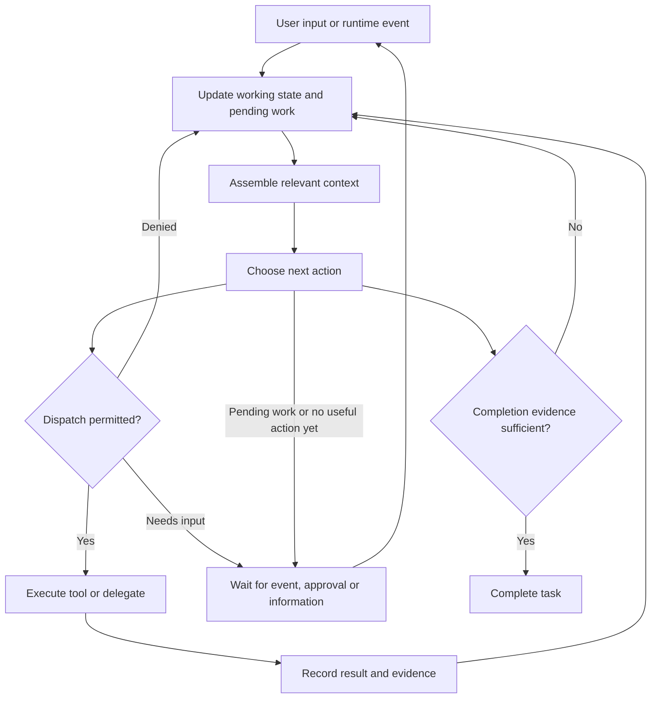

# Agent Loop

The agent loop repeatedly turns available state into a decision, executes an allowed action, observes its result, and decides what to do next. A model call is one component. The harness owns context assembly, tool dispatch, pending work, permissions, recording, and stopping.

[[concepts/loop engineering]] covers the outer policies that restart, schedule, or retry this loop. [[concepts/event-driven agents]] covers the events that wake or redirect it. Neither requires every step to be a model decision: known transitions can be ordinary code.

## Research Before Managed Services

[[sources/ReAct]] (2022) experimentally studies interleaving reasoning and environment actions. [[sources/Cognitive Architectures for Language Agents|CoALA]] (2023) supplies the broader architecture: persistent working state, internal memory operations, external actions, and a decision procedure. CoALA is conceptual synthesis, not a controlled demonstration of each component.

[[sources/Reflexion]] (2023) adds feedback retained for subsequent attempts; [[sources/LLMCompiler]] (2023) studies scheduling tool dependencies; [[sources/CodeAct]] (2024) studies executable code as an action representation. These address different design choices. They do not establish that every modern harness uses an identical loop or that a later service was derived from them.

## A Minimal Runtime Model

This is a design model, not a claim about a specific vendor implementation. Budget exhaustion, cancellation, and failures can end a run without establishing successful completion. Independent dispatched work can remain outstanding while another branch proceeds.

Keep task objectives and revisions, artifact versions, pending call identifiers, authority, budget, and completion evidence explicit. A transcript can be one input to this state; prose alone does not settle whether a tool took effect or whether a worker is still running.

## Termination Is a Runtime Policy

A response containing no tool call need not end the agent task. Distinguish termination inside an action loop from a controller that starts another turn after the inner loop returns. Current examples checked October 5, 2026:

| Level | Example | Completion mechanism |
|---|---|---|
| Inner action loop | [smolagents](https://github.com/huggingface/smolagents/blob/main/src/smolagents/agents.py) | Explicit `final_answer`, optionally accepted only after configured checks; missing actions lead to parsing/error handling rather than successful completion |
| Inner action loop | [SWE-agent](https://github.com/SWE-agent/SWE-agent/blob/main/sweagent/agent/agents.py) | Submission handling sets `StepOutput.done`; malformed or missing actions receive retries, with separate failure and budget exits |
| Graph controller | [LangGraph evaluator–optimizer](https://docs.langchain.com/oss/python/langgraph/workflows-agents#evaluator-optimizer) | Evaluation routes acceptance to `END` and rejection back to generation; a text response can finish a node without finishing the graph |
| Team controller | [AutoGen termination conditions](https://microsoft.github.io/autogen/stable/user-guide/agentchat-user-guide/tutorial/termination.html) | Explicit predicates over messages, tool execution, limits, or external signals; the individual AssistantAgent may still return on no tool call |
| Turn continuation | [Claude Code Stop hooks](https://code.claude.com/docs/en/hooks#stop-decision-control) and [goals](https://code.claude.com/docs/en/goal) | A hook can reject stopping; a separate goal evaluator can continue after a completed response, subject to failure and loop limits |

The explicit-action lineage predates native tool-calling APIs: the [original ReAct Wikipedia environment](https://github.com/ysymyth/ReAct/blob/master/wikienv.py) ends on `finish[answer]`; an invalid action leaves the episode open.

An explicit finish action makes the protocol clearer, but does not by itself verify success. A verifier can reject the model's completion proposal. Keep successful completion, waiting for input or events, cancellation, and resource exhaustion as distinct states. For a persistent assistant, ending a reply, completing one task, and ending an ongoing responsibility are also different transitions.

## Contracts That the Simple Diagram Hides

| Transition | Design question | Failure to test |
|---|---|---|
| Build context | Which facts, permissions, and outstanding obligations survive compaction? | A summary drops an unfinished obligation or upgrades a suggestion into authority |
| Discover capability | Which tool version and scope are available now? | A newly loaded schema is mistaken for permission to act |
| Dispatch work | Which calls are independent and who owns shared writes? | Speculative calls duplicate an effect or race on one artifact |
| Receive result | Which request and task revision produced it? | A late result is applied after the user changed the task |
| Accept steering | When is new input applied, and what remains in flight? | The UI reports an accepted correction as if execution already changed |
| Stop | Is this a model response, a completed worker, an accepted artifact, or a finished goal? | The parent reports success while required work is still pending |

[[sources/OpenAI Async Tools and Steering]] makes late results and queued input explicit API concerns. A new instruction is not a rollback. Record completed effects and decide how to reconcile them; see [[operations/durable sessions]] for replay, persistence, and side-effect guarantees.

## Evaluate the Loop

Compare configurations under matched tasks, models, and budgets. Ablate a mechanism rather than attributing the entire gain to the newest component. Record task success, invalid acceptance, recovery after interruption, stale-result handling, repeated effects, elapsed time, and cost per accepted outcome. These are proposed test dimensions, not universal benchmark standards.

[[sources/LoopsBench]] supplies sustained-work and regression obligations; [[sources/Agent Evaluation Reliability]] explains why model and harness claims require different comparisons. [[sources/SCLATE]] extends evaluation across session boundaries and scheduled events. A stronger final score does not by itself identify the mechanism that improved the run.

## Related

- [[concepts/dynamic tool discovery]]
- [[concepts/programmatic tool calling]]
- [[concepts/advisor agents]]
- [[concepts/background agents]]
- [[concepts/harness-aware agent learning]]
- [[operations/agent harnesses]]
- [[maps/Agent Capability Research Lineage]]
