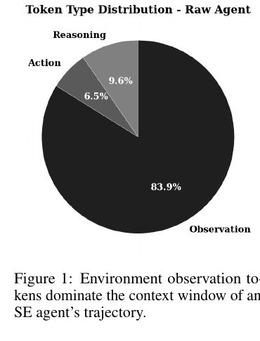
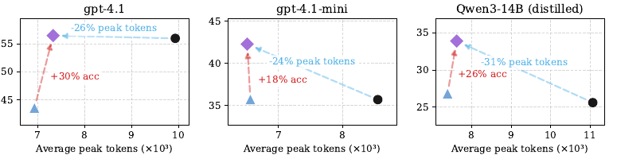
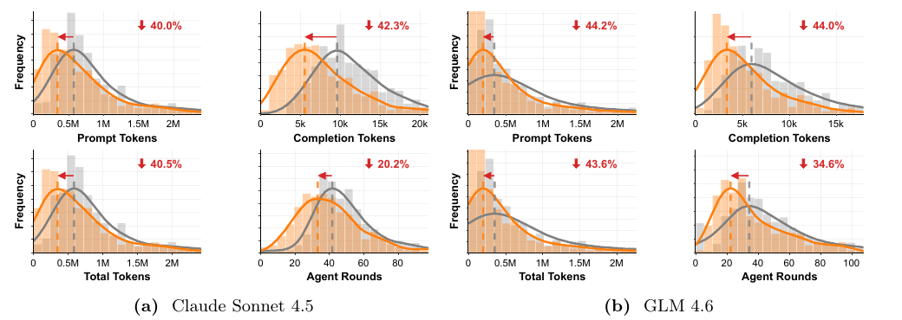
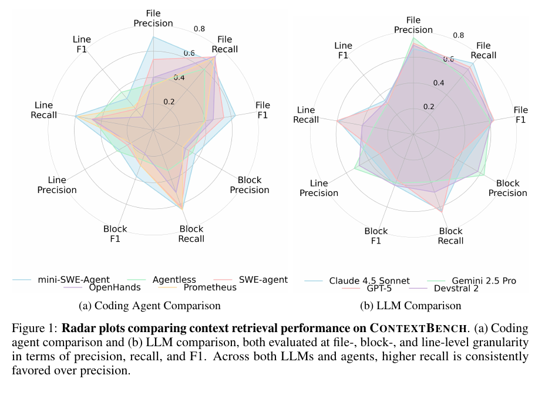
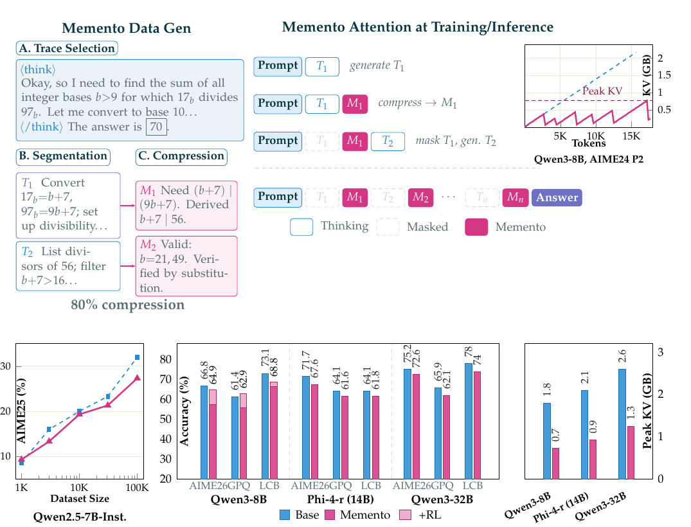
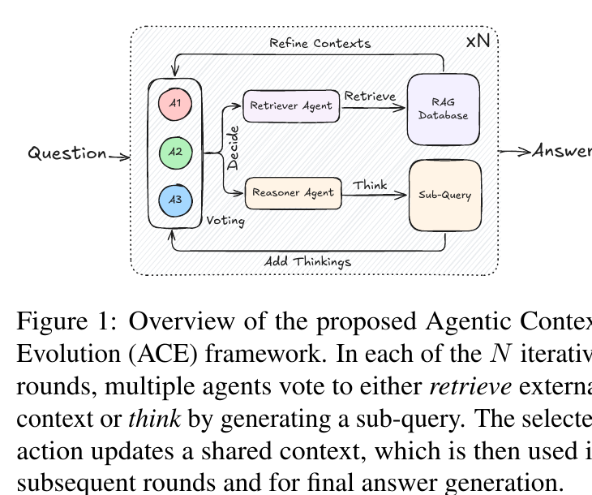

# Agent Memory Report: Compaction, Context, and Durable State

Date: 2026-06-01
Scope: local project graph only. Memory here includes persistent agent memory, compaction, retrieval, pruning, clearing, durable runtime state, handoff, skills, and learned procedures. Direct excerpts are intentionally short; longer source passages are summarized to stay within quotation limits. Embedded paper figures are local research crops; redraw or check rights before external distribution.

Shorter technical version: [Agent Memory Technical Brief](Agent%20Memory%20Technical%20Brief.md).

## Executive Summary

Agent memory is not one mechanism. The sources in this graph describe a layered architecture in which the model's active context, compacted context, persistent memory, retrieved evidence, durable workflow state, and reusable skills each solve a different part of the same problem: keeping an agent useful over time without flooding the next inference call.

The most consistent finding is that bigger context windows do not remove the need for memory. Anthropic frames context as finite working state and recommends compaction, clearing, memory, and retrieval depending on what is growing in the window. OpenAI's Codex and Responses API sources show a provider-native compaction path, including opaque compacted items. Cloudflare's Agent Memory source treats compaction as the natural point to ingest session knowledge into a persistent memory profile. Google ADK separates durable workflow state from raw chat history. Cursor's posts emphasize the harness: dynamic context, summarization tradeoffs, learned rules, and model-specific context handling. The newer memory stack also includes dreaming/sleep-time reflection: background jobs that review session traces and memory stores, deduplicate or revise memories, and extract reusable patterns outside the main task loop. Research sources add sharper techniques: observation masking, task-aware pruning, optimized compressors, context retrieval benchmarks, trajectory memory, evolving playbooks, and model-internal dense summaries.

For a builder, the design rule is simple but demanding: decide what must be exact, what can be summarized, what can be re-fetched, what should persist across sessions, and what should never be written. Memory is a write-manage-read loop, not just a vector database. Compaction is a lossy transition, not a permanent memory strategy. Durable sessions are runtime state, not chat transcript replay. Skills are procedural memory, not just prompt text.

## Core Model

The graph's sources converge on this decomposition:

```text
agent input at turn t =
  system/developer instructions
+ current user goal
+ recent high-value interaction history
+ compacted prior trajectory, if any
+ retrieved memory/evidence needed now
+ durable workflow state and artifact pointers
+ relevant skills/procedures

agent action =
  model(agent input at turn t)

memory update =
  filter, verify, classify, deduplicate, store, expire, or forget
  selected facts, decisions, preferences, task state, and lessons
```

In shorthand:

```text
C_t = I + G_t + R_t + K_t + retrieve(M_t, q_t) + compact(H_<t) + S_t
M_{t+1} = manage(M_t, write_candidates(H_t, artifacts_t, feedback_t))
```

`C_t` is the current context window. `M_t` is external memory. `H_t` is interaction history. `K_t` is durable runtime state such as workflow step, events, checkpoints, or artifacts. `S_t` is procedural memory such as skills and playbooks. The point of this formula is not that real systems literally implement this exact algebra; it is the architectural split that appears across the sources.

This also answers a recurring confusion: compaction does not store the mathematical representation of the model's intent in the way mechanistic interpretability papers study internal activations. The local sources describe summaries, compacted items, encrypted representations, dense state summaries, or external records. They are artifacts supplied back to later inference calls, not exposed neural hidden states. OpenAI's source is the closest to a latent representation claim because it says the compacted item can preserve prior state in an encrypted representation and Codex receives an opaque compaction item. Even there, the source presents it as an API-level continuation artifact, not as direct access to the model's internal activations.

## Taxonomy of Techniques

| Technique | What It Stores or Removes | Trigger | Best Use | Main Risk | Key Sources |
|---|---|---:|---|---|---|
| Active context | Current instructions, user request, recent messages, tool outputs | Every turn | Immediate reasoning | Context rot, cost, lost-in-middle | [Anthropic Effective Context Engineering](../sources/Anthropic%20Effective%20Context%20Engineering.md), [Cursor Improving Agent Harness](../sources/Cursor%20Improving%20Agent%20Harness.md) |
| Just-in-time retrieval | File paths, queries, references, selected source snippets | Need-driven | Large codebases and corpora | Bad query, missing hidden dependency | [Anthropic Effective Context Engineering](../sources/Anthropic%20Effective%20Context%20Engineering.md), [ContextBench](../sources/ContextBench.md) |
| Whole-transcript compaction | A summary or typed compaction block replacing older history | Token threshold or manual command | Long dialogue and decisions that cannot be re-fetched | Loss of exact details | [Anthropic Context Engineering Cookbook](../sources/Anthropic%20Context%20Engineering%20Cookbook.md), [OpenAI Codex Agent Loop](../sources/OpenAI%20Codex%20Agent%20Loop.md) |
| Provider-native opaque compaction | API compacted items, possibly encrypted/opaque | Server threshold or `/compact` | Long-running hosted agent loops | Less inspectable than text summary | [OpenAI Responses API Computer Environment](../sources/OpenAI%20Responses%20API%20Computer%20Environment.md), [OpenAI Agents SDK Compaction Sessions](../sources/OpenAI%20Agents%20SDK%20Compaction%20Sessions.md) |
| Tool-result clearing | Drops old re-fetchable tool outputs while preserving call structure | Tool-result volume threshold | Bulky logs, reads, search results | Re-fetch cost; cache invalidation | [Anthropic Context Engineering Cookbook](../sources/Anthropic%20Context%20Engineering%20Cookbook.md), [Microsoft Agent Framework Harness Compaction](../sources/Microsoft%20Agent%20Framework%20Harness%20Compaction.md) |
| Observation masking | Omits older environment observations | Turn/token/cost threshold | Coding agents with verbose outputs | Discards hidden clue | [The Complexity Trap](../sources/The%20Complexity%20Trap.md) |
| Task-aware pruning | Keeps selected lines/tokens relevant to the current task | Before model call or compression pass | Code contexts where structure matters | Pruner misses a critical line | [SWE-Pruner](../sources/SWE-Pruner.md) |
| Optimized compression | Learned or guideline-optimized compressors for observations/history | Long-horizon agent traces | Environment tasks with repeated formats | Extra compressor overhead | [ACON](../sources/ACON.md) |
| Memory offload | Facts, preferences, decisions, events, instructions, tasks | Explicit write, compaction, or background ingestion | Cross-session persistence | Poisoning, staleness, over-recall | [Cloudflare Agent Memory](../sources/Cloudflare%20Agent%20Memory.md), [Memory for Autonomous LLM Agents](../sources/Memory%20for%20Autonomous%20LLM%20Agents.md) |
| Dreaming / consolidation | Reorganized memory stores, deduplicated memories, cross-session patterns, failure lessons | Scheduled job, session batch, compaction event, or post-run reflection | Improving memory quality between tasks | Overgeneralized or unreviewed memory updates | [Anthropic Managed Agents Dreaming Outcomes](../sources/Anthropic%20Managed%20Agents%20Dreaming%20Outcomes.md), [Letta Code Memory Docs](../sources/Letta%20Code%20Memory%20Docs.md), [Google ReasoningBank](../sources/Google%20ReasoningBank.md) |
| Durable sessions | Explicit state schema, event history, checkpoints, artifact pointers | Every state transition | Workflows over days/weeks | State/schema drift | [Google ADK Durable Agents](../sources/Google%20ADK%20Durable%20Agents.md), [operations/durable sessions](../operations/durable%20sessions.md) |
| Handoff | Fresh thread/agent seeded with extracted goal, files, and state | Thread becomes meandering or too long | Starting a cleaner work unit | Bad handoff omits tacit context | [Anthropic Effective Harnesses for Long-Running Agents](../sources/Anthropic%20Effective%20Harnesses%20for%20Long-Running%20Agents.md), [Amp Handoff](../sources/Amp%20Handoff.md) |
| Procedural memory / skills | Reusable workflows, rules, instructions, examples | Curation, feedback, user command, agent reflection | Repeated work and organization-specific behavior | Bad rule compounds across runs | [Claim - Agent memory and skills create compounding improvement loops](../claims/Claim%20-%20Agent%20memory%20and%20skills%20create%20compounding%20improvement%20loops.md), [Cursor Bugbot Learned Rules](../sources/Cursor%20Bugbot%20Learned%20Rules.md), [LangSmith Context Hub](../sources/LangSmith%20Context%20Hub.md) |
| Trajectory memory | Strategy, recovery, and optimization lessons from prior runs | Post-run analysis | Self-improving agents | False causal attribution | [Trajectory-Informed Memory Generation](../sources/Trajectory-Informed%20Memory%20Generation.md), [Agentic Context Engineering](../sources/Agentic%20Context%20Engineering.md) |
| Model-internal compression | Dense state summaries or soft/latent summaries inside inference | During reasoning/inference | Reducing KV/context cost in reasoning models | Less transparent; training-dependent | [MEMENTO](../sources/MEMENTO.md), [AutoCompressors](../sources/AutoCompressors.md) |

## What the Product Sources Say

### Anthropic: Separate Compaction, Clearing, and Memory

Anthropic's context engineering sources are the cleanest architectural split in the graph. The cookbook distinguishes three primitives: compaction, tool-result clearing, and memory. Its short version is that each handles a different growth mode: dialogue and reasoning growth, bulky re-fetchable tool outputs, and cross-session persistence.

In the Anthropic framing, compaction summarizes a conversation close to the limit and restarts with that compressed state. It is explicitly lossy. The cookbook calls compaction a whole-transcript operation: user messages, assistant messages, tool calls, tool results, and earlier compaction blocks all become summary material. The effective-context article describes Claude Code preserving architectural decisions, unresolved bugs, and implementation details while dropping redundant outputs. The same article also points to just-in-time context retrieval: Claude Code can put durable project instructions in files such as `CLAUDE.md`, then use glob, grep, shell commands, and file reads to pull only needed context at runtime.

The important builder lesson is that Anthropic does not treat memory as a synonym for compaction. Memory is persistent note-taking outside the context window. Clearing is not summarization; it removes old, re-fetchable tool outputs. Compaction is not exact recall; it preserves substance and continuity.

Short source anchors: Anthropic calls context "finite" and recommends the "smallest possible" high-signal set of tokens. The cookbook says the primitives address a "different kind of context growth" and that lossiness is not binary.

Sources: [Anthropic Effective Context Engineering](../sources/Anthropic%20Effective%20Context%20Engineering.md), [Anthropic Context Engineering Cookbook](../sources/Anthropic%20Context%20Engineering%20Cookbook.md).

### OpenAI: Codex Uses Native Compaction Items

OpenAI's Codex loop source shows the transition from text summaries to an API-native compaction endpoint. Early Codex compaction used `/compact` with custom summarization instructions and fed the resulting assistant summary back as the next input. The current source says the Responses API returns a compacted list of items and includes a special compaction item with opaque encrypted content that preserves latent understanding of the prior conversation.

The Responses API computer-environment article gives the higher-level version: long-running tool loops fill the context window, so the API can produce a compaction item that preserves key prior state in a token-efficient representation. The Agents SDK docs add a practical framework layer: `OpenAIResponsesCompactionSession` wraps a session backend, can compact automatically after turns, and can also be invoked manually during idle time because compaction can block streaming.

The builder implication is twofold. First, compaction can be a provider feature, not just a prompt you write. Second, inspectability changes by mode. A text summary is easy to audit. An opaque compacted item may perform better or align with model training, but the harness cannot inspect the internal content in the same way.

Sources: [OpenAI Codex Agent Loop](../sources/OpenAI%20Codex%20Agent%20Loop.md), [OpenAI Responses API Computer Environment](../sources/OpenAI%20Responses%20API%20Computer%20Environment.md), [OpenAI Agents SDK Compaction Sessions](../sources/OpenAI%20Agents%20SDK%20Compaction%20Sessions.md).

### Cursor: Harness Context, Dynamic Retrieval, Learned Rules

Cursor's local sources are less a formal memory design than a harness engineering record. The harness post describes the context window as system prompt, tools, conversation state, and user request. It says Cursor moved from more static upfront context toward dynamic context that the agent fetches while working. It also describes experiments around summarizing at model-switch time, with the caution that summaries can lose important details in deep tasks.

Cursor is also represented by a production memory loop in Bugbot learned rules. Bugbot converts review feedback into learned rules that act as additional instructions in future runs. This is procedural memory: not "remember the whole session," but preserve a rule that changes future behavior. The source gives concrete scale: more than 110,000 repositories enabled learning and more than 44,000 rules had been generated at publication time.

The builder implication is that memory often enters through the harness. A coding assistant's memory may be a context fetcher, model-specific tool shape, learned rule store, summarizer at boundary events, and evaluation instrumentation, not a single memory API.

Sources: [Cursor Improving Agent Harness](../sources/Cursor%20Improving%20Agent%20Harness.md), [Cursor Bugbot Learned Rules](../sources/Cursor%20Bugbot%20Learned%20Rules.md), [Cursor Building Better Bugbot](../sources/Cursor%20Building%20Better%20Bugbot.md).

### Cloudflare: Managed Memory as Ingestion and Retrieval

Cloudflare's Agent Memory source is the strongest product example of persistent memory as a service. It defines a memory profile with operations to ingest a conversation, remember a specific item, recall needed information, list memories, and forget a memory. The bulk ingest path is typically called when the harness compacts context.

Its ingestion pipeline is not just "embed and store." The article describes extraction, verification, classification, deduplication, provenance tracking, and storage. It classifies memory candidates into facts, events, instructions, and tasks, keeps line provenance, resolves relative dates to absolutes, checks extracted items against the source transcript, and supports supersession. Retrieval combines several channels: full-text search, exact fact-key lookup, raw message search, direct vector search, HyDE vector search, rank fusion, and synthesis.

This is close to a production blueprint. The memory service constrains the tool surface so the primary agent does not spend the task context designing storage queries. Its ingestion path also moves some storage work off the critical path: indexing and vectorization can run asynchronously after ingestion.

Short source anchors: Cloudflare says agents should "recall what matters" and that memory should remain useful "as it grows." It explicitly ties ingestion to compaction.

Sources: [Cloudflare Agent Memory](../sources/Cloudflare%20Agent%20Memory.md), [operations/agent memory](../operations/agent%20memory.md).

### Google ADK: Durable State Beats Raw Chat Replay

Google ADK's durable-agent source is a useful counterweight to transcript-centric thinking. It argues that long-running workflows fail when raw chat history becomes the state container. Instead, agents should use explicit durable state: current workflow step, progress, events, checkpoints, artifacts, and wakeup conditions.

This is memory in a broader runtime sense. The agent should not infer "where am I?" from a huge transcript after a week. It should read the workflow state. Separately, Google ADK's context compression docs describe sliding-window event compaction over session history, with interval, overlap, and summarizer settings. That makes compaction a workflow-history maintenance primitive, while durable state remains the authoritative operational record.

Sources: [Google ADK Durable Agents](../sources/Google%20ADK%20Durable%20Agents.md), [Google ADK Context Compression](../sources/Google%20ADK%20Context%20Compression.md), [operations/durable sessions](../operations/durable%20sessions.md).

### LangChain, Letta, and Context Repositories

LangSmith Context Hub turns context into a managed, versioned asset: instructions, policies, examples, skills, domain knowledge, and memories can live in a collaborative repository rather than being scattered through prompts. Deep Agents adds runtime machinery: a code interpreter that preserves state and decides what returns to the model, delta checkpoints to avoid quadratic history storage, and a context hub backend with durable `/memories/`.

Letta Code pushes the persistent-agent idea further. The local docs say the agent has durable identity, memory, configuration, messages, and state across conversations. It can self-edit memory, accept `/remember`, run sleep-time "dream" subagents, and use compaction events as reflection triggers. Its MemFS is a git-backed filesystem where some directories are loaded into the system prompt and others are visible through a tree.

These systems treat memory as a filesystem-like substrate and a versioned collaboration problem, not only as retrieval.

Sources: [LangSmith Context Hub](../sources/LangSmith%20Context%20Hub.md), [LangChain Deep Agents v0.6](../sources/LangChain%20Deep%20Agents%20v0.6.md), [Letta Code Memory Docs](../sources/Letta%20Code%20Memory%20Docs.md).

### Dreaming and Memory Consolidation

Dreaming is one of the most important memory concepts in the graph because it changes where improvement happens. Ordinary memory writes happen during task execution: the agent notices something and writes it. Compaction happens at a context boundary: the agent or provider compresses prior context so work can continue. Dreaming happens outside the main work loop: a separate process reviews past sessions and memory stores, then produces a cleaner or richer memory state for future sessions.

Anthropic Managed Agents is the clearest product source. Its article describes dreaming as a scheduled process that reviews agent sessions and memory stores, extracts patterns, and curates memories so agents improve over time. The docs are more precise: a dream is an asynchronous job that takes a pre-existing memory store plus 1 to 100 session transcripts, then produces a separate output memory store. The input store is not modified. This makes dreaming reviewable: teams can inspect the output store, attach it to future sessions, or discard it.

The practical formula is:

```text
dream(input_memory_store, session_transcripts, instructions)
  -> output_memory_store

output_memory_store =
  merge duplicates
+ replace stale or contradicted entries
+ add new cross-session insights
+ reorganize memory for future retrieval
```

This is not just another compaction prompt. Compaction asks "what should survive into the next context window?" Dreaming asks "what should the agent learn after reviewing many traces?" The answer may include patterns a single session cannot reveal: recurring mistakes, converged workflows, team-level preferences, filetype workarounds, tool-specific patterns, or procedures that should become skills.

Letta Code has a parallel idea under sleep-time reflection. Its docs say Letta launches periodic dream subagents in the background to reflect on recent conversations and edit memory. The recommended MemFS trigger is a compaction event, which is an important pattern: compaction is the moment the system knows a session has generated enough material to justify consolidation.

Google ReasoningBank is the research-side analogue. It runs a closed loop of retrieval, extraction, and consolidation. After an agent acts, it self-assesses the trajectory and extracts success insights or failure reflections into structured reasoning memories. ReasoningBank matters because it emphasizes failures, not only successful workflows: a failed trajectory can become a preventative lesson.

Cloudflare Agent Memory also points in this direction, though more cautiously. Its current article describes asynchronous vectorization after ingestion and says Cloudflare is testing strategies for memory storage to improve asynchronously, explicitly analogizing the direction to sleep-time consolidation. That makes Cloudflare a near-adjacent source rather than a full dreaming implementation source.

Builder implications:

- Treat dreaming as a background memory-maintenance job, not as online retrieval.
- Keep the input store immutable and produce a new output store so review and rollback are possible.
- Run it on batches of sessions, especially after compaction, task completion, or repeated failures.
- Give it instructions about what to focus on and what to ignore.
- Extract both positive procedures and negative lessons from failures.
- Require provenance back to source sessions before promoted memories affect high-authority actions.
- Promote stable repeated procedures into skills only after evaluation.

Sources: [Anthropic Managed Agents Dreaming Outcomes](../sources/Anthropic%20Managed%20Agents%20Dreaming%20Outcomes.md), [Anthropic Managed Agents dreams docs](../raw/docs/anthropic-managed-agents-dreams-docs.md), [Letta Code Memory Docs](../sources/Letta%20Code%20Memory%20Docs.md), [Google ReasoningBank](../sources/Google%20ReasoningBank.md), [Cloudflare Agent Memory](../sources/Cloudflare%20Agent%20Memory.md), [Recent Agent Operating Concepts](../maps/Recent%20Agent%20Operating%20Concepts.md), [Harness Tracker](../maps/Harness%20Tracker.md).

### Procedural Memory and Skills

The skills cluster fills a gap that ordinary memory stores do not: it packages reusable know-how into files, scripts, references, and assets that can be discovered and loaded only when relevant. The local [Agent Skills Map](../maps/Agent%20Skills%20Map.md) calls skills the reusable procedural-knowledge layer for agents. This is memory, but not memory as "facts the user said." It is memory as reusable procedure.

The standard/source cards converge on a progressive-disclosure pattern. A skill has a small discoverable description loaded early, while detailed instructions, scripts, references, and assets are loaded only after activation. That makes skills a context-management technique as much as a capability mechanism: the agent can carry a large library of procedures without stuffing all of them into every prompt.

The research sources add two cautions. [SkillsBench](../sources/SkillsBench.md) treats skill utility as something to benchmark, not assume. [Agentic Skills in the Wild](../sources/Agentic%20Skills%20in%20the%20Wild.md) emphasizes realistic skill retrieval from larger collections, where benefits degrade if the agent cannot choose the right skill. [SAGE Skill Library](../sources/SAGE%20Skill%20Library.md), [SkillRL](../sources/SkillRL.md), and [Voyager](../sources/Voyager.md) show the more ambitious version: skill libraries become evolving state, generated, validated, reused, and improved across tasks.

For builders, skills should be governed like dependencies. They can include executable scripts and injected instructions, so they need review, versioning, tests, provenance, and removal paths. The failure mode is not only "bad memory recall"; it is a stale or unsafe procedure being invoked with authority.

Sources: [Anthropic Agent Skills](../sources/Anthropic%20Agent%20Skills.md), [Agent Skills Specification](../sources/Agent%20Skills%20Specification.md), [OpenAI Skills Docs](../sources/OpenAI%20Skills%20Docs.md), [Agent Skills Map](../maps/Agent%20Skills%20Map.md), [SkillsBench](../sources/SkillsBench.md), [Agentic Skills in the Wild](../sources/Agentic%20Skills%20in%20the%20Wild.md).

### Handoff Instead of More Compaction

The graph also includes sources arguing that compaction is not always the right boundary. Amp's handoff article says they removed compaction and replaced it with handoff into a fresh goal/thread. Anthropic's long-running harness source similarly uses an initializer agent, a coding agent, progress files, and git history so a fresh context can resume work from artifacts rather than from a repeatedly summarized thread.

This is an important pattern: sometimes the correct memory artifact is not a smaller chat history. It is a clear new goal plus files, branch state, progress notes, and tests.

Sources: [Amp Handoff](../sources/Amp%20Handoff.md), [Anthropic Effective Harnesses for Long-Running Agents](../sources/Anthropic%20Effective%20Harnesses%20for%20Long-Running%20Agents.md).

## What the Research Sources Add

### Survey Framing: Memory as Write-Manage-Read

The local survey [Memory for Autonomous LLM Agents](../sources/Memory%20for%20Autonomous%20LLM%20Agents.md) formalizes memory as a write-manage-read loop tied to the agent's perception and action cycle. It separates temporal scope, representation substrate, and control policy. The mechanisms it surveys include context-resident compression, retrieval stores, reflective self-improvement, hierarchical virtual context, and learned memory management.

Its most useful warning is that the update step is not append-only. Good memory systems summarize, deduplicate, score priority, resolve contradictions, and delete. This matches Cloudflare's production pipeline and the project's own [agent memory operation note](../operations/agent%20memory.md), which warns about memory poisoning and recommends provenance, write authority, expiration, review gates, and separation between trusted long-term memory and untrusted retrieved content.

Source: [Memory for Autonomous LLM Agents PDF](../raw/papers/memory-for-autonomous-llm-agents.pdf).

### Observation Masking: Cheap Baseline Before Smart Summaries

The Complexity Trap is a critical corrective for agent memory design. It finds that in software-engineering agents, environment observations dominate context. The paper's figure reports observation tokens at about 84% of an average raw agent turn in its preliminary analysis. Its experiments compare raw history, observation masking, LLM summarization, and a hybrid strategy.

The practical lesson is not that summarization is bad. It is that many agent traces are bloated by tool observations, not by irreplaceable reasoning. If the old observation can be safely omitted or re-fetched, masking or clearing may match summarization at lower complexity and cost.



Figure 1. Observation tokens dominate an SE agent trajectory. Source crop from [The Complexity Trap](../raw/papers/The%20Complexity%20Trap%20-%20Agent%20Context%20Management.pdf).


Figure 2. The Complexity Trap compares solve rate against cost for raw context, observation masking, and LLM-summary strategies. Source crop from [The Complexity Trap](../raw/papers/The%20Complexity%20Trap%20-%20Agent%20Context%20Management.pdf).

### Parallel Compaction: Compaction as Serving Architecture

Parallel Context Compaction treats compaction as a runtime bottleneck. Instead of one blocking summarizer over a full accumulated trajectory, it divides the context into target blocks and summarizes them concurrently before merging them. This matters for long-horizon serving because compaction can otherwise become a latency spike at exactly the point where the agent is already near a context boundary.

The broader lesson is that compaction design has systems knobs: block size, overlap, merge policy, summary budget, trigger threshold, and whether compaction runs during agent idle time. This complements OpenAI's SDK warning that automatic compaction can block streaming.


Figure 3. Sequential versus parallel context compaction. Source crop from [Parallel Context Compaction](../raw/papers/Parallel%20Context%20Compaction%20for%20Long-Horizon%20LLM%20Agent%20Serving.pdf).

### ACON: Optimize the Compressor Against Agent Failures

ACON treats context compression as an agent-specific optimization problem. It compresses both environment observations and interaction histories. Its key method is failure-driven guideline optimization: compare trajectories where full context succeeds but compressed context fails, analyze why, and update the natural-language compression guideline. The paper then distills the optimized compressor into smaller models to reduce overhead.

The front-page figure shows a better accuracy and token tradeoff than naive LLM prompting across GPT-4.1, GPT-4.1-mini, and Qwen3-14B distilled settings. The important idea is that "compress this conversation" is too generic; the compressor should be trained or tuned on the actual failure modes of the agent and environment.



Figure 4. ACON improves the accuracy/peak-token tradeoff on AppWorld. Source crop from [ACON](../raw/papers/ACON%20-%20Optimizing%20Context%20Compression%20for%20Long-horizon%20LLM%20Agents.pdf).

### SWE-Pruner: Prune Code with Task-Aware Structure

SWE-Pruner addresses a different failure mode: general-purpose token compression can break code semantics. The paper trains a small neural skimmer to select relevant lines based on the current task and an explicit pruning goal. Its results report substantial token reductions while preserving or improving success rates: 23-38% on SWE-Bench Verified-style agent runs and up to 54% across broader agent-task settings in the paper.

This belongs in memory architecture because coding agents often use "memory" to mean "what source code and logs should be in the next prompt." For code, exact lines and structural integrity matter. A good pruning system should preserve enough syntax, dependencies, and implementation detail for action, not merely produce a fluent summary.



Figure 5. SWE-Pruner reduces prompt/completion/total tokens and agent rounds in the paper's front-page analysis. Source crop from [SWE-Pruner](../raw/papers/SWE-Pruner%20-%20Self-Adaptive%20Context%20Pruning%20for%20Coding%20Agents.pdf).

### ContextBench: Retrieval Quality Is a Memory Problem

ContextBench evaluates context retrieval in coding agents at file, block, and line granularity. The related Letta Context-Bench article frames agentic context engineering as the agent's ability to decide what to retrieve and load. The benchmark's radar plots compare precision, recall, and F1 across coding agents and LLMs.

The lesson for memory design is that recall and precision must be measured at the artifact granularity the agent acts on. A memory system that retrieves the right file but not the right line can still fail. A system that retrieves many loosely related artifacts can create context saturation.



Figure 6. ContextBench retrieval performance across file, block, and line metrics. Source crop from [ContextBench](../raw/papers/ContextBench%20-%20Context%20Retrieval%20in%20Coding%20Agents.pdf).

### MEMENTO and Soft/Internal Compression

MEMENTO is the main source in the graph for model-internal context management. It trains reasoning models to segment long reasoning traces into blocks, compress each block into a memento, and continue while attending to mementos rather than the full earlier trace. The paper reports about 2.5x peak KV cache reduction and 1.75x throughput improvement in its setup. It also notes a dual information stream: text mementos plus corresponding KV states.

This is the closest technique to a "mathematical representation" of prior reasoning, but it is still not the same as a user-level memory entry. It is a trained inference mechanism that changes what the model attends to and retains in KV state. Builders should place it in a separate bucket from external memory stores and chat compaction summaries.



Figure 7. MEMENTO data generation, attention pattern, and efficiency results. Source crop from [MEMENTO](../raw/papers/MEMENTO%20-%20Teaching%20LLMs%20to%20Manage%20Their%20Own%20Context.pdf).

### Trajectory Memory and Evolving Playbooks

Trajectory-Informed Memory Generation argues that useful memory can be extracted from execution paths, not just facts. It generates strategy tips from clean successes, recovery tips from failure handling, and optimization tips from inefficient successes. It also tracks provenance from each lesson back to the source trajectory. This matches the project's claim that memory and skills create compounding improvement loops.

Agentic Context Engineering treats context as an evolving playbook. Its core warning is "context collapse": repeated rewriting can erase useful details over time. Its alternative is structured incremental updates, reflection, and curation. This is directly relevant to compaction: if every compaction rewrites the whole memory into a shorter document, the system can drift toward a polished but less useful summary.


Figure 8. Trajectory-informed memory extracts tips from execution traces, stores and consolidates them, then retrieves them for later tasks. Source crop from [Trajectory-Informed Memory Generation](../raw/papers/trajectory-informed-memory-generation.pdf).

Sources: [Trajectory-Informed Memory Generation](../raw/papers/trajectory-informed-memory-generation.pdf), [Agentic Context Engineering](../raw/papers/agentic-context-engineering.pdf), [Claim - Agent memory and skills create compounding improvement loops](../claims/Claim%20-%20Agent%20memory%20and%20skills%20create%20compounding%20improvement%20loops.md).

### Retrieve or Think

To Retrieve or To Think? adds a control-policy point. Retrieval is not always beneficial. The paper frames context evolution as a decision between acquiring external evidence and reasoning over existing context. This matters for memory systems because automatic recall on every turn can saturate the prompt with stale or irrelevant memories. The agent should retrieve when it has an information gap, not as a ritual.



Figure 9. Retrieve-or-think routing: agents vote whether to retrieve external context or reason over the current context. Source crop from [To Retrieve or To Think](../raw/papers/To%20Retrieve%20or%20To%20Think%20-%20Agentic%20Context%20Evolution.pdf).

Source: [To Retrieve or To Think](../sources/To%20Retrieve%20or%20To%20Think.md).

### Evaluating Compaction by Continuation, Not Similarity

Factory's context-compression evaluation source argues that summary similarity metrics miss the real issue: can the agent continue the task? It evaluates compressed context through probes about artifacts, continuity, context awareness, accuracy, completeness, and instruction following. It also compares styles: structured persistent summaries, opaque high-compression approaches, and detailed regenerated summaries.

The report's builder lesson is important: compression ratio is not the goal. Good compaction preserves what later action needs. Weak compaction often loses artifact trails, exact decisions, and next steps even if the summary reads well.

Sources: [Factory Context Compression Evaluation](../raw/articles/factory-context-compression-evaluation.md), [Claim - Context management is an agent architecture choice](../claims/Claim%20-%20Context%20management%20is%20an%20agent%20architecture%20choice.md).

## Similarities and Differences Across Providers

| Provider / System | Similarity to Others | Distinctive Move |
|---|---|---|
| Anthropic / Claude Code | Treats context as a finite resource; uses compaction and retrieval | Cleanest public split between compaction, clearing, and memory; emphasizes prompt tuning for compaction |
| OpenAI / Codex | Compacts long-running agent loops near thresholds | Provider-native compacted item; opaque encrypted continuation artifact; Agents SDK session wrapper |
| Cursor | Treats context as harness design and evaluates changes empirically | Dynamic context over static upfront context; learned rules for Bugbot; model-specific harness/tool adaptation |
| Cloudflare Agent Memory | Uses compaction boundary to preserve session knowledge | Managed memory profile with constrained remember/recall/forget/list API and multi-channel retrieval |
| Google ADK | Supports context compression | Separates durable workflow state from raw transcript; state schema is the source of truth |
| Anthropic Managed Agents | Adds memory stores and session traces to a managed runtime | Dreaming jobs consolidate memories between sessions into a reviewable output store |
| LangChain / Letta | Externalizes memory into filesystem/repository abstractions | Versioned context hub, MemFS, dream/reflection workflows, durable agent identity |
| Amp / long-running harnesses | Recognize compaction lossiness | Prefer handoff, artifacts, progress files, and fresh contexts for some work |

Common patterns:

- Every serious source treats context as scarce or at least easily polluted.
- Compaction is lossy and must be tuned or evaluated.
- Retrieval should be selective.
- Durable state should live outside the model context.
- Dreaming/consolidation is a write-side maintenance process, not a replacement for online context retrieval.
- Memory writes need governance: provenance, review, deletion, and contradiction handling.
- Procedural memory is becoming as important as factual memory.

Differences:

- OpenAI leans into provider-native opaque compaction for Codex continuation.
- Anthropic's public materials emphasize explicit developer choice among compaction, clearing, and memory.
- Cloudflare productizes memory as a managed ingestion/retrieval service.
- Google ADK frames long-running agents as durable workflows rather than long chats.
- Cursor frames the harness and evaluation loop as the place where memory/context tactics improve.
- Anthropic Managed Agents makes between-session memory consolidation a first-class API concept.
- Letta and LangChain expose memory as persistent, versioned, filesystem-like context.
- Amp argues that handoff can be a better boundary than repeated compaction.

## Safety and Governance

Memory raises the stakes of prompt injection because a poisoned write can persist after the malicious content has left the active window. The local [agent memory](../operations/agent%20memory.md) note is direct: a bad instruction, false fact, poisoned preference, or malicious tool note can silently shape future planning, retrieval, or delegation. In other words, memory turns a one-turn contamination into a durable state problem.

The safety sources split the threat surface into several layers. [Agent Security Bench](../sources/Agent%20Security%20Bench.md) includes memory poisoning alongside prompt injection, backdoor-style attacks, and mixed attacks. [AgentDojo](../sources/AgentDojo.md), [InjecAgent](../sources/InjecAgent.md), and [BrowseSafe](../sources/BrowseSafe.md) focus on indirect prompt injection through tools, external documents, and browser environments. [Design Patterns for Securing LLM Agents](../sources/Design%20Patterns%20for%20Securing%20LLM%20Agents.md) connects those attacks to implementable controls around privilege, tool boundaries, and isolation. [When Agents Misremember Collectively](../sources/When%20Agents%20Misremember%20Collectively.md) adds a multi-agent memory risk: agents can reinforce shared false memories, especially when social influence or shared memory makes wrong claims look corroborated.

The design controls are consistent with the memory lifecycle above:

- Separate trusted long-term memory from untrusted retrieved content.
- Track provenance, timestamp, writer identity, write authority, and expiry on every memory.
- Quarantine web/document/tool content before it can become a durable instruction.
- Require review gates before memories affect high-authority actions, permissions, finance, deployment, or security decisions.
- Prefer scoped memories: user-level, project-level, repo-level, team-level, task-level.
- Store contradictions and supersession chains rather than silently overwriting facts.
- Audit memory periodically for stale, adversarial, overfit, or low-value entries.
- Support user-visible list, forget, export, and deletion flows.
- For shared/team memory, include conflict resolution and authority rules.

Skills need the same treatment. A skill can inject instructions and run scripts, so it should be reviewed like a dependency. Memory and skills are both compounding layers; that is their value and their risk.

## Builder Guidance

### 1. Split Memory by Failure Mode

Do not start with "add vector memory." Start with the failure:

| Failure | Better First Tool |
|---|---|
| Agent forgets project preferences across sessions | Persistent semantic/procedural memory |
| Agent loses current task state after a pause | Durable session state and checkpoints |
| Agent hits context limit during one long thread | Compaction or handoff |
| Context is bloated by logs/search/file reads | Tool-result clearing or observation masking |
| Agent cannot find relevant code | Context retrieval and line/block/file benchmarks |
| Agent repeats a bad workflow | Learned rules, skills, trajectory memory |
| Agent needs exact prior artifact | Artifact store and pointers, not summary |
| Agent has irrelevant memories injected | Retrieval gating and memory ranking |

### 2. Use a Write-Manage-Read Lifecycle

A robust memory layer should implement:

1. Write candidates: explicit user saves, model `remember` calls, compaction ingestion, post-run reflection, human feedback, and artifact updates.
2. Filtering: reject untrusted instructions, prompt-injection payloads, transient facts, and low-confidence claims.
3. Verification: tie each memory to source lines, artifacts, timestamps, and writer authority.
4. Classification: separate preferences, facts, tasks, events, decisions, procedures, failures, recoveries, and constraints.
5. Conflict handling: supersede stale entries instead of silently accumulating contradictions.
6. Retrieval: combine exact lookup, keyword search, vector search, raw transcript fallback, and recency/authority scoring.
7. Context injection: synthesize only what the current turn needs; avoid dumping memory wholesale.
8. Forgetting: support deletion, expiry, and user review.

Cloudflare's source is the best production example of this lifecycle. The memory survey gives the general write-manage-read formalization. The project operation note adds safety concerns: memory poisoning is more damaging than one-turn prompt injection because bad memory can persist across tasks.

### 3. Treat Compaction as a Boundary Event

When compaction fires, do three things:

1. Produce the continuation artifact: text summary, provider compaction item, or handoff brief.
2. Preserve exact references: files changed, commands run, test results, artifacts, unresolved decisions, IDs, URLs, and branch state.
3. Trigger memory ingestion or reflection for cross-session knowledge.

Do not rely on compaction for exact recall. If exactness matters, store an artifact or pointer. If it can be re-fetched, clear it. If it should shape future behavior, write a memory or skill.

### 4. Evaluate with Action Probes

Use evals that ask whether the agent can continue:

- Can it name the current goal and next step?
- Can it find the relevant file, block, and line?
- Can it recover a decision and the reason for it?
- Can it avoid repeating a failed attempt?
- Can it respect a remembered user or project preference?
- Can it distinguish stale memory from current state?
- Can it cite the artifact or source that supports the memory?
- Can it complete the task with compressed context at lower cost?

Factory's evaluation source is especially useful here because it tests continuation rather than summary similarity. ContextBench adds artifact-level retrieval metrics. The Complexity Trap and SWE-Pruner show cost and task-success measures for coding agents.

Use an eval matrix rather than one metric:

| Capability | Evaluation Source Pattern | What to Measure |
|---|---|---|
| Compaction continuity | [Factory Context Compression Evaluation](../sources/Factory%20Context%20Compression%20Evaluation.md) | Can the agent resume the task, preserve artifacts, and follow prior decisions? |
| Context growth robustness | [LOCA-bench](../sources/LOCA-bench.md), [Letta Context-Bench](../sources/Letta%20Context-Bench.md) | Does performance degrade as irrelevant or long context grows? |
| Retrieval quality | [ContextBench](../sources/ContextBench.md) | File/block/line precision, recall, and F1 before final task success. |
| Cost and latency | [The Complexity Trap](../sources/The%20Complexity%20Trap.md), [Parallel Context Compaction](../sources/Parallel%20Context%20Compaction.md) | Token cost, instance cost, blocking compaction latency, and throughput. |
| Skill utility | [SkillsBench](../sources/SkillsBench.md), [Agentic Skills in the Wild](../sources/Agentic%20Skills%20in%20the%20Wild.md) | Does loading the skill improve outcome, and can the agent select it from a larger library? |
| Consolidation quality | [Anthropic Managed Agents Dreaming Outcomes](../sources/Anthropic%20Managed%20Agents%20Dreaming%20Outcomes.md), [Google ReasoningBank](../sources/Google%20ReasoningBank.md), [Trajectory-Informed Memory Generation](../sources/Trajectory-Informed%20Memory%20Generation.md) | Do background reflections remove duplicates, resolve contradictions, preserve provenance, and improve later task success? |
| Memory safety | [Agent Security Bench](../sources/Agent%20Security%20Bench.md), [AgentDojo](../sources/AgentDojo.md), [InjecAgent](../sources/InjecAgent.md) | Can untrusted content poison memory, trigger unsafe tools, or bypass instruction hierarchy? |
| Shared-memory reliability | [When Agents Misremember Collectively](../sources/When%20Agents%20Misremember%20Collectively.md), [AgentNet](../sources/AgentNet.md) | Do agents amplify false memories or resolve conflicting shared state? |

### 5. Default Architecture for a New Agent

A conservative first implementation:

```text
1. Keep recent turns verbatim within a small window.
2. Store all durable artifacts outside chat: files, patches, logs, test results, links.
3. Add tool-result clearing for bulky re-fetchable outputs.
4. Add text compaction with a structured schema:
   - current objective
   - hard constraints
   - decisions made
   - files/artifacts touched
   - failed attempts
   - next actions
   - open questions
5. Add persistent memory only for cross-session facts/preferences/procedures.
6. Require provenance and timestamps for every memory.
7. Retrieve memory only when the current turn asks for it or a classifier predicts relevance.
8. Promote repeated successful procedures into skills/playbooks after review.
9. Build probes that resume from compacted state and measure task completion.
10. Add dreaming/consolidation only after provenance, review, and rollback are in place.
```

For more mature systems, add multi-channel retrieval, asynchronous memory consolidation, handoff to fresh threads, learned retrieval policies, and task-aware pruning.

Maturity tiers:

- Default: recent verbatim window, artifact store, tool-result clearing, structured text compaction, provenance, selective retrieval, and user-visible memory controls.
- Intermediate: multi-channel retrieval, compaction-triggered ingestion, reviewable dreaming/consolidation jobs, skill libraries, handoff briefs, and continuation probes.
- Advanced: provider-native opaque compaction, parallel block compaction, ACON-style optimized compressors, MEMENTO-style model-internal compression, learned retrieval policies, dreaming/consolidation, and self-evolving skill libraries.

## Open Questions and Gaps

- Opaque compaction quality is hard to audit. OpenAI's provider-native path may preserve useful state, but external harnesses cannot inspect it like a text summary.
- Memory ROI is undermeasured. Sources show plausible benefits, but production cost/quality tradeoffs remain workload-specific.
- Governance UX is immature. Users need understandable memory review, deletion, provenance, and scope controls.
- Negative transfer is a real risk. Learned rules, trajectory tips, and memories can become stale or overgeneralized.
- Multi-agent shared memory is underdeveloped. Cloudflare mentions team memory, and Cursor/Anthropic discuss multi-agent harnesses, but cross-agent authority and conflict resolution need sharper models.
- Benchmarks lag production use. Current benchmarks test slices: retrieval, context growth, coding cost, or agent tasks. Real systems combine all of these.

## Source Register

Primary local source maps: [Context Management Map](../maps/Context%20Management%20Map.md), [Agent Skills Map](../maps/Agent%20Skills%20Map.md), and [Safety Map](../maps/Safety%20Map.md). Supporting local notes: [agent memory](../operations/agent%20memory.md), [durable sessions](../operations/durable%20sessions.md), [context management claim](../claims/Claim%20-%20Context%20management%20is%20an%20agent%20architecture%20choice.md), and [memory/skills claim](../claims/Claim%20-%20Agent%20memory%20and%20skills%20create%20compounding%20improvement%20loops.md).

Selected key dated source cards used:

| Source | Date in Local Graph | Type |
|---|---:|---|
| [Anthropic Context Engineering Cookbook](../sources/Anthropic%20Context%20Engineering%20Cookbook.md) | 2026-05-26 snapshot | docs/cookbook |
| [Anthropic Effective Context Engineering](../sources/Anthropic%20Effective%20Context%20Engineering.md) | 2025-09-29 | article |
| [OpenAI Codex Agent Loop](../sources/OpenAI%20Codex%20Agent%20Loop.md) | 2026-01-23 | engineering article |
| [OpenAI Responses API Computer Environment](../sources/OpenAI%20Responses%20API%20Computer%20Environment.md) | 2026-03-11 | engineering article |
| [OpenAI Agents SDK Compaction Sessions](../sources/OpenAI%20Agents%20SDK%20Compaction%20Sessions.md) | 2026-05-26 snapshot | docs |
| [Cursor Improving Agent Harness](../sources/Cursor%20Improving%20Agent%20Harness.md) | 2026-04-30 | article |
| [Cursor Bugbot Learned Rules](../sources/Cursor%20Bugbot%20Learned%20Rules.md) | 2026-04-08 | article |
| [Cursor Building Better Bugbot](../sources/Cursor%20Building%20Better%20Bugbot.md) | 2026-01-15 | article |
| [Cloudflare Agent Memory](../sources/Cloudflare%20Agent%20Memory.md) | 2026-04-17 | article |
| [Google ADK Durable Agents](../sources/Google%20ADK%20Durable%20Agents.md) | 2026-05-12 | article |
| [Google ADK Context Compression](../sources/Google%20ADK%20Context%20Compression.md) | 2026-05-26 snapshot | docs |
| [Microsoft Agent Framework Harness Compaction](../sources/Microsoft%20Agent%20Framework%20Harness%20Compaction.md) | 2026-03-12 | article |
| [LangSmith Context Hub](../sources/LangSmith%20Context%20Hub.md) | 2026-05-13 | article |
| [LangChain Deep Agents v0.6](../sources/LangChain%20Deep%20Agents%20v0.6.md) | 2026-05-13 | article |
| [Letta Code Memory Docs](../sources/Letta%20Code%20Memory%20Docs.md) | 2026-05-18 snapshot | docs |
| [Anthropic Managed Agents Dreaming Outcomes](../sources/Anthropic%20Managed%20Agents%20Dreaming%20Outcomes.md) | 2026-05-06 | article/docs bundle |
| [Google ReasoningBank](../sources/Google%20ReasoningBank.md) | 2026-04-21 | research article |
| [Anthropic Effective Harnesses for Long-Running Agents](../sources/Anthropic%20Effective%20Harnesses%20for%20Long-Running%20Agents.md) | 2025-11-26 | article |
| [Amp Handoff](../sources/Amp%20Handoff.md) | 2025-10-23 | article |
| [Factory Context Compression Evaluation](../sources/Factory%20Context%20Compression%20Evaluation.md) | 2025-12-16 | vendor research article |
| [Memory for Autonomous LLM Agents](../sources/Memory%20for%20Autonomous%20LLM%20Agents.md) | 2026-03-08 | arXiv survey |
| [The Complexity Trap](../sources/The%20Complexity%20Trap.md) | 2025-08-29; updated 2025-10-27 | paper |
| [Parallel Context Compaction](../sources/Parallel%20Context%20Compaction.md) | 2026-05-22 | paper |
| [ACON](../sources/ACON.md) | 2025-10-01; updated 2025-10-17 | paper |
| [SWE-Pruner](../sources/SWE-Pruner.md) | 2026-01-23; updated 2026-05-07 | paper |
| [ContextBench](../sources/ContextBench.md) | 2026-02-05 | paper/benchmark |
| [LOCA-bench](../sources/LOCA-bench.md) | 2026-02-08 | paper/benchmark |
| [Letta Context-Bench](../sources/Letta%20Context-Bench.md) | 2025-10-30 | benchmark article |
| [MEMENTO](../sources/MEMENTO.md) | 2026-04-10 | paper |
| [AutoCompressors](../sources/AutoCompressors.md) | 2023-12-01 | paper |
| [Trajectory-Informed Memory Generation](../sources/Trajectory-Informed%20Memory%20Generation.md) | 2026-03-11 | paper |
| [Agentic Context Engineering](../sources/Agentic%20Context%20Engineering.md) | 2025-10-06; ICLR 2026 version in local PDF | paper |
| [To Retrieve or To Think](../sources/To%20Retrieve%20or%20To%20Think.md) | 2026-01-13; updated 2026-01-14 | paper |
| [Anthropic Agent Skills](../sources/Anthropic%20Agent%20Skills.md) | 2025-10-16 | article |
| [Agent Skills Specification](../sources/Agent%20Skills%20Specification.md) | 2025-12-18 | protocol/spec |
| [OpenAI Skills Docs](../sources/OpenAI%20Skills%20Docs.md) | 2026-05-18 snapshot | docs |
| [SkillsBench](../sources/SkillsBench.md) | 2026-02-13 | paper/benchmark |
| [Agentic Skills in the Wild](../sources/Agentic%20Skills%20in%20the%20Wild.md) | 2026-04-06 | paper/benchmark |
| [SAGE Skill Library](../sources/SAGE%20Skill%20Library.md) | 2025-12-18 | paper |
| [SkillRL](../sources/SkillRL.md) | 2026-02-09 | paper |
| [Voyager](../sources/Voyager.md) | 2023-05-25 | paper |
| [Agent Security Bench](../sources/Agent%20Security%20Bench.md) | 2024-10-03; updated 2025-05-30 | paper/benchmark |
| [AgentDojo](../sources/AgentDojo.md) | 2024-06-19; updated 2024-11-24 | paper/benchmark |
| [InjecAgent](../sources/InjecAgent.md) | 2024-03-05; updated 2024-08-04 | paper/benchmark |
| [BrowseSafe](../sources/BrowseSafe.md) | 2025-11-25 | paper |
| [Design Patterns for Securing LLM Agents](../sources/Design%20Patterns%20for%20Securing%20LLM%20Agents.md) | 2025-06-10; updated 2025-06-27 | paper |
| [When Agents Misremember Collectively](../sources/When%20Agents%20Misremember%20Collectively.md) | 2026-01-31; updated 2026-03-01 | paper |
| [AgentNet](../sources/AgentNet.md) | 2025-04-01; updated 2025-05-29 | paper |
