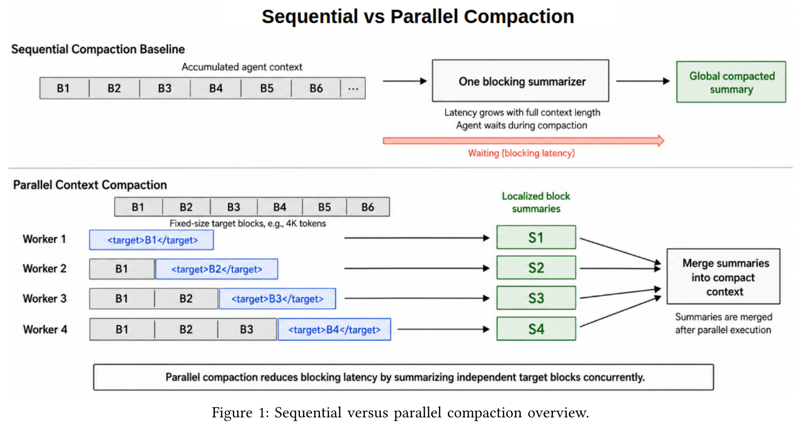
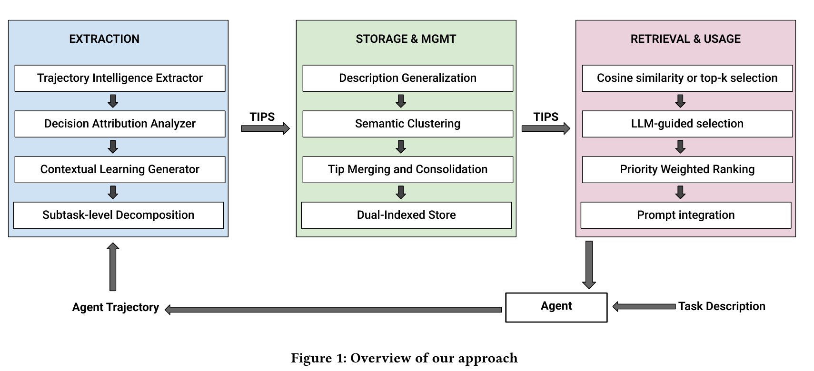
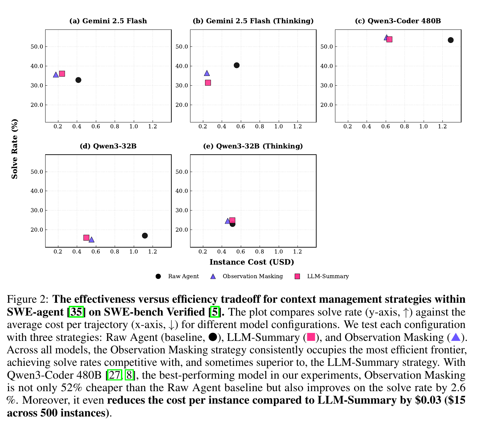

# Agent Memory Technical Brief

Date: 2026-06-01
Scope: local graph only. This is the shorter technical version of [Agent Memory Report](Agent%20Memory%20Report.md). It uses source terminology as labels and keeps direct excerpts short; long source passages are summarized because verbatim quotation is limited. Embedded paper figures are local research crops; redraw or check rights before external distribution.

## 0. Core Finding

The sources do not describe one thing called "memory." They describe a stack:

```text
online context management
  = just-in-time retrieval
  + compaction / compacted items
  + tool-result clearing / observation masking / pruning
  + handoff

external memory
  = memory stores / profiles / MemFS / ContextHub
  + remember / recall / list / forget
  + provenance / supersession / expiry

background consolidation
  = dreams / sleep-time reflection / trajectory memory
  + deduplication / contradiction repair / pattern extraction

procedural memory
  = Agent Skills / learned rules / skill libraries

durable runtime state
  = event logs / checkpoints / workflow state / artifacts
```

This is not the internal activation state studied by mechanistic interpretability. The sources describe artifacts that are passed back into future model calls: text summaries, API compaction items, memory stores, retrieved notes, durable state, skills, and sometimes dense/soft summaries trained into inference systems.

## 1. Minimal Architecture

```text
model_input_t =
  instructions
+ current_goal
+ recent_verbatim_turns
+ compacted_history        # summary or provider compaction item
+ retrieved_memory         # recall/search result, not full store
+ durable_state_pointer    # workflow step, artifacts, checkpoints
+ selected_skills          # loaded by progressive disclosure

write_side =
  memory_ingest(conversation)
+ remember(item)
+ dream(memory_store, sessions)
+ skill_promotion(repeated_procedure)

read_side =
  recall(query)
+ retrieve_files_or_blocks(task)
+ load_skill(skill_description_match)
+ read_durable_state(workflow_id)
```

Builder rule from the sources: decide whether information is exact, lossy, re-fetchable, durable, procedural, or unsafe to store.

## 2. Mechanism Groups

| Group | Mechanism | State Transform | Trigger | Inspectability | Source Anchors |
|---|---|---|---|---|---|
| Online context | Whole-transcript compaction | transcript -> summary / `compaction` block | token threshold, manual `/compact`, SDK session rule | high if text, lower if opaque | [Anthropic Context Engineering Cookbook](../sources/Anthropic%20Context%20Engineering%20Cookbook.md), [OpenAI Codex Agent Loop](../sources/OpenAI%20Codex%20Agent%20Loop.md), [OpenAI Agents SDK Compaction Sessions](../sources/OpenAI%20Agents%20SDK%20Compaction%20Sessions.md) |
| Online context | Provider-native compaction | prior input -> compacted item list with `type=compaction` | server threshold or `/compact` | opaque / encrypted in OpenAI source | [OpenAI Responses API Computer Environment](../sources/OpenAI%20Responses%20API%20Computer%20Environment.md), [OpenAI Codex Agent Loop](../sources/OpenAI%20Codex%20Agent%20Loop.md) |
| Online context | Parallel compaction | accumulated context blocks -> localized summaries -> merged compact context | serving/runtime compaction | text summaries, block-level knobs | [Parallel Context Compaction](../sources/Parallel%20Context%20Compaction.md) |
| Online context | Tool-result clearing | old tool results -> placeholders, tool-call structure retained | bulky re-fetchable outputs | high | [Anthropic Context Engineering Cookbook](../sources/Anthropic%20Context%20Engineering%20Cookbook.md), [Microsoft Agent Framework Harness Compaction](../sources/Microsoft%20Agent%20Framework%20Harness%20Compaction.md) |
| Online context | Observation masking | old observations omitted | verbose environment outputs | high, but lossy by omission | [The Complexity Trap](../sources/The%20Complexity%20Trap.md) |
| Online context | Task-aware pruning | long code context -> selected relevant lines | before model call / middleware | high if lines retained | [SWE-Pruner](../sources/SWE-Pruner.md) |
| Online context | Context retrieval | file/block/line search -> selected evidence | information gap | high if source linked | [ContextBench](../sources/ContextBench.md), [Letta Context-Bench](../sources/Letta%20Context-Bench.md) |
| External memory | Memory profile/store | sessions -> facts/events/instructions/tasks | compaction ingest, `remember` call | high if provenance stored | [Cloudflare Agent Memory](../sources/Cloudflare%20Agent%20Memory.md), [Memory for Autonomous LLM Agents](../sources/Memory%20for%20Autonomous%20LLM%20Agents.md) |
| External memory | MemFS / ContextHub | memories and context files -> versioned filesystem/repository | agent/user edits | high | [Letta Code Memory Docs](../sources/Letta%20Code%20Memory%20Docs.md), [LangSmith Context Hub](../sources/LangSmith%20Context%20Hub.md) |
| Background memory | Dreaming | memory store + sessions -> new memory store | scheduled, batch, compaction event | high if output store reviewed | [Anthropic Managed Agents Dreaming Outcomes](../sources/Anthropic%20Managed%20Agents%20Dreaming%20Outcomes.md), [Letta Code Memory Docs](../sources/Letta%20Code%20Memory%20Docs.md) |
| Background memory | Trajectory memory | execution traces -> strategy/recovery/optimization tips | post-run reflection | medium/high with provenance | [Trajectory-Informed Memory Generation](../sources/Trajectory-Informed%20Memory%20Generation.md), [Google ReasoningBank](../sources/Google%20ReasoningBank.md) |
| Procedural memory | Agent Skills | skill description -> loaded instructions/scripts/references/assets | skill match / explicit invocation | high if reviewed | [Agent Skills Specification](../sources/Agent%20Skills%20Specification.md), [Anthropic Agent Skills](../sources/Anthropic%20Agent%20Skills.md), [OpenAI Skills Docs](../sources/OpenAI%20Skills%20Docs.md) |
| Procedural memory | Learned rules / skill libraries | feedback or successful behavior -> future instruction/procedure | review feedback, RL, self-verification | varies | [Cursor Bugbot Learned Rules](../sources/Cursor%20Bugbot%20Learned%20Rules.md), [SAGE Skill Library](../sources/SAGE%20Skill%20Library.md), [SkillRL](../sources/SkillRL.md), [Voyager](../sources/Voyager.md) |
| Durable runtime | Durable state | workflow event -> explicit state/checkpoint/artifact pointer | every workflow transition | high | [Google ADK Durable Agents](../sources/Google%20ADK%20Durable%20Agents.md), [operations/durable sessions](../operations/durable%20sessions.md) |
| Boundary reset | Handoff | current thread -> new goal + relevant files + prompt draft | thread becomes too long/meandering | high if editable | [Amp Handoff](../sources/Amp%20Handoff.md), [Anthropic Effective Harnesses for Long-Running Agents](../sources/Anthropic%20Effective%20Harnesses%20for%20Long-Running%20Agents.md) |
| Model/inference | Mementos / soft compression | reasoning blocks -> dense state summaries / soft prompts | during inference or trained compression | lower | [MEMENTO](../sources/MEMENTO.md), [AutoCompressors](../sources/AutoCompressors.md) |

## 3. Implementation Contracts

### 3.1 Compaction Contract

Source terms: compaction, `compaction` content block, compacted item list, `type=compaction`, `encrypted_content`, sliding-window compaction, parallel block compaction.

```text
input:
  transcript_items
  tool_calls_and_results
  prior_compaction_blocks
  compaction_instructions

output:
  continuation_artifact =
    text_summary
    OR typed compaction block
    OR provider compacted item list

must preserve:
  objective
  constraints
  decisions
  unresolved questions
  files/artifacts touched
  failed attempts
  next actions

must not pretend to preserve:
  verbatim tool outputs
  exact table cells / logs / IDs unless explicitly retained
  cross-session memory
```

Use compaction for dialogue, reasoning, decisions, and state that cannot be re-fetched. Use clearing/masking for bulky outputs that can be re-fetched. Use handoff when the better unit is a new focused thread.



### 3.2 Memory Store Contract

Source terms: memory profile, memory store, ingest, remember, recall, list, forget, facts/events/instructions/tasks, provenance, supersession.

```text
memory_item:
  id
  type: fact | event | instruction | task | preference | procedure | failure_lesson
  content
  source: session_id | transcript_lines | artifact_id | user_write | feedback_event
  authority: user | system | tool | web | inferred
  created_at
  observed_at
  expires_at
  supersedes: [memory_id]
  confidence
  scope: user | project | repo | team | task
```

Cloudflare's architecture is the most explicit production pattern: ingestion extracts, verifies, classifies, deduplicates, stores, then retrieval combines channels such as full-text, exact fact-key lookup, raw message search, vector search, HyDE vector search, rank fusion, and synthesis.

### 3.3 Dreaming / Consolidation Contract

Source terms: dream, input memory store, sessions, output memory store, sleep-time dream subagents, reflection, ReasoningBank, closed loop of retrieval/extraction/consolidation.

```text
dream_job:
  inputs:
    memory_store_id
    session_ids[1..100]
    instructions
  output:
    new_memory_store_id
  invariants:
    input store is not modified
    output store can be reviewed, used, archived, or discarded

dream_output:
  merged duplicates
  replaced stale/contradicted entries
  surfaced cross-session insights
  extracted recurring mistakes
  extracted workflows agents converge on
  extracted preferences shared across a team
```

Dreaming is write-side maintenance, not online retrieval. Compaction asks what survives into the next context window. Dreaming asks what the agent should learn after reviewing many traces.

ReasoningBank and Trajectory-Informed Memory Generation are the research analogues: extract structured memories from successful and failed trajectories, including strategy tips, recovery tips, optimization tips, and preventative lessons.



### 3.4 Skill Contract

Source terms: Agent Skills, `SKILL.md`, progressive disclosure, instructions, scripts, references, assets, learned rules, skill library.

```text
skill:
  name
  description             # discoverable at startup / routing time
  instructions            # loaded only when relevant
  scripts/
  references/
  assets/
  tests/evals
  version
  owner
  trust_level
```

Skills are procedural memory. They package reusable behavior so agents do not rediscover procedures every run. The failure mode is stale or unsafe procedure reuse, so skills need dependency-style review, versioning, tests, and removal paths.

### 3.5 Durable State Contract

Source terms: durable state, event history, checkpoint/resume, artifacts, explicit state schema.

```text
workflow_state:
  workflow_id
  current_step
  status
  pending_events
  artifact_refs
  checkpoint_refs
  wakeup_conditions
  last_validated_at
```

Durable state is not the same as chat memory. Google ADK's pattern is that the agent reads the current workflow state instead of reconstructing progress from raw transcript history.

## 4. Decision Table

| Observed Failure | Use First | Do Not Use First |
|---|---|---|
| Agent forgets a user/project preference next session | memory store with provenance and scope | larger prompt |
| Agent loses current workflow step after pause | durable state/checkpoint | transcript replay |
| Agent hits context limit in one thread | compaction or handoff | vector memory |
| Old file reads/logs dominate context | tool-result clearing, observation masking | whole-transcript summary |
| Agent needs exact artifact | artifact store + pointer | summary |
| Agent cannot find relevant code | file/block/line retrieval evals | memory writes |
| Agent repeats bad workflow | learned rule, skill, trajectory memory | more raw history |
| Memory store accumulates duplicates/stale facts | dream/consolidation job | more recall |
| Many reusable procedures exist | Agent Skills / skill library | one huge system prompt |
| Untrusted web/doc content asks to persist instructions | quarantine + review gate | direct memory write |

## 5. Provider / System Patterns

| System | Pattern | Technical Distinction |
|---|---|---|
| Anthropic / Claude Code | compaction + clearing + memory + JIT retrieval | separates primitives by context-growth type |
| Anthropic Managed Agents | memory stores + dreams + outcomes + multiagent orchestration | dreams produce a separate output memory store from sessions and an input store |
| OpenAI / Codex | stateless loop + provider-native compacted items | `type=compaction` item can include opaque encrypted content |
| Cursor | harness-level dynamic context + learned rules | context strategy is evaluated and adapted per model/harness |
| Cloudflare Agent Memory | managed memory profile | constrained remember/recall/list/forget API; multi-channel retrieval |
| Google ADK | durable workflow state + context compression | state schema is authoritative; compaction maintains event history |
| LangChain / ContextHub | versioned context repository | context, skills, policies, examples, memories as collaborative assets |
| Letta Code | durable agent identity + MemFS + dream subagents | memory-first harness; compaction event can trigger reflection |
| Amp | handoff over repeated compaction | new focused thread with goal, prompt draft, and relevant files |

## 6. Evaluation Matrix

| Capability | Evaluation Question | Source Pattern |
|---|---|---|
| Compaction continuity | Can the agent continue the task, preserve artifact trail, and follow prior decisions? | [Factory Context Compression Evaluation](../sources/Factory%20Context%20Compression%20Evaluation.md) |
| Context growth | Does performance degrade as irrelevant/long context grows? | [LOCA-bench](../sources/LOCA-bench.md), [Letta Context-Bench](../sources/Letta%20Context-Bench.md) |
| Retrieval | Does the agent retrieve the right file, block, and line? | [ContextBench](../sources/ContextBench.md) |
| Cost / latency | What is token cost, instance cost, blocking latency, throughput? | [The Complexity Trap](../sources/The%20Complexity%20Trap.md), [Parallel Context Compaction](../sources/Parallel%20Context%20Compaction.md) |
| Pruning | Does line-level pruning preserve task-critical code structure? | [SWE-Pruner](../sources/SWE-Pruner.md) |
| Dreaming / consolidation | Does background reflection remove duplicates, resolve contradictions, and improve later success? | [Anthropic Managed Agents Dreaming Outcomes](../sources/Anthropic%20Managed%20Agents%20Dreaming%20Outcomes.md), [Google ReasoningBank](../sources/Google%20ReasoningBank.md) |
| Skills | Does skill loading improve outcome, and can the agent select the right skill from a library? | [SkillsBench](../sources/SkillsBench.md), [Agentic Skills in the Wild](../sources/Agentic%20Skills%20in%20the%20Wild.md) |
| Memory safety | Can untrusted content poison memory or bypass authority boundaries? | [Agent Security Bench](../sources/Agent%20Security%20Bench.md), [AgentDojo](../sources/AgentDojo.md), [InjecAgent](../sources/InjecAgent.md) |
| Shared memory | Do agents amplify false memories or resolve conflicting shared state? | [When Agents Misremember Collectively](../sources/When%20Agents%20Misremember%20Collectively.md), [AgentNet](../sources/AgentNet.md) |



## 7. Practical Build Order

```text
P0:
  event_log
  artifact_store
  durable_workflow_state
  recent_verbatim_window
  structured_text_compaction
  tool-result clearing for bulky outputs

P1:
  memory_store with provenance/scope/expiry/supersession
  recall gated by task need
  compaction-triggered memory ingestion
  continuation probes
  user-visible list/forget/export

P2:
  dream/consolidation job producing reviewable output store
  Agent Skills registry with progressive disclosure
  file/block/line retrieval evals
  trajectory memory from failures and recoveries

P3:
  parallel compaction
  ACON-style optimized compressors
  model-internal compression / mementos
  learned skill libraries
  multi-agent shared-memory conflict resolution
```

## 8. Safety Controls

Memory controls from the graph:

- Separate trusted long-term memory from untrusted retrieved content.
- Track provenance, write authority, source, timestamp, scope, and expiry.
- Quarantine web/tool/document content before durable instruction writes.
- Review high-authority memories before they affect actions, permissions, deployments, finance, or security.
- Use supersession chains instead of silent overwrite.
- Audit for stale, adversarial, overfit, and low-value entries.
- Support list, forget, export, archive, and delete.
- Treat skills like dependencies: review scripts, references, instructions, and versions.
- For dreams, keep input stores immutable and make output stores reviewable before attachment.

## 9. Figures Used

| Figure | Why Included |
|---|---|
| [Sequential vs parallel compaction](../assets/agent-memory-context-figures/parallel_fig1_sequential_parallel_compaction.png) | compaction as runtime architecture |
| [Trajectory-informed memory](../assets/agent-memory-context-figures/trajectory_memory_fig1_overview.png) | trace -> tip extraction/storage/retrieval |
| [Observation masking cost tradeoff](../assets/agent-memory-context-figures/complexity_fig2_efficiency_tradeoff.png) | clearing/masking can beat summarization on cost |
| [MEMENTO overview](../assets/agent-memory-context-figures/memento_fig0_overview.png) | model-internal context management |
| [ContextBench radar](../assets/agent-memory-context-figures/contextbench_fig1_retrieval_radar.png) | file/block/line retrieval as measurable memory substrate |

## 10. Source Spine

Primary maps: [Context Management Map](../maps/Context%20Management%20Map.md), [Agent Skills Map](../maps/Agent%20Skills%20Map.md), [Recent Agent Operating Concepts](../maps/Recent%20Agent%20Operating%20Concepts.md), [Safety Map](../maps/Safety%20Map.md).

High-weight source cards:

- [Anthropic Context Engineering Cookbook](../sources/Anthropic%20Context%20Engineering%20Cookbook.md)
- [Anthropic Effective Context Engineering](../sources/Anthropic%20Effective%20Context%20Engineering.md)
- [OpenAI Codex Agent Loop](../sources/OpenAI%20Codex%20Agent%20Loop.md)
- [OpenAI Responses API Computer Environment](../sources/OpenAI%20Responses%20API%20Computer%20Environment.md)
- [Cloudflare Agent Memory](../sources/Cloudflare%20Agent%20Memory.md)
- [Anthropic Managed Agents Dreaming Outcomes](../sources/Anthropic%20Managed%20Agents%20Dreaming%20Outcomes.md)
- [Google ReasoningBank](../sources/Google%20ReasoningBank.md)
- [Google ADK Durable Agents](../sources/Google%20ADK%20Durable%20Agents.md)
- [Letta Code Memory Docs](../sources/Letta%20Code%20Memory%20Docs.md)
- [Agent Skills Specification](../sources/Agent%20Skills%20Specification.md)
- [Factory Context Compression Evaluation](../sources/Factory%20Context%20Compression%20Evaluation.md)
- [The Complexity Trap](../sources/The%20Complexity%20Trap.md)
- [Parallel Context Compaction](../sources/Parallel%20Context%20Compaction.md)
- [ACON](../sources/ACON.md)
- [SWE-Pruner](../sources/SWE-Pruner.md)
- [ContextBench](../sources/ContextBench.md)
- [MEMENTO](../sources/MEMENTO.md)
- [Trajectory-Informed Memory Generation](../sources/Trajectory-Informed%20Memory%20Generation.md)
- [Agentic Context Engineering](../sources/Agentic%20Context%20Engineering.md)
- [Agent Security Bench](../sources/Agent%20Security%20Bench.md)
