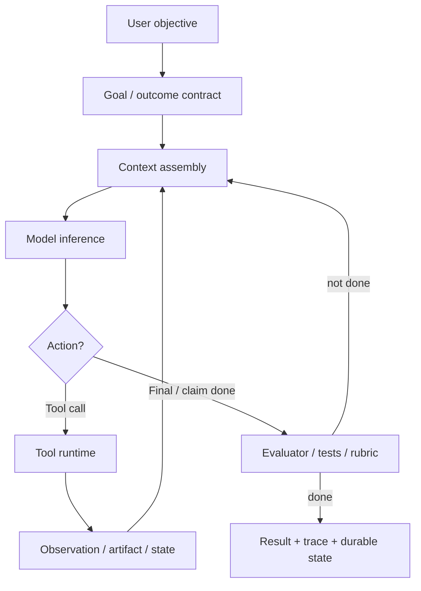
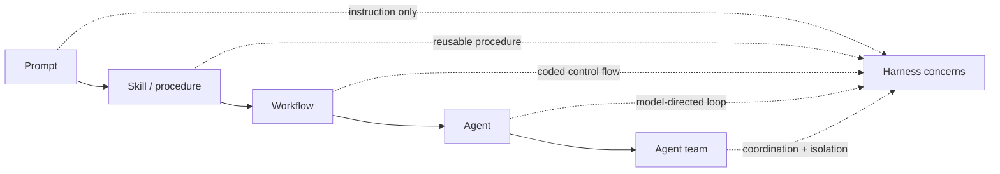
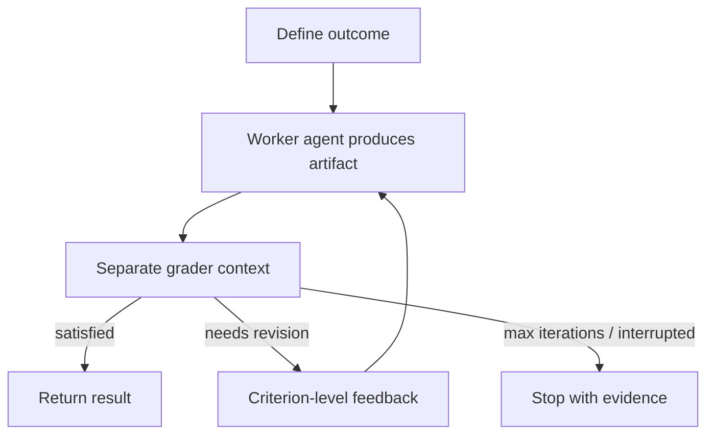

# Harness Engineering Report: Goals, Workflows, and Runtime Control

Date: 2026-06-14
Scope: local project graph, with current official Codex and Claude `/goal`, `/loop`, and workflow docs consulted for the goal-command and loop-engineering sections. Direct excerpts are intentionally short; longer source passages are summarized. Source-paper figures are referenced through local PDF page embeds for private vault analysis rather than copied as standalone images.

## Executive Summary

Harness engineering is the discipline of designing the runtime around a model so it can act reliably. The model is only one part of the agent. The harness assembles context, exposes tools, executes tool calls, records observations, applies permissions, manages memory and compaction, launches subagents, resumes work, traces behavior, and decides when a goal is satisfied.

The local graph already has the central definition: a harness is the runtime layer that turns a model into an acting system by managing the loop, context, tools, memory, execution environment, approvals, traces, compaction, and resumption. See [[operations/agent harnesses]] and [[maps/Harness Tracker]].

The important shift is from prompt-level design to system-level design. Prompt engineering asks how to word the instruction. Context engineering asks what information should enter the model. Harness engineering asks how the whole work loop should run: where state lives, how evidence is produced, what can execute, who or what verifies completion, when humans intervene, and how the system recovers from failure.

Goal-oriented agents fit directly inside harness engineering. A slash goal command is not just a bigger prompt. It is a persistent objective plus a stop condition, evidence standard, continuation policy, and lifecycle controls. Workflows are the control plans that pursue goals. Scheduled loops are the cadence layer that re-enters the harness over time. Outcomes and rubric graders make goals executable. Durable sessions, traces, tests, approvals, and sandboxes make the loop operational.

In shorthand:

```text
goal = objective + evidence standard + stop condition
workflow = executable control plan + workers + state transitions
loop = wake trigger + repeated prompt/workflow + state feedback + stop policy
outcome = goal + rubric + evaluator + repair loop
harness = runtime that makes all of this act, persist, resume, and stay bounded
```

## Thesis

Harness engineering is the new center of gravity for practical agents because capability now depends less on a single prompt and more on the operating substrate around the model.

That substrate determines:

- What the model sees.
- Which tools it can use.
- Which actions need approval.
- How errors and observations return to context.
- Where progress survives context loss.
- How subagents are scoped and coordinated.
- How completion is checked.
- How cost, latency, and safety are bounded.

This is visible across the graph. OpenAI describes the Codex harness as the agent loop and execution logic behind Codex experiences. Anthropic separates workflows, agents, long-running harnesses, and outcome graders. Cursor treats harness changes as product work evaluated with offline and online instrumentation. Cloudflare pushes the harness into durable infrastructure where agent-written plans can become resumable workflows. LangGraph, Deep Agents, OpenHarness, and OpenClaw expose similar ideas as framework/runtime primitives. Ralph shows the minimal local pattern: files, tests, git history, and fresh loops as the harness.

## The Unit of Design

The useful design unit is the loop, not the model call.



This loop is the common object behind Codex, Claude Code, Cloudflare Agents, Managed Agents, LangGraph, Deep Agents, OpenHarness, and Ralph. The products differ in where the control state lives: conversation transcript, local files, git history, workflow script variables, durable object state, event logs, issue tickets, or explicit session schemas.

The report's central definition:

> Harness engineering is the design and operation of the execution scaffold that turns a language model into a bounded, observable, stateful, tool-using system.

That scaffold is not the same as a framework. A framework gives reusable abstractions. A harness is the concrete runtime that closes the loop.

## Evidence Anchors

Short excerpts, kept deliberately brief:

- [[operations/agent harnesses]]: "A harness is the runtime layer"
- [[raw/articles/openai-codex-agent-loop]]: "orchestrating the interaction between the user, the model, and the tools"
- [[raw/articles/cursor-improving-agent-harness]]: "the harness and the model together determine how good the agent is"
- [[raw/docs/anthropic-managed-agents-outcomes-docs]]: "The outcome elevates a session from conversation to work"
- [[raw/docs/claude-code-workflows]]: "A workflow moves the plan into code"
- [[raw/articles/cloudflare-dynamic-workflows]]: "The agent writes the workflow; the platform runs it"

The longer source arguments are summarized in the sections below.

## From Workflows to Agents

Anthropic's [[sources/Anthropic Building Effective Agents]] is the clean baseline. It distinguishes workflows from agents:

- Workflows orchestrate LLMs and tools through predefined code paths.
- Agents let LLMs dynamically direct their own process and tool use.

Harness engineering sits around both. A workflow still needs context, tools, state, permissions, traces, and evaluation. An agent needs those even more because the next step is less predetermined.

The practical distinction is not "workflow bad, agent good." It is: how much control should live in code, and how much should live in the model?



As systems move rightward, harness work increases. More autonomy means more need for boundaries, observability, recovery, and evidence.

## Goal-Oriented Agents

Goal-oriented agents are best understood as a harness pattern, not a model personality.

The user-facing version is the slash goal command. Claude Code's `/goal` sets a completion condition; after each turn, a separate small model checks whether the condition is satisfied and either clears the goal or starts another turn. Codex CLI docs list `/goal <objective>`, `/goal`, `/goal pause`, `/goal resume`, and `/goal clear`; the Codex goals cookbook frames a goal as a measurable outcome, verification surface, constraints, boundaries, iteration policy, and blocked stop condition. Current official docs consulted: [Claude `/goal`](https://code.claude.com/docs/en/goal), [Codex CLI slash commands](https://developers.openai.com/codex/cli/slash-commands), and [Using Goals in Codex](https://developers.openai.com/cookbook/examples/codex/using_goals_in_codex).

The local vault does not yet have dedicated source cards for those exact `/goal` docs. It does have the stronger general pattern through [[sources/Claude Managed Agents Define Outcomes]], [[concepts/outcomes and rubric graders]], and [[methods/ralph loop]].

A goal-oriented harness needs five parts:

| Part | Question | Concrete examples |
|---|---|---|
| Objective | What should become true? | "All auth tests pass"; "produce a cited report"; "empty the issue queue" |
| Evidence | How will the system know? | test output, benchmark result, artifact diff, rubric score, human approval |
| Continuation | What happens if not done? | next turn, retry, replan, subagent fanout, workflow phase |
| Boundaries | What may the agent touch? | files, tools, network, budget, time, model, approvals |
| Stop policy | When should it stop anyway? | done, blocked, unsafe, budget exhausted, max turns |

This makes `/goal` part of harness engineering because the command changes runtime behavior:

- The objective persists outside one prompt.
- Continuation can happen after a turn would otherwise return control.
- Completion is judged against evidence, not just model confidence.
- The goal has lifecycle state: active, paused, resumed, cleared, achieved, or blocked.
- The user gets a control surface for long-running work.

## Loop Engineering

Loop engineering is the next useful label for the same movement from prompt-level steering to runtime-level steering. See [[concepts/loop engineering]] and [[sources/Addy Osmani Loop Engineering]].

The key distinction:

```text
prompt engineering = how to ask
harness engineering = how the model acts
loop engineering = how the acting system is re-entered, corrected, and stopped over time
```

Claude Code's [[sources/Claude Code Scheduled Tasks]] makes this concrete. `/loop` and cron tools rerun prompts inside the current session, can use fixed or model-chosen intervals, can load a default `loop.md`, and carry operational constraints such as seven-day expiry, local timezone scheduling, task IDs, and no catch-up for missed runs.

That means `/loop` belongs in harness engineering. It changes who owns continuation: the user is no longer manually starting every turn. The harness owns the wakeup and the model owns the next iteration. The design problem becomes: what should wake the loop, what evidence should it inspect, what may it touch, and when must it stop?

Loop engineering also clarifies the relation among Ralph, workflows, and durable infrastructure:

| Pattern | Wake trigger | Durable state | Primary risk |
|---|---|---|---|
| Claude `/loop` | local timer inside a session | scheduled task ID, transcript, repo files, `loop.md` | unattended local recurrence without enough verification |
| Claude workflow | user request, command, or `ultracode` | script variables, workflow script, artifacts | high token spend or weak orchestration script |
| Self-improving code loop | benchmark result, evaluator score, or experiment metric | candidate code, traces, archive/database of variants | evaluator hacking or unsafe generated code |
| Cloudflare Dynamic Workflow | event, request, tenant code, or agent-written plan | platform workflow state and routing metadata | durable execution of the wrong plan |
| Ralph loop | human or shell restarts a fresh agent run | specs, plan, tests, commits | local progress against weak specs |

## Outcomes and Rubric Graders

Outcomes are the managed-agent version of goal orientation. In [[raw/docs/anthropic-managed-agents-outcomes-docs]], an outcome has a description, a rubric, and a maximum iteration count. The harness provisions a separate grader context, evaluates the artifact against criteria, and sends gaps back to the worker agent.

This is the clearest bridge between goal commands and harness engineering:



The key design move is separation of concerns. The worker produces. The grader evaluates. The harness loops and stops. That is more robust than asking the same model to decide whether its own work is good enough.

This also aligns with [[sources/Anthropic Demystifying Agent Evals]], which defines an agent harness as the system that processes inputs, orchestrates tool calls, and returns results, while the evaluation harness runs tasks, records steps, grades outputs, and aggregates results.

## Workflows as Control Plans

The new workflow sources added to the vault are well connected to this report.

[[sources/Claude Code Workflows]] shows workflows as JavaScript scripts that orchestrate subagents at scale. The current raw docs distinguish subagents, skills, agent teams, and workflows by who holds the plan:

- Subagents: Claude decides turn by turn.
- Skills: Claude follows instructions.
- Agent teams: a lead agent coordinates peer sessions.
- Workflows: the script decides what runs next.

That is a harness boundary. Moving the plan into code moves state and control out of the conversation context and into an inspectable runtime.

[[sources/Cloudflare Dynamic Workflows]] pushes the same idea into infrastructure. A workflow can be tenant-specific, repo-specific, request-specific, or agent-written. The platform persists the workflow envelope, routes later steps back to the correct dynamic code, retries steps, hibernates during sleeps, and waits for external events such as approval.

The pattern:

```text
Claude workflow: model writes script -> local runtime coordinates subagents
Claude /loop: scheduler wakes prompt -> model checks state -> scheduler repeats or stops
Cloudflare workflow: model/user writes run(event, step) -> durable platform executes it
Ralph workflow: human/agent writes files -> shell loop repeatedly runs coding agent
```

All five are harness engineering because they decide where control, state, and evidence live.

## Ralph as Minimal Harness

The Ralph loop is the smallest complete harness pattern in the graph. See [[methods/ralph loop]] and [[sources/Ralph Playbook]].

Ralph turns an open-ended coding conversation into a restartable loop:

1. Define requirements as files.
2. Generate or update an implementation plan.
3. Start a fresh agent loop from stable files.
4. Pick one bounded task.
5. Investigate, implement, and validate.
6. Update the plan and operational notes.
7. Commit.
8. End the loop so the next run starts clean.

This is harness engineering without a hosted platform. The durable substrate is the repository:

- Specs carry goals.
- `IMPLEMENTATION_PLAN.md` carries workflow state.
- `AGENTS.md` carries project procedure.
- Tests and lints create backpressure.
- Git history records progress.
- Fresh context reduces drift.
- Subagents provide context isolation.

Ralph's risk is also a harness risk: if specs are weak, tests absent, permissions too loose, or plan updates sloppy, the loop can keep moving while optimizing the wrong target.

## Product and Runtime Evidence

| Source | Harness engineering lesson |
|---|---|
| [[sources/OpenAI Codex Agent Loop]] | Codex makes the agent loop explicit: prompt assembly, tool calls, observations, context growth, prompt caching, and compaction. |
| [[sources/OpenAI Unlocking Codex Harness]] | App Server exposes the same Codex harness through stable JSON-RPC primitives, thread persistence, streaming events, approvals, and diffs. |
| [[sources/Anthropic Effective Harnesses for Long-Running Agents]] | Compaction is not enough; long-running work needs initializer/coding roles, progress artifacts, git history, feature lists, and testing tools. |
| [[sources/Anthropic Harness Design Long-Running Apps]] | Separate generator and evaluator contexts, tune the harness, and use external feedback loops for quality. |
| [[sources/Cursor Improving Agent Harness]] | Harness improvement is product engineering: evals, online experiments, model-specific tools/prompts, dynamic context, tool-error monitoring. |
| [[sources/Claude Code Workflows]] | Workflows move orchestration into readable, rerunnable scripts with separate runtime state. |
| [[sources/Claude Code Scheduled Tasks]] | `/loop` and cron tools make recurrence a harness primitive with cadence, expiry, local state, and task management. |
| [[sources/Addy Osmani Loop Engineering]] | Loop engineering names the layer that designs recurring prompt/workflow systems above direct manual prompting. |
| [[sources/Meta-Harness]] | Harness code itself becomes the optimization target: what to store, retrieve, present, and check. |
| [[sources/Darwin Godel Machine]] | Self-improving coding agents can mutate their own scaffold under benchmark feedback, but need sandboxing and objective-hacking controls. |
| [[sources/Anthropic When AI Builds Itself]] | AI-assisted engineering is shifting the bottleneck from implementation to direction-setting, review, validation, and governance. |
| [[sources/Cloudflare Dynamic Workflows]] | Durable infrastructure can run agent-written plans with retries, hibernation, event waits, routing metadata, and sandboxed dynamic code. |
| [[sources/Google ADK Durable Agents]] | Durable agents need explicit state machines and wakeup events, not raw chat replay. |
| [[sources/LangGraph Docs]] | Graph state machines expose durable execution, interrupts, human-in-the-loop, and stateful orchestration. |
| [[sources/LangChain Deep Agents v0.6]] | Production harnesses include code interpreters, typed streams, checkpoint deltas, context backends, and model-specific profiles. |
| [[sources/OpenHarness Docs]] | Harness primitives can be made composable: tools, compaction, streaming, subagents, providers, and middleware. |
| [[sources/OpenClaw Agent Harness Plugins]] | A clean harness boundary can be the low-level executor for prepared agent turns. |
| [[sources/OpenAI Symphony]] | Issue trackers become control planes: one ticket, one workspace, bounded policy, proof of work, review, retry. |

## Research Lineage

The research sources do not usually use the phrase "harness engineering." They still study the same design surface: control flow, verification, memory, workflow search, runtime supervision, and plan isolation.

### AFlow: Search Over Workflows

[[sources/AFlow]] treats workflow design itself as an optimization problem. Rather than hand-design a chain, the system searches over code-represented agentic workflows using execution feedback.

Harness implication: prompts, roles, operators, and edges are not sacred. They are candidates to evaluate and improve.

Relevant local figure pages:

![[raw/papers/AFlow - Automating Agentic Workflow Generation.pdf#page=5]]

![[raw/papers/AFlow - Automating Agentic Workflow Generation.pdf#page=10]]

### Self-Improving Code Loops

[[methods/self-improving code loops]] is the sharper form of loop engineering where the mutable artifact is executable. The loop proposes code or procedure changes, runs an evaluator, records trace and score, then keeps, branches, or reverts the candidate.

[[sources/Meta-Harness]] applies this to harness code itself: context, retrieval, storage, and presentation policy become searchable source code. [[sources/Darwin Godel Machine]] applies it to coding-agent scaffolds with an archive of variants. [[sources/Hyperagents]] extends the idea toward meta-agents that improve the improvement process. [[sources/AlphaEvolve]] applies the loop to algorithms and production infrastructure code. [[sources/The AI Scientist-v2]] applies related agentic tree search to research hypotheses, experiments, figures, and manuscripts.

Harness implication: once the harness can improve executable artifacts, evaluator quality becomes the safety boundary. The system needs sandboxing, provenance, rollback, budget caps, and adversarial checks for metric hacking.

Relevant local figure pages:

![[raw/papers/Meta-Harness - End-to-End Optimization of Model Harnesses.pdf#page=1]]

![[raw/papers/Darwin Godel Machine - Open-Ended Evolution of Self-Improving Agents.pdf#page=3]]

![[raw/papers/AlphaEvolve - A coding agent for scientific and algorithmic discovery.pdf#page=2]]

### Voyager: Procedural Memory and Self-Verification

[[sources/Voyager]] predates the current harness vocabulary, but it has many of the pieces: automatic curriculum, executable skill library, code-as-action, environment feedback, and self-verification.

Harness implication: a capable agent needs a loop that turns experience into reusable procedures, not just a prompt that asks it to try harder.

Relevant local figure pages:

![[raw/papers/Voyager - An Open-Ended Embodied Agent with Large Language Models.pdf#page=2]]

![[raw/papers/Voyager - An Open-Ended Embodied Agent with Large Language Models.pdf#page=4]]

### Plan-Then-Execute: Human Review and Trust

[[sources/Plan-Then-Execute]] shows the human side of harness design. Plan-first interfaces let users inspect and edit the plan before execution, but they also create trust and cognitive-load tradeoffs.

Harness implication: planning is not only a reasoning tactic. It is a user interface, approval surface, and risk-control boundary.

Relevant local figure page:

![[raw/papers/Plan-Then-Execute - User Trust and Team Performance with LLM Agents.pdf#page=1]]

### Web Plan-Then-Execute: Security Boundary

[[sources/Web Agents Plan-Then-Execute]] argues that web agents should avoid exposing action selection to untrusted page content. The plan is committed before execution; untrusted content is processed through bounded routines rather than allowed to redirect control flow.

Harness implication: workflow structure can be a prompt-injection defense. The safer pattern is not "tell the model to ignore malicious content," but reduce the runtime authority of untrusted observations.

Relevant local figure page:

![[raw/papers/Web Agents Should Adopt the Plan-Then-Execute Paradigm.pdf#page=2]]

### SupervisorAgent: Runtime Supervision

[[sources/Stop Wasting Your Tokens]] introduces runtime supervision for multi-agent systems. A supervisor watches high-risk interactions, intervenes selectively, reduces waste, and limits error propagation.

Harness implication: not every agent output should flow freely into the shared state. Runtime control can filter, correct, silence, or escalate.

Relevant local figure pages:

![[raw/papers/Stop Wasting Your Tokens - Towards Efficient Runtime Multi-Agent Systems.pdf#page=2]]

![[raw/papers/Stop Wasting Your Tokens - Towards Efficient Runtime Multi-Agent Systems.pdf#page=5]]

### VeriMAP: Planning with Checkability

[[sources/VeriMAP]] makes verification part of the plan. The planner decomposes tasks into subtasks with structured named I/O and verification functions. Executors produce structured outputs; verifiers check them; coordinators manage contexts and replanning.

Harness implication: plans should specify how their outputs will be checked. Verification should not be bolted on after the fact.

Relevant local figure pages:

![[raw/papers/VeriMAP - Verification-Aware Planning for Multi-Agent Systems.pdf#page=3]]

![[raw/papers/VeriMAP - Verification-Aware Planning for Multi-Agent Systems.pdf#page=7]]

## The Harness Engineering Stack

The graph suggests this stack:

| Layer | Design question | Common failure if missing |
|---|---|---|
| Goal / outcome | What does done mean? | Premature completion or endless wandering |
| Workflow / control | Who decides next action? | Repeated ad hoc turns and lost plan state |
| Context | What enters the model now? | Context rot, omission, or stale evidence |
| Tools | What can the model do? | Ambiguous actions, brittle calls, bad observations |
| State / memory | What persists outside context? | Restart amnesia and transcript replay |
| Runtime | Where does code execute? | Unsafe host access, unreproducible behavior |
| Permissions | What needs approval? | Hidden high-impact actions |
| Observability | What can operators inspect? | No way to debug or audit |
| Evaluation | How is success checked? | Model self-satisfaction instead of evidence |
| Cost controls | What bounds spend and latency? | Unbounded subagents, retries, and token waste |

The same stack can be used to compare products:

- Codex emphasizes local/cloud coding loop, tools, compaction, App Server, approvals, and thread state.
- Claude Code emphasizes coding harness, subagents, worktrees, workflows, goals, and skills.
- Cloudflare emphasizes durable infrastructure, dynamic code, hibernation, sandboxing, and event waits.
- Cursor emphasizes model-specific harness tuning, dynamic context, evals, and production telemetry.
- LangGraph and Deep Agents emphasize explicit graph state, durable execution, typed streams, checkpoints, and human-in-the-loop.
- Ralph emphasizes simple files, tests, commits, and fresh loops.

## Design Principles

### 1. Make the Goal Operational

A goal should be a contract, not aspiration.

Weak:

```text
Improve the service.
```

Stronger:

```text
Reduce p95 checkout latency below 120 ms, verified by the checkout benchmark, while keeping the correctness suite green. Stop after 10 failed attempts or if the benchmark cannot run, and report evidence plus the blocker.
```

### 2. Put State Where It Belongs

Do not make the transcript carry everything. Use the right state carrier:

- Conversation context for immediate reasoning.
- Files for project facts and durable work plans.
- Git for recoverable progress.
- Workflow variables for orchestration state.
- Event logs for audit and replay.
- Memory stores for cross-session facts and procedures.
- Issue trackers for durable work units.

### 3. Separate Worker and Judge

When quality matters, make the evaluator separate from the generator. Use tests, static analysis, model rubrics, human review, or dedicated verifier agents depending on the work.

This is the shared point behind outcomes, evaluator-optimizer workflows, VeriMAP, Anthropic evals, Cursor evals, and Ralph backpressure.

### 4. Treat Tools as Product Surface

Tool definitions, errors, schemas, permissions, and observations shape behavior as much as prompts do. Bad tools produce bad trajectories. Good tools make recovery possible.

### 5. Prefer Durable Artifacts to Hidden Memory

If future agents need it, write it down somewhere inspectable. Long-running harnesses work because agents can read progress files, tests, feature lists, commits, and issue state. Opaque memory can help, but it should not be the only source of truth.

### 6. Bound Autonomy Explicitly

Autonomy without a stop policy is not a harness. Bound it by evidence, budget, time, turns, approvals, tool allowlists, workspace isolation, and human review.

## Failure Modes

| Failure | What it looks like | Harness countermeasure |
|---|---|---|
| Prompt-only goals | Agent says it is done without proof | Evidence standard, tests, rubric, status view |
| Context rot | Old errors and stale outputs pollute decisions | compaction, clearing, retrieval, fresh loops |
| Restart amnesia | New session cannot tell what happened | progress files, git history, durable state |
| Unbounded retries | Agent keeps trying plausible fixes | turn/time/budget clauses and blocked state |
| Tool ambiguity | Model calls wrong or underpowered tools | better tool schema, errors, affordances |
| Hidden high-impact action | Agent changes external state silently | permissions, approvals, sandbox policy |
| Multi-agent noise | More agents increase cost and disagreement | orchestration, routing, supervision, dropout |
| Self-judging leniency | Generator accepts weak output | separate evaluator or deterministic checks |
| Workflow drift | Plan changes after seeing untrusted input | plan-then-execute, quarantined data processing |
| Source-of-truth drift | Memory contradicts files or tickets | provenance, supersession, explicit state schema |

## Where "Harness Engineering" Starts and Ends

Harness engineering includes:

- The agent loop.
- Prompt and context assembly.
- Tool schema, execution, and result handling.
- Sandboxes, worktrees, containers, and remote environments.
- Permissions, approvals, hooks, and policies.
- Memory, compaction, pruning, and retrieval.
- Workflows, subagents, teams, and routing.
- Durable sessions, event logs, and wakeup mechanisms.
- Evaluators, tests, rubrics, traces, dashboards, and replay.
- Cost, latency, and resource controls.

It does not include every aspect of agent development. Model training, dataset curation, product UX, and business process design matter, but they become harness engineering only when they control the runtime loop around the model.

## Practical Checklist

For any serious agent workflow, ask:

1. What is the goal, and what evidence proves it?
2. What happens when the evidence says "not yet"?
3. What is the max turn, time, cost, or risk boundary?
4. Which state is in context, and which state is durable?
5. What can be re-fetched instead of remembered?
6. Which tools are available, and what errors do they return?
7. Which actions need human approval?
8. What sandbox or workspace boundary contains execution?
9. How are subagents isolated and coordinated?
10. How are traces, artifacts, and decisions inspected later?
11. How does the system resume after crash, context loss, or human delay?
12. Which evaluator decides done?

If those questions are unanswered, the system is probably still a prompt demo, not an engineered harness.

## Gaps in the Current Vault

- Exact local source cards for Codex `/goal` and Claude Code `/goal` are absent. The report cites current official docs externally.
- The vault has many later sources that reference ReAct-style loops, but it does not appear to have dedicated source cards for ReAct, Reflexion, or Self-Refine. Those would help complete the methodology lineage.
- There is no standalone `concepts/harness engineering.md`; the concept currently lives across [[operations/agent harnesses]], [[maps/Harness Tracker]], and this report.
- The OpenAI "harness engineering" page referenced by the Symphony README is not yet curated as a source card.
- The source-paper figure pages are embedded through local PDFs. If this report is exported publicly, redraw the figures as original diagrams or check rights before distribution.
- The graph has strong product evidence and strong MAS workflow-search evidence, but fewer papers that explicitly name "harness" as a term. The report therefore treats harness engineering as a synthesis across runtime, orchestration, eval, context, and infrastructure sources.

## Bibliography

Core vault anchors:

- [[operations/agent harnesses]]
- [[operations/agent infrastructure]]
- [[operations/durable sessions]]
- [[operations/permissions]]
- [[operations/sandboxes]]
- [[operations/agent observability]]
- [[operations/agent evals]]
- [[operations/worktree isolation]]
- [[maps/Harness Tracker]]
- [[maps/What Makes Agent Systems Better]]
- [[maps/Recent Agent Operating Concepts]]
- [[maps/Context Management Map]]
- [[claims/Claim - Harnesses tools and context are core agent performance levers]]
- [[claims/Claim - Runtime control and verification improve agent reliability]]
- [[concepts/agent operating surfaces]]
- [[concepts/tool use]]
- [[concepts/outcomes and rubric graders]]
- [[concepts/loop engineering]]
- [[methods/ralph loop]]
- [[methods/multi-agent orchestration]]
- [[methods/runtime supervision]]
- [[methods/agentic workflow search]]

Product and runtime sources:

- [[sources/OpenAI Codex Agent Loop]]
- [[sources/OpenAI Unlocking Codex Harness]]
- [[sources/OpenAI Symphony]]
- [[sources/Anthropic Building Effective Agents]]
- [[sources/Anthropic Effective Harnesses for Long-Running Agents]]
- [[sources/Anthropic Harness Design Long-Running Apps]]
- [[sources/Anthropic Demystifying Agent Evals]]
- [[sources/Claude Managed Agents Define Outcomes]]
- [[sources/Claude Code Workflows]]
- [[sources/Claude Code Scheduled Tasks]]
- [[sources/Addy Osmani Loop Engineering]]
- [[sources/Meta-Harness]]
- [[sources/Darwin Godel Machine]]
- [[sources/Hyperagents]]
- [[sources/AlphaEvolve]]
- [[sources/The AI Scientist-v2]]
- [[sources/Anthropic When AI Builds Itself]]
- [[sources/Claude Code Agent Teams]]
- [[sources/Anthropic Claude Code Worktrees]]
- [[sources/Cloudflare Dynamic Workflows]]
- [[sources/Cloudflare Project Think]]
- [[sources/Anthropic Managed Agents]]
- [[sources/Anthropic Managed Agents Dreaming Outcomes]]
- [[sources/Cursor Improving Agent Harness]]
- [[sources/Cursor Scaling Long-Running Autonomous Coding]]
- [[sources/Cursor Multi-Agent Kernels]]
- [[sources/Google ADK Durable Agents]]
- [[sources/LangGraph Docs]]
- [[sources/LangChain Deep Agents v0.6]]
- [[sources/OpenHarness Docs]]
- [[sources/OpenClaw Agent Harness Plugins]]
- [[sources/Ralph Playbook]]

Research sources:

- [[sources/AFlow]]
- [[sources/Meta-Harness]]
- [[sources/Darwin Godel Machine]]
- [[sources/Hyperagents]]
- [[sources/AlphaEvolve]]
- [[sources/The AI Scientist-v2]]
- [[sources/Voyager]]
- [[sources/Plan-Then-Execute]]
- [[sources/Web Agents Plan-Then-Execute]]
- [[sources/Stop Wasting Your Tokens]]
- [[sources/VeriMAP]]
- [[sources/AgentFlow]]
- [[sources/PEAR]]
- [[sources/AgentDropout]]
- [[sources/Why Do Multi-Agent LLM Systems Fail]]
- [[sources/The Orchestration of Multi-Agent Systems]]

External current docs consulted:

- [Claude Code `/goal`](https://code.claude.com/docs/en/goal)
- [Codex CLI slash commands](https://developers.openai.com/codex/cli/slash-commands)
- [Using Goals in Codex](https://developers.openai.com/cookbook/examples/codex/using_goals_in_codex)
