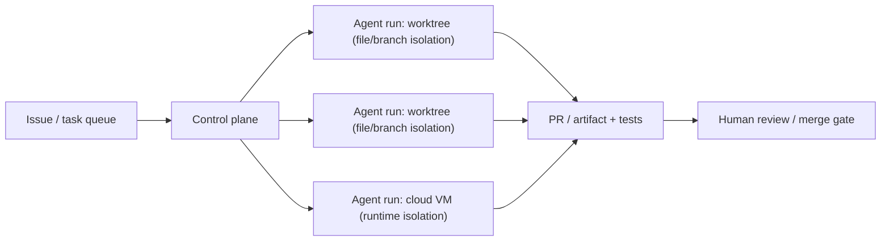
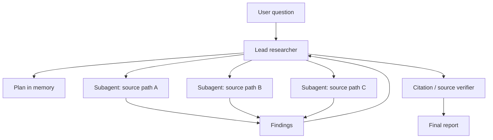
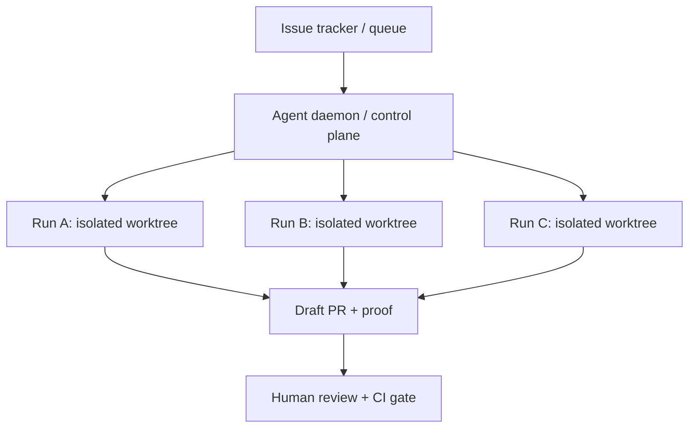
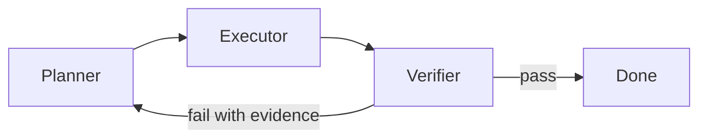
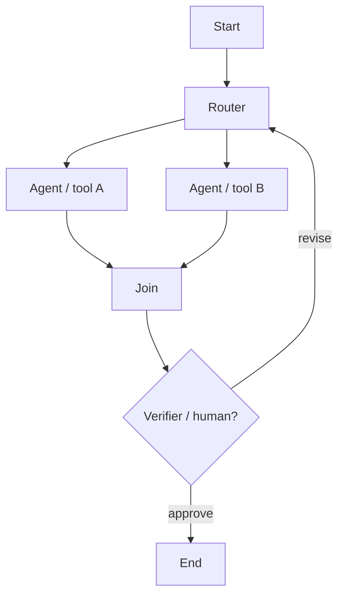
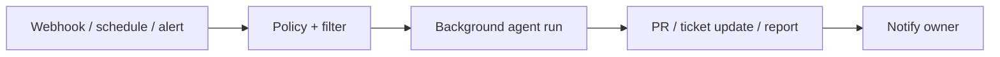

# Multi-Agent Report: Architectures, Evidence, and 2026 Build Patterns

Date: 2026-07-05
Scope: local project graph plus official vendor/product pages as captured in the vault's source cards. Originally written 2026-06-03; revised 2026-07-05 against the rebuilt 471-source graph, folding in the scaling-science measurements, the Cognition and Cursor production positions, the settled aggregation evidence, and the mid-2026 platform landscape. Strong recency bias: 2026 product systems and 2025-2026 papers are weighted above earlier role-play and debate-era systems. Direct excerpts are intentionally short; longer source arguments are summarized. Source-paper figures are embedded as local PDF page references for vault analysis; for public distribution, verify paper licenses or redraw the figures. The generated architecture image set is a local working asset and is not part of the public vault.

## Executive Summary

In 2026, a production multi-agent system is a harnessed workforce: isolated agent sessions, durable state, task queues, worktrees or sandboxes, explicit verification, and human review. The architecture that matters most is often not the conversational topology; it is the operating substrate that lets many agent loops run without corrupting context, code, credentials, or each other. That substrate has itself become a product layer since the original draft: GitHub Agent HQ orchestrates coding agents from rival vendors inside one control plane ([[sources/GitHub Agent HQ]]), Google Antigravity ships a dedicated manager surface for spawning and observing asynchronous agents ([[sources/Google Antigravity]]), Anthropic's Managed Agents expose shared memory stores and a session event stream as beta API primitives ([[sources/Claude Managed Agents Memory Stores]], [[sources/Claude Managed Agents Session Event Stream]]), and Factory and Microsoft extend the harness to organization-level software factories, with scale claims that are vendor-reported ([[sources/Factory 2.0 Software Factory]], [[sources/Microsoft Agentic Platform Agent Factory]]).

The most reliable systems use multi-agent execution when the task has at least one of these properties:

- **Breadth**: many independent search, reading, or data-gathering paths.
- **Isolation**: subagents can work in separate context windows, repositories, files, VMs, or worktrees.
- **Specialization**: roles need different tools, prompts, permissions, or models.
- **Verification**: progress can be judged by tests, citations, benchmarks, rubrics, CI, or human approval.
- **Durability**: work spans more than one foreground chat turn and needs resume, audit, or scheduling.

Architecture selection is task-conditional and measured. Across 260 configurations on six benchmarks, relative performance against one agent spans +80.8% (decomposable financial reasoning under centralized coordination) to -70.0% (sequential planning under independent agents); independent agents amplify trace-level errors 17.2x while centralized coordination contains amplification to 4.4x; and coordination pays until a single agent reaches roughly 0.45 accuracy, after which returns diminish or turn negative ([[sources/Towards a Science of Scaling Agent Systems]]). Controlled comparisons agree: fixed multi-agent workflows often trail matched single-agent setups under a normalized protocol, while runtime-generated workflows can help on harder tasks ([[sources/Do More Agents Help]]).

Production evidence sharpened in both directions. Cognition keeps writes single-threaded and reports the added agents paying off as intelligence: a clean-context Devin Review loop catches about 2 bugs per PR, 58% of them severe, on Cognition's own telemetry ([[sources/Cognition Multi-Agents Whats Actually Working]]). Cursor holds the opposite position at fleet scale, with vendor-reported runs of hundreds of concurrent agents writing under recursive planner ownership ([[sources/Cursor Scaling Long-Running Autonomous Coding]]). The other strong production anchors stand: Anthropic Research's lead/subagent system, Kimi Agent Swarm, Claude Code agent teams, Devin managing Devins, OpenAI Symphony and Codex worktrees/subagents, the GitHub Copilot coding agent, Google ADK durable agents, and aggregation shipping as research infrastructure in OpenRouter Fusion ([[sources/OpenRouter Fusion Beats Frontier]]).

The research layer supplies the selection thresholds. Topology matters, but not by itself: [[sources/MultiAgentBench]] makes coordination protocol a measured variable, [[sources/Multi-Agent Design - MASS|MASS]] reports that prompts frequently dominate multi-agent performance, and [[sources/BAMAS]] and [[sources/MasRouter]] make cost-aware topology/model/role selection first-class. [[sources/Why Do Multi-Agent LLM Systems Fail|MAST]] remains the main task-failure taxonomy, now paired with Microsoft's adversarial complement ([[sources/Microsoft Taxonomy of Failure Modes in AI Agents]]), and [[sources/Multi-Agent Teams Hold Experts Back]] shows self-organizing teams can fail to match their strongest member. Debate and voting carry an entry criterion: beat self-consistency at matched compute ([[sources/Should We Be Going MAD]], [[sources/Stop Overvaluing Multi-Agent Debate]]), and since model votes correlate — on one leaderboard dataset, models agree 60% of the time when both err ([[sources/Correlated Errors in Large Language Models]]) — execution-grounded checks remain the only independent verifier.

Short version:

```text
measure the single-agent baseline first
use more agents when you can split the work, isolate the context, and verify the result
avoid more agents when work is tightly sequential, tool-heavy, same-file, or unverifiable
```

## Core Thesis

Architecture selection in 2026 runs through operational questions:

```text
What work should be split?
Who owns each split?
How do the agents communicate?
Where does shared state live?
What verifies each handoff?
What stops the system?
What makes the run recoverable?
```

The 2024 generation emphasized role-play — designer, engineer, tester, reviewer personas with scripted phases — and explored coordination that way. The systems useful in 2026 production run on operational control:

- one session per issue, task, branch, document, or research thread;
- separate context windows and filesystem/sandbox boundaries;
- task queues, locks, mailboxes, progress files, and governed shared memory;
- code-based orchestration when deterministic control matters;
- LLM-based delegation only when the task structure is open-ended;
- single-threaded writes unless workspaces are isolated;
- evaluators with real authority, clean-context reviewers, tests, human approvals, and audit logs;
- cost-aware routing and dropout instead of unbounded agent multiplication.

The revision hardens this thesis from measurement and from production. Measurement first: task structure decides the sign of the coordination benefit, error containment is architectural, and coordination saturates once the single agent is already strong ([[sources/Towards a Science of Scaling Agent Systems]]). Production second: the vendor that wrote the canonical case against multi-agents now ships multi-agent shapes around a single-writer core ([[sources/Cognition Dont Build Multi-Agents]], [[sources/Cognition Multi-Agents Whats Actually Working]]), while Cursor's fleet-scale runs show that where verification is cheap, many writers can share a branch under recursive planner ownership ([[sources/Cursor Scaling Long-Running Autonomous Coding]]). Chains, role teams, debate, voting, and group chat survive as components inside this larger harness, with entry criteria attached: the workflow patterns descend from the workflow-versus-agent distinction in [[sources/Anthropic Building Effective Agents]], and a debate or voting layer earns its place by beating self-consistency at matched compute ([[sources/Stop Overvaluing Multi-Agent Debate]]).

## Architecture Map

The generated architecture images are local working assets and are not part of the public vault. The textual taxonomy below preserves the same pattern IDs without depending on those SVG files. The strongest 2026 product evidence concentrates around `03 Fan-out / Gather`, `04 Hub-and-Spoke`, `08 Planner-Executor-Verifier`, `12 Message Bus`, `15 Dynamic DAG / Graph Workflow`, `20 Human-in-the-Loop Gate`, `21 Issue-Tracker Control Plane`, `24 Runtime Supervisor / Monitor`, `25 Durable Harness / Runtime`, `26 Independent Parallel`, and `29 Centralized Swarm`. `30 Ralph Loop` is included as a practical coding-agent loop pattern rather than a multi-agent topology. The 30 active patterns should be read across two axes. Both extend the workflow-versus-agent distinction in [[sources/Anthropic Building Effective Agents]]: workflows orchestrate LLMs and tools through predefined code paths, while agents dynamically direct their own processes.

| Axis | Question | Examples |
|---|---|---|
| **Topology** | Who talks to whom? | chain, hub-and-spoke, hierarchy, graph, selector group chat, blackboard |
| **Operating mode** | What starts and sustains work? | foreground chat, background task, event-driven webhook, scheduled job, issue queue |

The 2026 vendor counterpart is Anthropic's coordination-patterns taxonomy, which maps five of these patterns — generator-verifier, orchestrator-subagent, agent teams, message bus, shared state — to entry criteria and separates persistent agent teams from one-shot subagent delegation ([[sources/Anthropic Multi-Agent Coordination Patterns]]). Topology boundaries need not follow personas: Google's ADK/A2A reference pipeline splits agents along language and runtime boundaries instead, a Python extraction agent and a Go compliance validator running as distributed services with explicit state transitions and fail-safe human review ([[sources/Google ADK A2A Cross-Language Multi-Agent Team]]).

Some patterns deliberately sit outside pure topology. Ralph loop, issue-control plane, runtime supervisor, and durable harness are harness patterns: they describe how the run is bounded, resumed, supervised, or triggered, not just how agents exchange messages. The recursive end of this axis now has a research name: in [[sources/Recursive Agent Harnesses]], a parent agent generates scripts that spawn full subagent harnesses in parallel, each carrying tools, filesystem access, code execution, and planning rather than a bare model call. One level up, Factory frames an organization-wide software factory whose loop turns external signals into planned changes and feeds monitoring back into new work signals ([[sources/Factory 2.0 Software Factory]], vendor-reported).

The "Background Agents" graphic from ONA belongs mostly to the second axis:

| ONA mode | Meaning | Closest local designs | 2026 evidence |
|---|---|---|---|
| **Swarms** | Many agents converge on one result from multiple angles. | `03 Fan-out / Gather`, `26 Independent Parallel`, `27 Voting / Ensemble`, sometimes `04 Hub-and-Spoke` | Kimi Agent Swarm; Cursor `/best-of-n`; Anthropic parallel Claude compiler prototype |
| **Fleets** | Many agents do independent background work across issues, repos, or workspaces. | `21 Issue-Tracker Control Plane`, `25 Durable Harness`, `06 Persistent Team` | Devin managing Devins; OpenAI Symphony; Codex/Cursor/GitHub background coding agents; [[sources/Google Antigravity|Google Antigravity Manager surface]] |
| **Event-driven** | Agents start from PR events, CI failures, Slack, alerts, webhooks, APIs. | `12 Message Bus`, `21 Issue-Tracker Control Plane`, `24 Runtime Supervisor` | GitHub Copilot cloud agent integrations; Devin Automations; Google ADK event/dormancy patterns |
| **Scheduled** | Agents run on recurring maintenance or audit cadence. | `25 Durable Harness`, `21 Issue-Tracker Control Plane`, `24 Runtime Supervisor` | Devin scheduled sessions; Google Jules scheduled tasks; [[sources/OpenAI Codex Automations|Codex automations]] |

Scheduled recurrence carries its own design choice ([[sources/OpenAI Codex Automations]]; see Recipe E). The practical lesson of the table: a working 2026 "swarm" is fan-out/gather or independent parallel work under a harness that can isolate sessions and compare outcomes.

## What Works by Task

| Task shape | Best architectures | Why it works | Evidence | Main risk |
|---|---|---|---|---|
| Broad research and intelligence gathering | Hub-and-spoke, fan-out/gather, independent parallel, shared state | Subagents explore independent source paths in separate context windows, then return compressed findings | [[sources/Anthropic Multi-Agent Research System]], [[sources/Kimi Agent Swarm]] | Token burn, duplicate searches, citation drift; trained single-agent researchers are a competing path |
| Large-scale web/data collection | Swarm/fan-out, issue-control plane, durable harness | Parallel agents collect, categorize, summarize, and produce artifacts | [[sources/Kimi Agent Swarm]] | Quota/cost, false aggregation, source quality |
| Autonomous coding across independent issues | Issue-control plane, worktree fleet, planner-executor-verifier, human gate | One workspace per task, CI/test proof, PR review, human merge | [[sources/OpenAI Symphony]], [[sources/OpenAI Codex App Worktrees]], [[sources/Devin Manages Devins]], [[sources/Cursor 3.2]], [[sources/GitHub Copilot Coding Agent]] | Merge conflicts, low-quality passing tests, review bottleneck |
| Long-running coding in one large codebase | Persistent team, task locks, durable harness, runtime supervisor | Agents loop through tasks, coordinate via files/locks, and keep progress artifacts | [[sources/Anthropic Parallel Claudes C Compiler]], [[sources/Claude Code Agent Teams]], [[sources/Cursor Scaling Long-Running Autonomous Coding]], [[sources/Cursor Agent Swarm Model Economics]] | Same-bug pileups, context pollution, unreviewed complexity |
| Measurable optimization | Parallel search, planner-worker, tournament, evaluator loop | Agents can try many variants and use benchmark feedback as objective signal | [[sources/Cursor Multi-Agent Kernels]], [[sources/AFlow]] | Metric overfit, cheating evaluator, expensive search |
| Scientific hypothesis generation | Supervisor plus specialized agents, debate/tournament, ranking/evolution | Specialized roles generate, critique, rank, evolve, and meta-review hypotheses | [[sources/AI Co-Scientist]], [[sources/Google AI Co-Scientist Article]] | Hypothesis plausibility without real validation |
| Customer support / enterprise routing | Router, handoff, agents-as-tools, hierarchy | Clear request classes and specialist agents | [[sources/OpenAI Agents SDK Docs]], [AWS Bedrock multi-agent collaboration](https://docs.aws.amazon.com/bedrock/latest/userguide/agents-multi-agent-collaboration.html), [[sources/Google ADK Multi-Agent Patterns]] | Silent misrouting, policy gaps, inconsistent memory |
| High-risk or irreversible work | Planner-executor-verifier, human gate, runtime supervisor | The system pauses or rejects unsafe steps before execution | [[sources/Magentic-UI]], [[sources/OpenAI Agents SDK Docs]], [[sources/Google ADK Multi-Agent Patterns]], [[sources/Plan-Then-Execute]] | Human bottleneck, rubber-stamp approvals |
| Open-ended self-organizing group deliberation | Selector group chat, debate, round-robin | Useful for idea generation and critique when outcomes are subjective | [[sources/AutoGen SelectorGroupChat]], [[sources/MultiAgentBench]] | Expert dilution, consensus errors, runaway context |

Task structure decides the sign of the coordination benefit ([[sources/Towards a Science of Scaling Agent Systems]]); sequential or tool-heavy work stays single-agent even when it looks splittable. The research rows carry a competing path: end-to-end trained single research agents compete with fan-out ([[sources/Kimi Researcher]], [[sources/Tongyi DeepResearch Technical Report]]) — fan-out remains the default when breadth across independent sources is the bottleneck; a trained single researcher competes when the task is one deep thread. The rubber-stamp risk in the high-risk row is evidenced rather than assumed ([[sources/Plan-Then-Execute]]; see Recipe C).

## Major Players and Their Architectures

| Player / system | Current architecture signal | How they use it | Best task fit | Status / caveat |
|---|---|---|---|---|
| **Anthropic Research** | Lead researcher plus parallel subagents; memory plan; citation agent | Lead plans, spawns subagents, synthesizes, cites | Breadth-first research with many sources/tools | Production case study; reported +90.2% internal eval and about 15x chat-token use |
| **Anthropic Claude Code Agent Teams** | Team lead, independent teammates, shared task list, mailbox, hooks | Multiple Claude Code sessions coordinate directly | Research/review, independent modules, debugging hypotheses, cross-layer work | Experimental and disabled by default; docs suggest starting with 3-5 teammates |
| **Anthropic parallel compiler prototype** | Independent looping agents, containers, task locks, git sync, tests | 16 agents worked over nearly 2,000 sessions on a compiler | Large decomposable coding with strong tests | Research prototype; expensive and early |
| **OpenAI Agents SDK** | Agents as tools, handoffs, code orchestration, evaluator loops, parallel agents | Build app-level orchestration in Python | Customer support, research apps, deterministic workflows, agent composition | Production SDK; durable execution available through the Temporal integration; evals and state design remain the builder's responsibility |
| **OpenAI Codex / Symphony** | Worktrees, subagents, issue-control plane, isolated runs, proof of work | Turn project tickets into agent runs and reviewed PRs | Software backlogs and maintenance | Symphony is an engineering preview; spec defaults to bounded concurrency and turn limits |
| **GitHub Agent HQ / Copilot** | Multi-vendor orchestration control plane: mission control assigns multiple agents in parallel, branch controls gate CI on agent-created code, agent identity and access management treats agents as team members | Coding-agent sessions start from issues, PRs, the repo Agents tab, VS Code, and mobile; agents run asynchronously and produce reviewable artifacts and draft changes | Repo work across vendors plus org-level allowlists, policy, and audit | Claude and Codex in public preview since 2026-02-04, Business and Pro tiers from 2026-02-26, one premium request per session; Google, Cognition, and xAI integrations announced as underway; reviewer remains responsible |
| **Cursor** | Agents window, worktrees, `/best-of-n`, `/multitask`, long-running cloud/remote sessions; research harness of recursive planners spawning sub-planners plus non-communicating workers, with model-per-role assignment | Run many agents across repos/environments and compare results; fleet runs push to one branch under planner ownership | Parallel coding, background work, measurable optimization, week-scale autonomous projects | Product features plus a 38% geomean GPU-kernel case study; research runs report hundreds of concurrent agents writing over 1 million lines of code in close to a week (vendor-reported) |
| **Cognition Devin** | Single-writer core with agents as added intelligence: clean-context Devin Review loop, capability-routed "smart friend" escalation, manager Devin coordinating child Devins over internal MCP; scheduled sessions and automations | Writes stay single-threaded; delegated agents review, escalate, and coordinate rather than co-write | Fleet-style coding, PR review, recurring tasks | Reports about 2 bugs caught per PR, 58% of them severe, and about 8x enterprise usage growth over six months; Cognition telemetry, not independently audited |
| **Factory (Droids)** | Agent-native software factory: Droids for task execution, skills for bounded procedures, automations with objective and memory, Droid Computers for persistent execution, Missions for multi-agent autonomous runs | External signals become planned changes that are built, tested, reviewed, shipped, and monitored, with monitoring feeding back into new signals | Organization-level SDLC loops above per-run fleets | Vendor architecture post; customer and production-readiness claims are vendor-reported |
| **Kimi Agent Swarm** | Commander plus up to 300 specialists; trained orchestrator; context sharding | Horizontal scaling for retrieval, writing, docs, code, office automation | Large-scale search, document processing, long outputs | Beta; reports 4.5x speedup and BrowseComp 15.9% to 33.3% |
| **OpenRouter Fusion** | Server-side parallel model panel with web search/fetch per panel model; judge/synthesizer identifies consensus, contradictions, blind spots, and unique insights | One API call, model slug, server tool, plugin, or chatroom fans a prompt across the panel and grounds the final answer in the judge analysis | Deep research and question answering | Reports a Fable 5 + GPT-5.5 panel at 69.0% on 93 of 100 DRACO tasks (7 content-filtered) and Opus 4.8 fused with itself at 65.5% vs 58.8% solo; FAQ says it is not a drop-in coding-model replacement |
| **Google ADK** | Sequential, routing, delegation, human-in-loop, durable agents with state machines | Builder framework for multi-agent apps | Enterprise workflows, durable/event-driven agents | Framework docs/tutorials; production quality depends on implementation |
| **Google Antigravity** | Editor view plus a Manager surface for spawning, orchestrating, and observing multiple async agents; Artifacts (task lists, plans, screenshots, browser recordings) as verifiable deliverables; agents browser-test their own changes | Users assign work across workspaces and comment on Artifacts like documents while agents run asynchronously | Parallel coding with artifact-first review | Public preview, free for individuals; model-pluralist at launch (Gemini 3 Pro plus Claude Sonnet 4.5 and OpenAI GPT-OSS); Gemini CLI retired into the Antigravity CLI |
| **Google AI Co-Scientist** | Supervisor plus generation/reflection/ranking/evolution/proximity/meta-review agents | Scientific hypothesis generation and refinement | Research ideation and experimental planning | Research/product frontier; requires scientist validation |
| **Microsoft AutoGen / Magentic-One** | Orchestrator with WebSurfer, FileSurfer, Coder, Terminal; selector group chat; internally, an agent-factory platform of lifecycle-spanning agents (planning, development, security, operations, PR review, incident response) with specs as the single source of truth | Generalist multi-agent tasks and framework patterns; internal SDLC agents at company scale | Web/file/code/terminal tasks, demos, benchmarks; enterprise lifecycle automation | Strong research/framework anchor, not a SaaS product by itself; internal scale signals such as AI review over most Microsoft PRs are Microsoft-reported |
| **AWS Bedrock Agents** | Supervisor and supervisor-with-routing multi-agent collaboration | Enterprise agents coordinate specialist collaborators | Enterprise workflows with hosted infra | GA/product docs; exact architecture is managed service |
| **LangGraph** | Graph state machine, durable execution, interrupts, human-in-loop | Low-level framework for stateful workflows and multi-agent graphs | Complex workflows needing explicit state | Production framework; requires engineering discipline |
| **CrewAI** | Crews, flows, role agents, hierarchical manager process | Role-based teams and business workflows | Fast role-team prototyping, SOP-like automation | Product/framework; role design can become ceremony |
| **AgentScope** | Async framework, tool/environment interactions, MCP, sandboxing, deployment | Developer-centric multi-agent application framework | Research and production agent apps | Strong China-origin framework source |

Platform-level control planes are the newest layer in this table: GitHub and Google now ship surfaces that manage agents from rival vendors rather than only their own ([[sources/GitHub Agent HQ]], [[sources/Google Antigravity CLI Transition]]), and Factory and Microsoft extend the harness to organization-level software factories ([[sources/Factory 2.0 Software Factory]], [[sources/Microsoft Agentic Platform Agent Factory]]). The Cognition and Cursor rows carry the two live production positions on parallel writing; see [[sources/Cognition Multi-Agents Whats Actually Working]], [[sources/Cursor Scaling Long-Running Autonomous Coding]], and [[sources/OpenRouter Fusion Beats Frontier]] below.

## What the Product Sources Say

### Anthropic: Multi-Agent Research Works for Breadth

Anthropic's Research system is the clearest public production case for orchestrator-worker research. The lead agent creates a plan, stores that plan in memory, launches subagents with scoped research tasks, receives compressed findings, and passes the final report through a citation agent. The quantitative claims matter. Anthropic reports that its multi-agent research system with Claude Opus 4 as lead and Sonnet 4 subagents outperformed single-agent Opus 4 by 90.2% on an internal research eval. It also reports that token use explains about 80% of BrowseComp performance variance, rising to about 95% when tool calls and model choice are included. In the same accounting, agents use about 4x more tokens than chat interactions and multi-agent systems use about 15x more. The source's own caveat is decisive: coding tasks often have fewer truly parallel subtasks than research, and real-time coordination remains hard. Short source anchors: "separate context windows"; "15x more tokens"; "breadth-first queries."

Sources: [[sources/Anthropic Multi-Agent Research System]], [[sources/BrowseComp]].

Pattern reference: `04 Hub-and-Spoke Orchestrator`. Hub-and-spoke is the right mental model for Anthropic Research: the lead decomposes and synthesizes, while subagents explore separate context paths.

### Anthropic Managed Agents: Shared Memory Becomes a Product Primitive

Shared state across agent sessions is now a shipped API surface rather than homegrown glue. Managed Agents memory stores (beta header `managed-agents-2026-04-01`, launched 2026-04-23) are workspace-scoped document collections mounted at `/mnt/memory/<slug>/` in the session sandbox, with `read_write` or `read_only` access enforced at the filesystem level. The limits are concrete: at most 8 stores per session, 2,000 memories per store, and 100 kB (about 25k tokens) per memory. Concurrent writers resolve through optimistic concurrency, a `content_sha256` precondition on updates with re-read and retry on mismatch, and every mutation creates an immutable version attributed to the writing session, retained 30 days, with a redaction endpoint that scrubs secrets while preserving the audit trail. The recommended namespacing is one read-only shared reference store plus per-user, per-team, or per-project read-write stores, and the docs carry their own injection warning: a shared read-write store lets injected content become trusted memory in later sessions. The launch post cites Rakuten at 97% fewer first-pass errors and Wisedocs at 30% faster verification; both are vendor-reported customer figures ([[sources/Claude Managed Agents Memory Stores]]).

The companion event-stream spec gives the runtime-supervisor pattern a published wire protocol. Mid-turn steering is a two-step interrupt-then-redirect flow (`user.interrupt`, then `user.message`), streams resume by event-ID dedup rather than cursors, delta previews are shed under load while buffered complete events always appear in history, and `span.model_request_end` is the guaranteed close signal even when a turn errors or is interrupted ([[sources/Claude Managed Agents Session Event Stream]]). The same beta surface ships outcomes, a separate rubric-driven grader that checks artifacts and sends repair feedback — the evaluator-with-authority pattern productized — and dreaming, between-session memory consolidation, the step the MANBENCH false-memory measurements say needs verification first ([[sources/Anthropic Managed Agents Dreaming Outcomes]], [[sources/When Agents Misremember Collectively]]). The surface is beta-versioned; names and semantics may change.

### Kimi: Swarm as Horizontal Scaling

Kimi Agent Swarm is the boldest product claim for large-scale agent fan-out. The help center describes a commander plus specialists architecture with up to 300 subagents, more than 4,000 tool calls per task, and about 4.5x faster execution than single-agent sequential execution. It also reports BrowseComp accuracy improving from 15.9% to 33.3% in its setup and critical steps reduced by about 40%.

The important design details are not just the agent count. Kimi emphasizes training the orchestrator rather than the subagents, preventing serial collapse and fake parallelism, and sharding context so subagents keep detailed local notes while returning key conclusions to the commander. This is product evidence for `29 Centralized Swarm`, `03 Fan-out / Gather`, `26 Independent Parallel`, and `04 Hub-and-Spoke`, not strong evidence for a fully decentralized mesh. It is still a commander-led system.

The counterweight comes from the same vendor. Moonshot's earlier Kimi-Researcher (2025-06-24) is a single research agent trained entirely through end-to-end agentic reinforcement learning: 26.9% Pass@1 on Humanity's Last Exam (state of the art at release, up from an 8.6% starting score), 69% pass@1 averaged over 4 runs on xbench-DeepSearch, outperforming models such as o3 with search tools, with an average of 23 reasoning steps and more than 200 URLs explored per task. Its launch page explicitly criticizes prompt-based multi-agent workflows as tied to specific LLM versions and needing frequent manual updates as models or environments change ([[sources/Kimi Researcher]]). One vendor shipping both positions is evidence that trained single-agent research and workflow orchestration are layers to combine rather than rivals. All figures on both pages are vendor-reported.

Sources: [[sources/Kimi Agent Swarm]], [[sources/Kimi Researcher]].

Pattern reference: `29 Centralized Swarm`. Kimi-style swarm is best viewed as controlled fan-out/gather: many workers, one commander, isolated context shards, and compressed return paths.

### Coding Agents: Fleets Need Worktrees, VMs, and Review

The 2026 coding-agent pattern is a fleet, not a chatroom. Cursor, Codex, Devin, GitHub, and Claude Code all expose some version of background sessions, isolated workspaces, task queues, or parallel agents.

OpenAI Symphony is the cleanest control-plane example: it monitors an issue tracker, spawns isolated implementation runs, asks agents to produce proof of work, and expects human review before landing changes. The repository summary is explicit: Symphony lets teams manage work rather than supervise coding agents. It is a trusted-environment engineering preview. The spec's default shape is intentionally bounded: 10 concurrent agents and 20 max turns, which is a useful production lesson even if the exact numbers change.

Devin's managed-Devins pattern is similar at the product level. One main Devin delegates to a team of isolated Devin sessions, monitors progress, resolves conflicts, and compiles results. GitHub Copilot's coding agent runs on reused CI infrastructure: it boots a GitHub Actions VM, clones the repo, analyzes the codebase, and pushes commits to a draft pull request with session logs streaming its reasoning, and it can be started by assigning a GitHub issue to Copilot on github.com, GitHub Mobile, or the CLI, or by prompting from Copilot Chat or VS Code ([[sources/GitHub Copilot Coding Agent]]). Cursor 3.0/3.2 turns the IDE into an agent command center with worktrees, cloud/remote environments, and multiple parallel agent surfaces. Codex is programmable as a control plane in its own right: the App Server protocol exposes `thread/start`, `thread/resume`, `thread/fork`, `turn/start`, and `turn/steer` over JSON-RPC, plus compaction, interruption, and approval requests, so a coordinator can drive worker threads through a stable public surface ([[sources/OpenAI Codex App Server Docs]]).

The isolation vocabulary deserves precision. A git worktree is file/branch isolation, not a runtime or security sandbox; the vendor ladder runs from agent-managed local worktrees (Claude Code, Codex) up to per-agent isolated cloud VMs (Devin), with worktrees isolating file edits while subagents and agent teams coordinate the work ([[sources/Git Worktrees for Agents - Evolution and Vendor Approaches]]).

A platform layer now sits above the individual vendor fleets. GitHub Agent HQ (announced 2025-10-28) makes coding agents from Anthropic, OpenAI, Google, Cognition, and xAI available inside GitHub under paid Copilot subscriptions, with mission control for assigning multiple agents in parallel across GitHub, VS Code, mobile, and CLI, branch controls that gate when CI runs on agent-created code, and identity and access management that treats agents like team members ([[sources/GitHub Agent HQ]]). Claude and Codex became runnable in public preview on 2026-02-04 for Copilot Pro+ and Enterprise, extended to Business and Pro tiers on 2026-02-26; each coding-agent session consumes one premium request under the existing subscription ([[sources/GitHub Agent HQ Claude and Codex]]).

The architecture is:



Sources: [[sources/OpenAI Symphony]], [[sources/OpenAI Codex App Worktrees]], [[sources/OpenAI Codex Subagents]], [[sources/OpenAI Codex App Server Docs]], [[sources/Devin Manages Devins]], [[sources/Cursor 3.2]], [[sources/Cursor 3 Agents Window]], [[sources/GitHub Copilot Coding Agent]], [[sources/GitHub Agent HQ]], [[sources/GitHub Agent HQ Claude and Codex]], [[sources/Git Worktrees for Agents - Evolution and Vendor Approaches]].

Pattern reference: `21 Issue-Tracker Control Plane`. Issue tracker as control plane is the strongest 2026 background-agent pattern for software work.

### Cognition: Single-Writer Multi-Agents That Ship

Cognition wrote the canonical counter-position the fleet pattern has to answer, then narrowed it with production data. "Don't Build Multi-Agents" (2025-06-12) states two principles: share context as full agent traces rather than individual messages, and treat every action as carrying implicit decisions, because parallel writers making conflicting implicit decisions produce bad results. Its conclusion at the time was that a single-threaded linear agent plus context compression is more reliable than parallel subagents. The essay names context engineering the top job of engineers building agents and observes that Claude Code subagents answer questions rather than write in parallel ([[sources/Cognition Dont Build Multi-Agents]]).

The ten-month follow-up (2026-04-22) keeps the single-writer principle and adds the multi-agent shapes that ship around it. Devin Review catches about 2 bugs per PR, roughly 58% of them severe, and the loop works best when the coding and review agents share no context beforehand: a clean-context reviewer escapes the writer's accumulated context rot and reads the diff fresh. Smart-friend escalation routes hard problems to a stronger model, and in cross-frontier Claude-plus-GPT production pairings the delegation logic became a capability router rather than a difficulty escalator. A manager Devin coordinates child Devins over internal MCP. Enterprise Devin usage grew about 8x over six months. Unstructured swarms are judged "mostly a distraction"; the practical shape is "map-reduce-and-manage." All numbers are Cognition telemetry, not independently audited ([[sources/Cognition Multi-Agents Whats Actually Working]]). The follow-up also discounts the headline autonomous-fleet demos, including the Cursor browser and the Anthropic C compiler, as sharing "a simple, verifiable success criterion" that most real software lacks. That is the right frame for the fleet evidence in this report: the largest-scale runs sit where verification is cheap.

### Factory Missions: Ordered Mutation with Adversarial QA

Factory's April 2026 written Missions architecture provides a second operator design that converges on Cognition's single-writer result while packaging it as a long-running orchestrated system. Missions separates an orchestrator, fresh-context workers, and fresh-context validators, with shared mission artifacts carrying state across roles. The article's programmatic runner starts workers for each feature in order; the May talk adds that read-only search, API research, and code review may fan out internally. No comparative error-rate measurement is published ([[sources/Factory How Missions Work]], [[sources/Factory Missions Multi-Agent Architecture Talk]]).

The most important mechanism is the pre-implementation validation contract. During planning, correctness is expressed as assertions and every feature is assigned coverage of those assertions before code exists. After a milestone, a scrutiny validator runs tests, types, lint, and dedicated review agents, while a behavioral validator launches the application and exercises user flows. Failed checks create corrective features rather than being silently absorbed into context. Each worker also emits a structured handoff covering completed and omitted work, commands and exit codes, discovered issues, and procedure compliance.

For the April-May architecture snapshot, this makes Missions a useful middle position between Cognition and Cursor: ordered feature mutation with a durable multi-role control plane and targeted read-only parallelism rather than a large parallel-writer fleet. The article's Slack-clone run lasted 16.5 hours: implementation consumed 60.5% of runtime, validation 37.2%, none of six milestones passed its first validation round, 52.5% of 38.8K generated lines were tests, and statement coverage was 89.25%. The talk separately reports a longest Mission of 16 days. These are vendor-reported case metrics, not controlled or independently audited evidence. Factory's current product page advertises parallel Droid execution, so the ordered runner should be read as a dated architecture description or a particular task granularity, not timeless product behavior.

### Cursor: Hundreds of Agents for Weeks

Cursor's research harness is the largest-scale public evidence for long-running multi-agent coding. Hundreds of concurrent agents on one project wrote over 1 million lines of code across 1,000 files (a web browser from scratch) in close to a week, consuming trillions of tokens, and the refined harness later peaked at about 1,000 commits per hour across 10M tool calls over a week with no human intervention. A Solid-to-React in-place migration took over three weeks with +266K/-193K edits; it was passing Cursor's CI and early checks but, per Cursor, still needed careful review. Ongoing runs include a Java LSP (7.4K commits, 550K LoC), a Windows 7 emulator (14.6K commits, 1.2M LoC), and an Excel implementation (12K commits, 1.6M LoC). Cognition's follow-up cites the same browser at 200k LOC, so treat the scale figures as vendor-reported and disputed ([[sources/Cursor Scaling Long-Running Autonomous Coding]], [[sources/Cursor Self-Driving Codebases]]).

The harness evolution is the lesson. Flat peer self-coordination through a locked shared file failed: twenty agents slowed to the effective throughput of one to three, and with no hierarchy agents became risk-averse and avoided hard tasks. An integrator role for quality control created more bottlenecks than it solved and was removed. A continuous executor holding too many roles (plan, spawn, review, merge, judge) developed pathological behaviors, sleeping randomly and claiming premature completion. The design that worked is a root planner owning the full scope, recursive subplanners owning slices, and workers on their own repo copies that never communicate with other planners or workers, each returning one structured handoff.

The correctness trade-off cuts against verify-everything intuition at fleet scale. Requiring 100% correctness before every commit caused major serialization, pushed workers out of scope, and made many agents pile on and trample each other fixing the same issue; accepting a small constant error rate plus a final "green" branch fixup pass preserved throughput. Model assignment is per-role: GPT-5.2 proved better at extended autonomous work, Opus 4.5 tends to stop earlier and take shortcuts, and GPT-5.2 out-planned GPT-5.1-Codex. Cursor's summary matches this report's thesis: "The harness and models matter, but the prompts matter more."

### Cursor Agent Swarms: Model Economics and Coordination Substrate

Cursor's July 2026 follow-up supplies the missing economics behind its fleet-scale position. On a held-out SQLite rebuild task, the new swarm beat the old swarm in every tested model configuration under the same task and time budget; at four hours, new runs scored approximately 73–85% while old runs ranged from 11–77%, and every new run later reached 100%. Cursor reports this as a vendor-run comparison with manual anti-cheating and implementation-balance checks, not an independent benchmark ([[sources/Cursor Agent Swarm Model Economics]]).

The role economics are the more transferable result. Frontier planners recursively decompose the task while cheaper workers execute narrow leaves, preserving context specialization. Cursor reports similar quality across mixes but costs from about $1,339 for an Opus 4.8 planner with Composer 2.5 workers to $10,565 for GPT-5.5 throughout; workers carry most tokens, while expensive planner tokens can dominate dollars. This supports role-specific model routing, but not a universal planner/worker price ratio.

The architecture also shows why swarm scale is a harness problem rather than an agent-count problem. Cursor reports a purpose-built VCS at approximately 1,000 commits per second, plus design-document references, neutral conflict resolution, megafile decomposition, intentional-breakage comments, decorrelated review lenses, and an agent-owned Field Guide. These mechanisms address split-brain design, planner contention, merge conflicts, file-size hotspots, ossification, and knowledge transfer. The old-versus-new comparison is promising but does not isolate which mechanism produced the gain or establish that the reported economics transfer beyond Cursor's environment.

The coordination diagnostics make that caveat concrete. In the Grok comparison, the old harness generated 68,000 commits in its first two hours—about 70 times the new pace—and more than 70,000 conflicts before it was stopped, versus fewer than 1,000 conflicts across the new run's four hours. Its hottest file accumulated 7,771 conflicts from 1,173 agents, versus 47 under the new harness; it sprawled to 54 crates, including three SQL packages, while the new run stabilized at nine. In the Fable mix both harnesses reached 100%, but the engine shrank from 64,305 to 9,908 lines under the new harness. Those are stronger signals of reduced coordination waste than commit count alone, but remain vendor measurements from a bundled intervention.

Verifier placement is now visibly task-shape-dependent across vendors. MiniMax's Agent Team embeds an adversarial Verifier whose failed checks wake the producing node for revision ([[sources/MiniMax Agent Team]]; partial capture, bot-blocked source), Cursor removed both its judge and its integrator as bottlenecks, and Cognition runs verification as a separate clean-context loop after the write. Where verification authority sits is a design decision the task shape has to justify, not a fixed rule.

### Claude Code Agent Teams: Peer Communication Is Powerful but Expensive

Claude Code's agent-team docs explicitly separate subagents from teammates. Subagents have their own context but only report back to the caller. Agent-team teammates are independent Claude Code sessions, can message each other directly, share a task list, and run with lead coordination.

The docs' use-case guidance is pragmatic: teams are strongest for research/review, new modules, competing debugging hypotheses, and cross-layer coordination. They are weaker for sequential work, same-file edits, and tightly dependent tasks. They also cost more than subagents because every teammate is a separate Claude instance. The recommended starting shape is small: 3-5 teammates, with roughly 5-6 tasks per teammate before coordination overhead and diminishing returns dominate. The architecture is not just "many agents." It includes a team lead, teammates, task list, mailbox, task dependencies, file locks for task claiming, plan approval for teammates, and hooks for quality gates.

Daisy Hollman's May 2026 Claude Code workshop supplies the day-to-day operating model around those primitives. She reports using long-lived worktrees with persistent agent identities, direct agent messaging where contexts should share information, `/loop` for polling slow CI and continuing repair, Auto Mode for automated permission decisions with an adversarial check, and a multi-session view plus remote control for supervising working and blocked sessions. The explicit human problem is context-switching latency: asynchronous parallel agents only create leverage if the operator can rapidly recover the identity, state, and next decision of each stream. The same talk makes context loading an architecture choice across MCP, Skills, Hooks, and Agents; its prior vault summary incorrectly substituted CLAUDE.md for Agents and has been corrected ([[sources/Context Engineering MCP CLAUDE-md Skills Hooks Talk]]).

The same harness substrate is product-portable beyond coding. Claude Cowork (research preview 2026-01-12, GA 2026-04-09) re-ships the Claude Code harness for general knowledge work: per Simon Willison's same-day teardown, it runs in a containerized VM with user-granted folders mounted inside the sandbox perimeter, approval gates before significant actions, scheduled recurring tasks, and MCP connectors. The harness-reuse details are observed-at-launch findings from an external teardown, not vendor documentation.

Sources: [[sources/Claude Code Agent Teams]], [[sources/Context Engineering MCP CLAUDE-md Skills Hooks Talk]], [[sources/Claude Cowork Research Preview]].

Pattern reference: `06 Persistent Team Workforce`. Peer teams are valuable when teammates need to communicate and own separate work, but they add coordination overhead.

### Anthropic C Compiler: Parallel Agents Need Better Harnesses Than Prompts

Anthropic's C compiler experiment is one of the strongest 2026 examples of autonomous agent-team coding. The source reports 16 agents, nearly 2,000 Claude Code sessions, about $20,000 in API costs, and a 100,000-line Rust-based C compiler that can build Linux 6.9 on x86, ARM, and RISC-V.

The lesson is the harness rather than the headcount: containers, task locks, git synchronization, high-quality tests, progress files, clean environments, limited output, fast deterministic subsampling, and oracle-based decomposition when all agents were otherwise stuck on the same Linux-kernel bug. The run also marks the boundary condition for parallelism. When there were many independent failing tests, agents could split naturally. When the task became one giant bottleneck, more agents duplicated work and overwrote each other. The system needed a new evaluator/oracle to create parallelizable slices.

Anthropic's long-running-harness guidance is the single-agent-across-sessions counterpart. Even a then-frontier model like Opus 4.5 on the Agent SDK in a plain loop falls short of building a production-quality web app from a high-level prompt, failing in two ways: one-shotting past the context window and leaving undocumented half-work, or seeing prior progress and declaring the job done prematurely. The finding predates the Fable 5 generation, whose vendor-claimed long-horizon persistence with file-based memory bears directly on this harness lesson ([[sources/Claude Fable 5 and Claude Mythos 5]]). The fix is structural. An initializer agent sets up an init script, a progress log, an initial git commit, and a feature-requirements file (over 200 features, all initially marked failing, stored as JSON because the model is less likely to inappropriately change JSON than Markdown); each later session works one feature at a time, commits with descriptive messages, and starts by running an end-to-end browser test through the Puppeteer MCP, which dramatically improved performance and stopped false completions. The stated open question is whether one general coding agent or specialized testing, QA, and cleanup agents perform best across sessions.

Sources: [[sources/Anthropic Parallel Claudes C Compiler]], [[sources/Anthropic Effective Harnesses for Long-Running Agents]].

Pattern reference: `26 Independent Parallel`. Independent parallelism is effective only when the task can be split into independently verifiable slices.

### Cursor Kernels: Measurable Optimization Is a Sweet Spot

Cursor's GPU-kernel case study is a strong 2026 data point because the objective was measurable. The system optimized 235 CUDA kernel problems on Blackwell GPUs, reported a 38% geomean speedup, beat baselines on 149 of 235 problems, and achieved more than 2x improvement on 45 problems. The coordination protocol lived in a markdown file, while a planner distributed and rebalanced work across workers based on benchmark performance. This fits the broader thesis: multi-agent systems work best when they can explore multiple variants and receive hard feedback.

Source: [[sources/Cursor Multi-Agent Kernels]].

### Google Antigravity: A Dedicated Agent-Manager Surface

Google Antigravity (launched 2025-11-18 alongside Gemini 3, public preview free for individuals) makes the agent manager a first-class product surface. It pairs an Editor view (a VS Code fork) with a Manager surface, "a dedicated interface where you can spawn, orchestrate, and observe multiple agents working asynchronously" across workspaces. Agents emit Artifacts (task lists, implementation plans, screenshots, browser recordings) as verifiable deliverables that users comment on like a document, and agents autonomously drive a browser to test their own changes. The platform is model-pluralist, running Gemini 3 Pro alongside Claude Sonnet 4.5 and OpenAI GPT-OSS ([[sources/Google Antigravity]]). On this report's axes it is operating-mode evidence, a product surface for `24 Runtime Supervisor` and `25 Durable Harness`, rather than a new topology.

The consolidation behind Antigravity is itself a data point. Google retired Gemini CLI within roughly a year of open-sourcing it: Antigravity CLI became available to all on 2026-05-19, and Gemini CLI stopped serving free-tier and AI Pro/Ultra users on 2026-06-18. The replacement is Go-based, supports asynchronous background multi-agent orchestration, and shares its harness with the Antigravity 2.0 desktop app, with Agent Skills, Hooks, and Subagents carried over unchanged ([[sources/Google Antigravity CLI Transition]]). Google's "multi-agent reality" rationale is vendor framing for a deprecation, but the preserved skills/hooks/subagents surface is turning into the cross-vendor harness baseline.

### OpenRouter Fusion: Aggregation Ships as an API

Aggregation left the debate-era lab and shipped as infrastructure. OpenRouter Fusion (published 2026-06-12) is a server-side model panel plus judge/synthesizer exposed as one API call, model slug, server tool, plugin, or chatroom: panel models get web search and fetch, and a judge identifies consensus, contradictions, blind spots, and unique insights before grounding the final answer. On 100 DRACO deep-research tasks, a Fable 5 + GPT-5.5 panel scored 69.0% and a budget panel 64.7%; Opus 4.8 fused with itself scored 65.5% against 58.8% solo, which suggests part of the lift comes from multiple samples plus synthesis rather than model diversity alone ([[sources/OpenRouter Fusion Beats Frontier]]). The article's own caveats bound the claim: Fable scores cover 93 of the 100 tasks because content filters blocked 7, the judge was swapped to Gemini 3.1 Pro Preview, DRACO is text-only and English-only with no long-horizon coding tasks, and the FAQ states Fusion is not a drop-in coding-model replacement.

### Software Factories: The Control Loop Above the Fleet

The June 2026 vendor sources push the harness pattern one level up, from per-run control planes to organization-level SDLC loops. Factory 2.0 frames the step after individual coding-agent productivity as an agent-native software factory: external signals become planned changes that are built, tested, reviewed, secured, shipped, and monitored, with monitoring feeding back into new signals. Its stated requirements are model independence, sovereign control over organizational learning, and continual self-improvement across SDLC stages; the product vocabulary spans Droids for task execution, skills for bounded procedures, automations for recurring workflows, Droid Computers for persistent execution, and Missions for multi-agent autonomous execution ([[sources/Factory 2.0 Software Factory]]). [[sources/Factory How Missions Work]] fills in the April per-run mechanics beneath that factory layer: a predeclared validation contract, fresh-context workers, externalized state, and scrutiny plus behavioral validators. [[sources/Factory Missions Multi-Agent Architecture Talk]] supplements it with structured handoff fields, read-only fan-out, operator observability, role-specific model routing, and thin deterministic bookkeeping.

Microsoft describes the same shape internally as a move from software factory to AI and agent factory spanning planning, development, security, operations, modernization, PR review, and incident response, with specs treated as the single source of truth for what to build, how to verify it, and how to operate it in production ([[sources/Microsoft Agentic Platform Agent Factory]]). Both extend `21 Issue-Tracker Control Plane` and `25 Durable Harness` to the organization level, and the scale and production-readiness claims in both are vendor-reported.

### Google AI Co-Scientist: Specialized Agents for Hypotheses

Google's AI Co-Scientist is the strongest domain-specific research example in the graph. It uses a supervisor and specialized agents for generation, reflection, ranking, evolution, proximity, and meta-review. The architecture is not a generic software team; it mirrors parts of scientific method: generate hypotheses, criticize them, rank them, evolve them, and use tournament-style comparison to focus compute. The lesson for builders is to design roles around the domain's actual evaluation loop. Scientific research is not just "researcher + writer." It needs novelty, plausibility, literature grounding, review, prioritization, and experimental planning.

Sources: [[sources/AI Co-Scientist]], [[sources/Google AI Co-Scientist Article]].

![[raw/papers/Towards an AI Co-Scientist.pdf#page=9]]

Figure 7. AI Co-Scientist architecture page showing specialized agents and feedback loops. Source: [[raw/papers/Towards an AI Co-Scientist.pdf|Towards an AI Co-Scientist]].

## What the Research Sources Add

### Scaling Science: When Coordination Helps, Hurts, and Saturates

Coordination benefit is now measured rather than asserted. [[sources/Towards a Science of Scaling Agent Systems]] evaluates five canonical architectures (single, independent, centralized, decentralized, hybrid) over 260 configurations, 9 models from 3 LLM families, and 6 benchmarks. Error containment is architectural: independent agents amplify trace-level errors 17.2x through unchecked propagation, while centralized coordination contains amplification to 4.4x. Coordination also saturates: once the single-agent baseline exceeds roughly 0.45 accuracy, adding coordination yields diminishing or negative returns (v3: beta = -0.236, p = 0.004). Relative performance against single-agent spans +80.8% (decomposable financial reasoning, centralized) to -70.0% (sequential planning, independent), tool-heavy tasks suffer disproportionately from coordination overhead, and a predictive model built from coordination metrics selects the best architecture for 87% of held-out configurations. The build order follows: measure the single-agent baseline first, and centralize coordination where errors must be contained.

Controlled comparisons under a normalized protocol agree, and separate claimed lift from protocol advantage. [[sources/Do More Agents Help]] runs single-agent, fixed multi-agent, and evolving multi-agent workflows under one normalized execution and logging protocol (same benchmark loader, tool access, answer contract, and usage accounting) across ten reasoning, coding, and tool-use benchmarks. Under those controls, at most one of six tested MAS exceeds the matched single-agent anchor on benchmark-balanced average accuracy; the remaining five trail by 2.56-11.29 points with more expensive accuracy-cost trade-offs. On its protocol-aligned external GAIA snapshot, a Claude-Code-style runtime-generated workflow reaches 66.72% overall and 69.23% on Level 3, more than 20 points above the strongest non-Claude baseline, itself a fixed MAS.

[[sources/MacNet]] is the pro-scaling counterpoint: DAG-organized collaboration among over 1,000 agents, with performance following logistic growth in agent count. Its transferable lesson reconciles it with the saturation results: irregular topologies outperform regular ones, so topology choice rather than raw agent count drives quality. It is a 2024 paper (ICLR 2025) and should be recency-weighted as such.

### MultiAgentBench: Coordination Protocol Is an Experimental Variable

MultiAgentBench evaluates collaboration and competition across domains while varying coordination protocols including star, chain, tree, and graph. The key point is methodological: topology is measurable. It is not a diagram choice.

The paper's results should not be reduced to "graph always wins." It finds protocol effects vary by task and metric, but the graph protocol had the best task/planning/token profile in the Research scenario. The paper also shows a scaling lesson: going from one to three agents significantly improved coordination scores while task scores rose more gradually, but increasing the agent count decreased overall KPI, with further increases likely introducing coordination challenges that counterbalance task gains ([[sources/MultiAgentBench]]). That matters for builders: evaluate topology against the task, not against a universal taste for more connected graphs.

![[raw/papers/MultiAgentBench - Evaluating the Collaboration and Competition of LLM agents.pdf#page=4]]

Figure 8. MultiAgentBench coordination-protocol diagrams: centralized and decentralized structures. Source: [[raw/papers/MultiAgentBench - Evaluating the Collaboration and Competition of LLM agents.pdf|MultiAgentBench]].

![[raw/papers/MultiAgentBench - Evaluating the Collaboration and Competition of LLM agents.pdf#page=7]]

Figure 9. MultiAgentBench protocol comparison and results table. Source: [[raw/papers/MultiAgentBench - Evaluating the Collaboration and Competition of LLM agents.pdf|MultiAgentBench]].

### MASS: Optimize Prompts Before Multiplying Agents

MASS is one of the most important 2026-framed sources because it does not treat topology as independent of prompts. Its analysis says prompts frequently dominate MAS performance, and influential topologies are a small fraction of the design space. The design method interleaves local prompt optimization, topology optimization, and global prompt optimization. The reported average score moves from 65.28 for chain-of-thought and 70.26 for debate to 78.79 for MASS ([[sources/Multi-Agent Design - MASS]]). The stage ablation orders the work: block-level prompt optimization supplies the largest single gain, topology optimization adds a smaller increment on top, and workflow-level prompt optimization adds a little more. The practical lesson follows the same order: optimize the local agent — instructions, tools, role definitions — first, then scale the topology.

![[raw/papers/Multi-Agent Design - Optimizing Agents with Better Prompts and Topologies.pdf#page=1]]

Figure 10. MASS frames prompts and topologies as joint design variables. Source: [[raw/papers/Multi-Agent Design - Optimizing Agents with Better Prompts and Topologies.pdf|Multi-Agent Design]].

![[raw/papers/Multi-Agent Design - Optimizing Agents with Better Prompts and Topologies.pdf#page=5]]

Figure 11. MASS framework and search space. Source: [[raw/papers/Multi-Agent Design - Optimizing Agents with Better Prompts and Topologies.pdf|Multi-Agent Design]].

### AFlow and ADAS: Search the Workflow, Not Just the Prompt

AFlow and ADAS are useful because they move agent design from hand-crafted recipes to search. AFlow represents workflows in code and uses execution feedback to search over workflow structures. ADAS frames agent-system design as a meta-search problem. This is most useful when the task has a stable evaluator. For math, coding, QA, benchmark tasks, or internal workflows with clear rubric scores, search can discover non-obvious chains, branches, and repair loops. AFlow's reported averages beat common hand-designed baselines in its benchmark suite, with the standing limit of all search-based design: for ambiguous work, search can overfit to a weak metric.

Sources: [[sources/AFlow]], [[sources/ADAS]], [[methods/agentic workflow search|methods/agentic workflow search]].

![[raw/papers/AFlow - Automating Agentic Workflow Generation.pdf#page=5]]

Figure 12. AFlow's workflow-search framework. Source: [[raw/papers/AFlow - Automating Agentic Workflow Generation.pdf|AFlow]].

The search is also moving into the live loop: MASS, AFlow, and ADAS search designs offline, and the orchestrator itself can be trained. [[sources/Multi-Agent Collaboration via Evolving Orchestration]] trains a puppeteer-style central orchestrator with reinforcement learning to sequence and prune agents as task state changes, reporting superior performance at reduced computational cost, with the key improvements attributed to more compact, cyclic reasoning structures rather than more agents. [[sources/AgentFlow]] trains the planner of a planner-executor-verifier-generator system on-policy inside the multi-turn loop by broadcasting a verifiable trajectory-level outcome to every turn; with a 7B-scale backbone it reports average accuracy gains of 14.9% on search, 14.0% on agentic, 14.5% on mathematical, and 4.1% on scientific tasks, surpassing larger proprietary models such as GPT-4o. Both pair with the Do More Agents Help finding that runtime-generated workflows can help where fixed structures trail.

### MasRouter and BAMAS: Cost Is Part of Correctness

MasRouter and BAMAS are production-relevant because they treat routing, model assignment, role assignment, topology, and budget as a joint problem. Multi-agent systems can be too expensive even when they work. MasRouter routes across collaboration mode, roles, and LLM choice. It reports an average 85.93 score against lower routing baselines, with 17%-28% lower cost on some tasks. BAMAS constructs budget-aware MAS by provisioning models and selecting a collaboration topology under a cost budget. Its reported tradeoffs are exactly the kind production builders need: GSM8K at 95.3 average with 542.9 average cost versus a similar AutoGen result at 1425.3, and MBPP 82.6 at 529.2 versus a stronger-cost baseline above 3700. In its topology selection, feedback-style designs were favored for math, linear designs for code, and planner-driven designs were often too costly or unstable.

For builders, this becomes a required design step:

```text
choose topology = choose quality + latency + cost + observability + failure mode
```

Sources: [[sources/MasRouter]], [[sources/BAMAS]], [[operations/cost control|operations/cost control]], [[methods/runtime routing|methods/runtime routing]].

![[raw/papers/BAMAS - Structuring Budget-Aware Multi-Agent Systems.pdf#page=3]]

Figure 13. BAMAS budget-aware MAS construction. Source: [[raw/papers/BAMAS - Structuring Budget-Aware Multi-Agent Systems.pdf|BAMAS]].

![[raw/papers/BAMAS - Structuring Budget-Aware Multi-Agent Systems.pdf#page=7]]

Figure 14. BAMAS topology distributions across datasets and budgets. Source: [[raw/papers/BAMAS - Structuring Budget-Aware Multi-Agent Systems.pdf|BAMAS]].

### Graph-of-Agents: Select Agents and Pass Messages Sparingly

Graph-of-Agents is a 2026 graph-message-passing framework over a pool of heterogeneous models. It selects relevant agents, constructs directed edges, performs forward and reverse message passing, then pools outputs. The important production direction is efficiency: use fewer selected agents and structured communication, not full all-to-all chatter. The paper reports that a three-agent GoA setting can beat or match six-agent baselines; on MMLU-Pro, the reported GoAMax result uses fewer calls and far fewer tokens than a [[sources/Mixture-of-Agents|MoA]]-style baseline while scoring higher. This is the research counterpart to product systems that use routers and specialists. It supports `15 Dynamic DAG / Graph Workflow`, `16 Adaptive Routing`, and `18 Heterogeneous Model Assignment`.

Source: [[sources/Graph-of-Agents]].

![[raw/papers/Graph-of-Agents - A Graph-based Framework for Multi-Agent LLM Collaboration.pdf#page=4]]

Figure 15. Graph-of-Agents pipeline: node sampling, edge sampling, message passing, graph pooling. Source: [[raw/papers/Graph-of-Agents - A Graph-based Framework for Multi-Agent LLM Collaboration.pdf|Graph-of-Agents]].

![[raw/papers/Graph-of-Agents - A Graph-based Framework for Multi-Agent LLM Collaboration.pdf#page=8]]

Figure 16. Graph-of-Agents efficiency analysis. Source: [[raw/papers/Graph-of-Agents - A Graph-based Framework for Multi-Agent LLM Collaboration.pdf|Graph-of-Agents]].

### Debate and Aggregation: A Settled Family

The 2022-2024 aggregation question — do debating or voting copies of a model beat one model sampled more? — is settled, and its answer is a selection rule. Debate rarely beats self-consistency at matched compute: [[sources/Should We Be Going MAD]] finds debate protocols "in their current form do not reliably outperform" self-consistency and ensembling, and [[sources/Stop Overvaluing Multi-Agent Debate]] confirms it across 5 MAD methods, 9 benchmarks, and 4 base models under matched conditions, with debate consuming significantly more inference-time compute. Error correlation caps what voting can buy: across 350+ models, LLMs agree 60% of the time when both err on one leaderboard dataset, and large accurate models correlate even across vendors, so execution-grounded checks remain the only independent verifier ([[sources/Correlated Errors in Large Language Models]]). The known levers are heterogeneous base models among debaters and agreement modulation; the structural exception is adversarial assigned-position debate with a separate judge under information asymmetry, which lifts non-expert LLM judges from 48% to 76% accuracy and human judges from 60% to 88% ([[sources/Debating with More Persuasive LLMs]]).

The family's quantitative anchors: plain sampling-and-voting scales with count — Llama2-13B with 15 samples reaches 59% on GSM8K against 54% for single-query Llama2-70B — but its "agents" are independent samples under majority vote, not coordination ([[sources/More Agents Is All You Need]]); synthesis beats voting — layered aggregation-by-regeneration with only open-source models scores 65.1% on AlpacaEval 2.0 against 57.5% for GPT-4 Omni, on an LLM-judged benchmark rather than agentic tasks ([[sources/Mixture-of-Agents]]). The lineage runs from [[sources/Multiagent Debate Improves Factuality and Reasoning]] (default 3 agents, 2 rounds; headline gains predate compute-matched comparisons) against the control of [[sources/Self-Consistency Improves Chain of Thought Reasoning]] (+17.9% on GSM8K over greedy decoding). The family-by-family treatment lives in [[methods/debate and aggregation]].

### Blackboard Pickup Can Beat Coordinator Assignment

[[sources/LLM Multi-Agent Blackboard System]] tests volunteer pickup against coordinator-directed assignment: the central agent posts requests to a shared blackboard and subordinate agents volunteer based on self-assessed capability. It reports 13%-57% relative improvement in end-to-end success across three data-science benchmarks (KramaBench, modified DSBench, DA-Code) and up to 9% relative gain in data-discovery F1 over the strongest baseline (v2 revision, 2026-01-31). The scalability argument matters as much as the margins: the coordinator no longer needs to model each subagent's expertise. The evidence is data-science information discovery only; the margins may not transfer to code generation or long-horizon workloads.

### Governed Team Memory: Provenance, Hierarchy, and False Memories

Shared memory now has both constructive designs and measured failure modes. [[sources/Governed Shared Memory for Multi-Agent LLM Systems]] names the fleet-memory failure modes (unauthorized leakage, stale propagation, contradiction persistence, provenance collapse) and matching governance primitives (scoped retrieval, temporal supersession, provenance tracking, policy-governed propagation); its MemClaw implementation reconstructed 100% of depth-four derivation chains with correct writer identity and showed zero cross-fleet leakage, though the evaluation is against the authors' own service. [[sources/G-Memory]] supplies the constructive hierarchy: insight, query, and interaction graphs propagate lessons across a team while keeping per-agent trajectories separate, improving embodied-action success by up to +20.89% and knowledge-QA accuracy by up to +10.12%, on simulated MAS benchmarks only. [[sources/When Agents Misremember Collectively]] supplies the measured failure mode: on MANBENCH (20 tasks, 4,838 questions, five interaction protocols, 13 LLMs), collective false memories form through social influence and persist through memory consolidation, and prompt-level plus alignment defenses achieve an average 74.40% reduction in the effect. Team memory needs provenance and verification before consolidation, not just storage.

### Trained Single-Agent Deep Research: The Competing Path

End-to-end trained single agents now compete directly with multi-agent research pipelines. [[sources/Tongyi DeepResearch Technical Report]] presents an open-sourced 30.5B-parameter agentic model with only 3.3B activated per token, trained through agentic mid-training and post-training on fully automated synthetic data; it reports 32.9 on Humanity's Last Exam and 43.4 on BrowseComp, above the 33.3 BrowseComp figure this report cites for Kimi Agent Swarm, under different eval conditions. The vendor split is instructive: Moonshot ships both a trained single research agent and the swarm ([[sources/Kimi Researcher|Kimi-Researcher]], see the Kimi section above) — layers, not rivals.

### Recursive Agent Harnesses: The Recursive Unit Is a Harness, Not a Model Call

[[sources/Recursive Agent Harnesses]] names a pattern the product sources already ship: the recursive unit is a full agent harness with tools, filesystem access, code execution, and planning, and a parent agent generates and runs executable scripts that spawn subagent harnesses in parallel. Workflow scripts coordinating many subagents outside the main conversation context are an architecture, not an implementation detail, which strengthens this report's code-based-orchestration thesis.

### MAST: Failure Modes Are Architectural

Why Do Multi-Agent LLM Systems Fail? is the main task-failure taxonomy. It introduces MAST-Data with 1,642 annotated traces across seven open-source MAS frameworks, and groups failures into specification/system design, inter-agent misalignment, and task verification. The paper reports failure rates from 41% to 86.7% across systems, with leading failure groups around poor specification/system design, inter-agent misalignment, and task verification. Its interventions are practical rather than cosmetic: reported case studies improve AG2 on GSM-Plus from 84.75 to 89.75 and ChatDev ProgramDev-v0 (a related 32-task set) from 25.0 to 40.6 ([[sources/Why Do Multi-Agent LLM Systems Fail]]).

The builder lesson: most failures resolve through clearer specs, better decomposition, stronger tools, better state, termination checks, and verifiers, not through asking agents to "collaborate better." Repair is also becoming targeted: [[sources/GBC AgentChord]] treats coordination failure as a credit-assignment problem, modeling the MAS as a computational graph with token-level influence weights to identify which agent caused an error and aim prompt optimization there, validated on MultiWOZ and tau-bench.

![[raw/papers/Why Do Multi-Agent LLM Systems Fail.pdf#page=2]]

Figure 17. MAST taxonomy of MAS failure modes. Source: [[raw/papers/Why Do Multi-Agent LLM Systems Fail.pdf|Why Do Multi-Agent LLM Systems Fail?]].

### Microsoft AIRT: The Adversarial Failure Taxonomy

MAST catalogs honest agents failing at coordination; [[sources/Microsoft Taxonomy of Failure Modes in AI Agents]] catalogs the adversarial complement. The Microsoft AI Red Team's 2x2 taxonomy (safety vs. security, novel vs. existing) covers threats MAST does not: memory poisoning, indirect prompt injection, agent impersonation, agent flow manipulation, and multi-agent jailbreaks. Its mitigations are design-phase controls rather than prompts: agent identity with granular permissions and audit trails, memory hardening with trust boundaries and least-privilege writes, control-flow constraints, environment isolation, and logging; a worked case study shows memory poisoning of an email assistant achieving data exfiltration, mitigated by external validation before autonomous memory writes. The June 2026 v2.0 update, grounded in a year of red-team engagements, adds seven categories including supply chain compromise, feedback loop poisoning, and autonomy escalation.

### Atomix: Tool Side Effects Need Transaction Semantics

[[sources/Atomix]] names the orchestrator failure modes around tool side effects: partial effects, losing-branch residue, stale writes, and irreversible sends. Its answer is progress-aware transactions: seal a transaction when its data footprint completes, commit only after per-resource frontiers confirm no earlier conflicting work remains, and stratify effects as bufferable (released), reversible (compensated on abort), or irreversible (gated behind commit). Reported wrapper overhead is microsecond-scale relative to tool latency. It is a research prototype not yet validated inside a production orchestrator; its transferable value is a transactional vocabulary for retries, cancellation, and speculative branches.

### AI Control: Supervise Agents That May Be Working Against You

The verifier patterns in this report assume honest-but-fallible agents; the AI-control line assumes the monitored agent is adversarial. [[sources/AI Control Despite Intentional Subversion]] evaluates protocols where an untrusted GPT-4 plants backdoors in code that pass all test cases while a weaker trusted GPT-3.5 rates suspiciousness and rewrites above-threshold code, and untrusted monitors get anti-collusion redaction and paraphrasing so monitor and policy cannot coordinate. Backdoors that pass all tests undercut reliance on CI alone as verification for high-autonomy coding fleets. [[sources/Ctrl-Z Controlling AI Agents via Resampling]] extends control evaluation to multi-step agents: on BashBench's 257 system-administration tasks, resampling suspicious actions and analyzing trajectory history cuts covert malicious-code execution from 58% to 7% at a 5% cost to legitimate task performance, measured against the paper's own red-team attack policies rather than as a general guarantee. A June 2026 security cluster extends the threat model to inter-agent surfaces: [[sources/MESA]] ranks communication edges by security criticality so hardening is prioritized rather than uniform, and [[sources/Linguistic Firewall]] replaces routing on self-asserted capability descriptions, an attack surface when agents misrepresent themselves, with active capability testing. Both are new submissions without citations or headline numbers yet; weight them lightly.

### The Planner Is the Privileged Attack Surface

Planner-executor splits concentrate capability, and therefore attack value, in the planner. [[sources/PEAR]] benchmarks planner-executor MAS and finds that a weak planner degrades clean task performance more severely than a weak executor, that memory pays off attached to the planner while executor-side memory adds little, and that attacks succeed at high rates (mostly above 70%), with planner-stage injection more effective than executor-stage injection and attack success positively correlated with utility: stronger settings are more attackable. [[sources/Web Agents Plan-Then-Execute]] supplies the defense: commit to a task-specific plan before observing untrusted content, so injected data can influence values inside a predefined execution graph but cannot redefine the task or synthesize new actions at runtime. Its WebArena analysis finds all tasks compatible with plan-then-execute and 81.28% completable with a purely programmatic plan, without any runtime LLM subroutine. Planner isolation is a security boundary, not only a performance pattern.

### Expert Dilution: More Voices Can Make the Team Worse

Multi-Agent Teams Hold Experts Back is the sharpest 2026 measurement of unconstrained deliberation. It finds that self-organizing LLM teams often fail to match the strongest individual member, even when told who the expert is. The reported performance loss reaches up to 37.6% on HLE and 15.2% on MATH-500, and the main bottleneck is leveraging expertise rather than identifying it ([[sources/Multi-Agent Teams Hold Experts Back]]). This applies directly to selector group chat, round-robin teams, dense all-to-all discussion, and debate. Discussion can average away the best signal. If expertise matters, the architecture needs explicit weighting, authority, routing, or acceptance criteria.

![[raw/papers/Multi-Agent Teams Hold Experts Back.pdf#page=3]]

Figure 18. Teams fail to leverage expertise and can dilute the best member. Source: [[raw/papers/Multi-Agent Teams Hold Experts Back.pdf|Multi-Agent Teams Hold Experts Back]].

Adjacent measurements complete the collective-dynamics picture. [[sources/Lazy Agents to Deliberation]] names the opposite collapse: in RL-trained two-agent reasoning setups, one agent dominates while the other contributes little, reducing the team to a single agent; the analysis traces the cause to a bias in multi-turn GRPO's loss normalization that favors fewer turns, and mitigates it with a Shapley-inspired per-step contribution measure. Dilution averages away the best member, laziness collapses the team into one member, and neither is fixed by adding voices. [[sources/Aligned Agents Biased Swarm]] shows individual alignment does not compose: structured workflows act as echo chambers that amplify minor stochastic biases into systemic polarization, across the tested personas, roles, topologies, and iteration depths, even when each base model is nominally neutral; its "Trigger Vulnerability" shows that injecting purely objective, neutral text in RAG fashion can trigger massive polarization. Bias in a MAS is a distributional property of the system (Gini coefficient, variance, entropy), so it must be measured on collective outputs, not per agent.

## Architecture Patterns: When to Use Each

| Pattern | Use when | Avoid when | Strong examples |
|---|---|---|---|
| **Ralph Loop** | One coding agent needs restartable file-by-file progress | Weak tests or checkpoints without evidence | Ralph Playbook, Codex-style coding loops |
| **Fixed Chain** | Stages are stable: classify, retrieve, draft, review; control flow is committed before untrusted content arrives | Branching and discovery dominate | OpenAI code-orchestrated chains; ADK sequential pattern |
| **Router / Dispatcher** | Request classes are clear and specialists differ | Misclassification is costly, labels are fuzzy, or third-party agents self-describe capabilities ([[sources/Linguistic Firewall]]) | OpenAI handoffs; AWS Bedrock routing supervisor; ADK dispatcher |
| **Fan-out / Gather** | Subtasks independent and final answer synthesizable | Shared mutable files or dependencies dominate | Anthropic Research, Kimi, Cursor best-of-N |
| **Centralized Swarm** | Many specialists should work in isolated context under one accountable commander | Merge criteria are weak or commander bottleneck dominates | Kimi Agent Swarm, Anthropic Research-style broad research |
| **Hub-and-Spoke** | One lead should own final synthesis and guardrails | Lead bottleneck loses too much detail | Anthropic Research, Magentic-One |
| **Hierarchy** | Work is large enough for managers and subteams | Latency and overhead exceed benefit | Devin managing Devins, Cursor recursive planners, CrewAI hierarchy, LangGraph supervisors |
| **Recursive Harness** | A parent can emit deterministic code spawning subagent harnesses | Subtask boundaries are unknowable upfront | [[sources/Recursive Agent Harnesses]]; [[sources/Cursor Self-Driving Codebases|Cursor subplanners]] |
| **Planner-Executor-Verifier** | Plans and outputs can be checked; plan committed before untrusted content is observed ([[sources/Web Agents Plan-Then-Execute|plan-then-execute]]) | Bad verifier, subjective output, or planner exposed to untrusted input ([[sources/PEAR]]) | [[sources/MiniMax Agent Team|MiniMax]] (partial capture), Magentic-One, [[sources/AgentFlow]], coding agents with CI |
| **Generator-Critic Loop** | Iteration improves measurable quality | No stopping rule or weak feedback | [[sources/Reflexion]], Devin Review with clean context ([[sources/Cognition Multi-Agents Whats Actually Working|Cognition]]), evaluator-feedback loops |
| **Debate / Vote** | Adversarially assigned positions with a separate judge ([[sources/Debating with More Persuasive LLMs|Persuasive LLMs]]); heterogeneous debaters | Free-form consensus; self-consistency matches it at equal compute ([[sources/Should We Be Going MAD|Going MAD]], [[sources/Stop Overvaluing Multi-Agent Debate|Stop Overvaluing MAD]]); expert weighting matters | [[sources/Multiagent Debate Improves Factuality and Reasoning|Du et al. debate]] (3 agents, 2 rounds default); family treatment in [[methods/debate and aggregation]] |
| **Selector Group Chat** | Dynamic turn-taking is useful | Context pollution or endless discussion likely | AutoGen SelectorGroupChat |
| **Message Bus** | Events should trigger independent handlers | Tracing and cascading side effects are weak, or handlers are not idempotent ([[sources/You Cannot Have Exactly-Once Delivery|exactly-once is impossible]]) | Devin Automations, GitHub/Slack/Jira/Linear integrations |
| **Shared State / Blackboard** | Agents coordinate through artifacts and a control component schedules pickup ([[sources/Corkill Blackboard Systems|Corkill]]) | Stale state, unmanaged write conflicts, or flat lock-file peer coordination at fleet scale ([[sources/Cursor Scaling Long-Running Autonomous Coding|Cursor]]) | Claude Code team task list, [[sources/Claude Managed Agents Memory Stores|memory stores]], progress files, [[sources/LLM Multi-Agent Blackboard System|blackboard study]] |
| **Decentralized Agent Mesh** | Cross-org, fault tolerance, no central controller | Need strong security and final accountability | AgentNet-style research; edge-criticality ranking ([[sources/MESA]]); weak production evidence |
| **Dynamic DAG / Graph Workflow** | Dependencies, branching, retries, human interrupts | Simple pipeline is enough | LangGraph, CrewAI Flows, AutoGen GraphFlow |
| **Adaptive Routing / Dropout** | Cost or expertise varies by task | Router may hide needed expertise | MasRouter, BAMAS, Graph-of-Agents, [[sources/AgentDropout]], [[sources/Multi-Agent Collaboration via Evolving Orchestration|Puppeteer]] |
| **Workflow / Topology Search** | Stable evaluator exists | Metric overfit likely | AFlow, ADAS, MASS |
| **Heterogeneous Model Assignment** | Models differ in skill/cost | Benchmarking absent | MasRouter, Graph-of-Agents, [[sources/X-MAS]], OpenAI model selection, Devin capability router |
| **Cross-Team Tournament** | Many solution paths should compete | Integration cost too high | Croto, AI Co-Scientist evolution/ranking |
| **Human-in-the-Loop Gate** | Risk, ambiguity, irreversible action | Throughput is the only goal, or reviewers rubber-stamp plausible plans ([[sources/Plan-Then-Execute]]) | Magentic-UI, OpenAI HITL, ADK HITL |
| **Issue-Tracker Control Plane** | Backlog work maps to tickets/artifacts | Specs and tests are poor | Symphony, Copilot cloud agent, Devin, Cursor |
| **Protocol-Mediated Collective** | Agents/tools cross org boundaries | Capability claims unverified; identity and quota governance still maturing | MCP, A2A ([[sources/Linux Foundation A2A Project Launch|Linux Foundation]]) |
| **Environment-Mediated Society** | Simulations/social behavior are the target | Deterministic delivery is required; the evidence is behavioral believability, not task performance | [[sources/Generative Agents]], social simulation |
| **Runtime Supervisor / Monitor** | Need cost, safety, retries, stopping control | Sidecar lacks signal or authority; monitor may collude with the monitored model | Managed agents ([[sources/Claude Managed Agents Session Event Stream|event stream]]), hooks, [[sources/OpenTelemetry GenAI Semantic Conventions|OTel GenAI]] observability, trusted editing ([[sources/AI Control Despite Intentional Subversion|AI Control]]) |
| **Durable Harness / Runtime** | Work spans turns, events, schedules, or failures | One-shot answer is enough | Google ADK durable agents, LangGraph, Managed Agents, Codex, [[sources/Temporal OpenAI Agents SDK Integration|Temporal]], [[sources/Restate Durable AI Loops|Restate]], [[sources/Anthropic Effective Harnesses for Long-Running Agents|initializer harness]] |
| **Independent Parallel** | Embarrassingly parallel work | Results need mutual correction; sequential planning or tool-heavy tasks ([[sources/Towards a Science of Scaling Agent Systems|scaling study]]) | Subagents, best-of-N, compiler task locks |
| **Voting / Ensemble** | Answers can be independently ranked; hard tasks where sampling gains scale with count ([[sources/More Agents Is All You Need|More Agents]]) | Errors are correlated ([[sources/Correlated Errors in Large Language Models|Correlated Errors]]) | [[sources/Self-Consistency Improves Chain of Thought Reasoning|Self-consistency]], [[sources/Mixture-of-Agents|MoA]], [[sources/OpenRouter Fusion Beats Frontier|OpenRouter Fusion]] (not a coding drop-in) |
| **Role-Based SOP Team** | Work phases are known | Roles are fake ceremony | MetaGPT, ChatDev, CrewAI crews |

The workflow rows carry a named lineage: Fixed Chain, Router/Dispatcher, Fan-out/Gather, and Generator-Critic Loop descend from the prompt-chaining, routing, parallelization, and evaluator-optimizer patterns in [[sources/Anthropic Building Effective Agents]]. The protocol row consolidated during 2025. Google donated A2A to Linux Foundation stewardship on 2025-06-23 ([[sources/Linux Foundation A2A Project Launch]]), and IBM's ACP wound down into A2A on 2025-08-29 after roughly five months as an independent protocol ([[sources/ACP Joins A2A Under Linux Foundation]]); proliferation is collapsing toward MCP plus A2A, and foundation hosting alone did not keep ACP alive. The routing and mesh security caveats ([[sources/Linguistic Firewall]], [[sources/MESA]]) are June 2026 submissions without carded evaluation numbers yet; treat them as early signals.

## Tooling Guide

Framework choice is a measured variable, not neutral plumbing: MAFBench finds framework-level design choices alone can swing latency by over 100x (1.3x versus 117x direct-LLM latency), planning accuracy by up to 30%, and coordination success from above 90% to below 30% [[sources/Understanding Multi-Agent LLM Frameworks]]. Benchmark candidate frameworks under controlled conditions before committing.

### OpenAI Agents SDK

Use it when you want a lightweight Python framework with handoffs, agents-as-tools, guardrails, tracing, sessions, MCP, and code-level orchestration. The docs distinguish LLM-directed orchestration from code-directed orchestration. The two core multi-agent patterns are:

- **Agents as tools**: manager keeps control and calls specialists for bounded subtasks.
- **Handoffs**: a triage agent transfers the active conversation to a specialist.

Best for: production apps where you want explicit tool/control surfaces but still use LLM delegation.

Sources: [[sources/OpenAI Agents SDK Docs]], [official orchestration docs](https://openai.github.io/openai-agents-python/multi_agent/), [handoffs docs](https://openai.github.io/openai-agents-python/handoffs/).

### LangGraph

Use it when you need stateful graphs, durable execution, interrupts, human-in-loop, explicit branches, and recoverable workflows. LangGraph is strongest when the graph itself is the product architecture. The Deep Agents v0.6 source is relevant because it shows the framework direction: subagents, context isolation, filesystem/state tools, middleware, and storage/checkpoint optimization rather than only conversational graphs.

One production caution: resuming an `interrupt()` restarts the whole node from the top, so pre-interrupt code re-executes and must be idempotent; side effects belong after the interrupt call, and static `interrupt_before`/`interrupt_after` are demoted to debugging tools [[sources/LangGraph Interrupts]].

Best for: complex graph workflows, supervisor architectures, long-running task state, and systems that need to resume.

Sources: [[sources/LangGraph Docs]], [[sources/LangChain Deep Agents v0.6]].

### CrewAI

Use it when you want role-based teams, crews, flows, memory, guardrails, and a high-level business-process abstraction. CrewAI is easiest when the workflow naturally resembles roles and phases.

Best for: SOP-style workflows, business process automation, fast role-team prototypes.

Source: [[sources/CrewAI Docs]].

### AutoGen

Use it when you want research-grade multi-agent conversation patterns, group chats, selector group chat, round-robin teams, and Magentic-One-style orchestrator systems. For new production builds, note that Microsoft positions the Agent Framework as the production successor to AutoGen and Semantic Kernel, keeping AutoGen best for research-grade experimentation ([[sources/Microsoft Agent Framework Docs]]).

Best for: experimentation, interactive group-chat patterns, Magentic-One-like generalist tasks.

Sources: [[sources/AutoGen SelectorGroupChat]], [[sources/Magentic-One]].

![[raw/papers/Magentic-One - A Generalist Multi-Agent System for Solving Complex Tasks.pdf#page=5]]

Figure 19. Magentic-One's orchestrator-and-specialists design. Source: [[raw/papers/Magentic-One - A Generalist Multi-Agent System for Solving Complex Tasks.pdf|Magentic-One]].

### Google ADK

Use it when you want official Google patterns for sequential pipelines, routing, delegation, human-in-loop, durable agents, state machines, and event/dormancy patterns. A2A extends this across runtime boundaries, with agent boundaries following deployments rather than personas ([[sources/Google ADK A2A Cross-Language Multi-Agent Team]]).

Best for: enterprise workflows, durable/event-driven agents, Google ecosystem integration.

Sources: [[sources/Google ADK Multi-Agent Patterns]], [[sources/Google ADK Durable Agents]].

### Durable Execution Runtimes (Temporal, Restate)

Use them when agent loops must survive crashes, rate limits, and long waits without repeating completed steps or re-spending tokens. Temporal runs the OpenAI Agents SDK loop as a Workflow and each LLM or tool call as an Activity (OpenAI made `Runner` an abstract base class to enable it; generally available since 2026-03-23) [[sources/Temporal OpenAI Agents SDK Integration]]. Restate journals existing SDK loops in place, with first-class suspension and durable promises plus Virtual Objects for idempotent agent-to-agent communication [[sources/Restate Durable AI Loops]]. Both are rival vendor blogs; read their comparison as positioning.

Best for: long-running workflows that need checkpointed resume and human-approval pauses.

### AWS Bedrock Agents

Use it when you want managed multi-agent collaboration under AWS infrastructure. Bedrock exposes supervisor and supervisor-with-routing collaboration modes for specialist agents.

Best for: enterprise AWS-hosted agents with managed collaboration.

Sources: [AWS announcement](https://aws.amazon.com/about-aws/whats-new/2025/03/amazon-bedrock-multi-agent-collaboration/), [AWS Bedrock docs](https://docs.aws.amazon.com/bedrock/latest/userguide/agents-multi-agent-collaboration.html).

### OpenHands Software Agent SDK

Use it when you want product-harness capabilities under your own control: native sandboxed execution, agent lifecycle control, model-agnostic multi-LLM routing, and built-in security analysis in one SDK, with local-to-remote portability; the V1-over-V0 failure-reduction figures are vendor production data (MLSys 2026) [[sources/OpenHands Software Agent SDK]].

Best for: teams that want an open-source coding-agent harness they fully control.

### Product-Specific Coding-Agent Harnesses

Use Codex, Claude Code, Cursor, Devin, GitHub Copilot, Google Antigravity, or Jules when the problem is software work and the product already supplies repository context, shell/filesystem access, worktrees, PRs, review surfaces, skills, and background sessions.

This layer is consolidating into control planes. GitHub Agent HQ puts agents from Anthropic, OpenAI, Google, Cognition, and xAI under paid Copilot subscriptions, assigned in parallel from mission control [[sources/GitHub Agent HQ]]; Claude and Codex are runnable since 2026-02, with Google, Cognition, and xAI integrations announced as underway [[sources/GitHub Agent HQ Claude and Codex]]. Codex is programmable as a control plane through the App Server protocol ([[sources/OpenAI Codex App Server Docs]]). Google retired Gemini CLI into the Antigravity CLI, sharing one harness with the [[sources/Google Antigravity|Antigravity]] desktop app ([[sources/Google Antigravity CLI Transition]]).

Worktrees isolate files and branches, not runtimes; see Recipe B for operating figures ([[sources/Git Worktrees for Agents - Evolution and Vendor Approaches]]).

Best for: real repos, backlog execution, code maintenance, PR production, repeated engineering tasks.

The build-versus-buy rule:

```text
If the task is software engineering inside a repo, start with a coding-agent product.
If the harness fits but coordination is custom, buy the harness and build the coordinator on its protocol surface.
If the task is an application workflow, use an agent framework.
If the task is novel research, build a harness and eval first.
```

Whichever path you take, instrument against the OpenTelemetry GenAI semantic conventions so traces stay portable across observability platforms; the spec is pre-stable as of 2026-07, so pin the semconv version [[sources/OpenTelemetry GenAI Semantic Conventions]].

## Building MAS From the Ground Up

### Step 1: Classify the Task

Work through these questions in order; the first two decide whether a topology question exists at all:

| Question | If yes | Architecture implication |
|---|---|---|
| Is the task low-entropy and well-defined? | Use a deterministic workflow, not an agent ([[sources/MiniMax Agent Lessons 2025]]) | Hand control to the model only for open-ended, ambiguous problems |
| Does one agent already exceed roughly 0.45 accuracy on your eval? | Stay single-agent ([[sources/Towards a Science of Scaling Agent Systems]]) | Coordination tends toward diminishing or negative returns |
| Can the work split into independent subtasks? | Use fan-out, independent parallel, or issue-control plane | Assign owners; avoid same-file conflicts |
| Does one entity need final accountability? | Use hub-and-spoke or planner-executor-verifier | Keep synthesis and guardrails centralized |
| Are there stable phases? | Use fixed chain or role-based SOP team | Make artifacts explicit between phases |
| Does the route depend on runtime findings? | Use router, graph workflow, adaptive routing | Instrument route decisions |
| Is the work long-running or background? | Use durable harness, control plane, event/schedule triggers | Store state outside chat |

### Step 2: Pick the Operating Mode

Each mode can run as a workflow or as an agent directing its own process; [[sources/Anthropic Building Effective Agents]] recommends the simplest form, adding complexity only when it demonstrably improves outcomes.

| Mode | Trigger | State | Review surface |
|---|---|---|---|
| Foreground assistant | User turn | Conversation/session | Direct answer |
| Background task | User delegates task | Session/worktree/sandbox | PR/artifact/report |
| Event-driven | Webhook, CI, Slack, alert | Event log + task state | Incident report, PR, ticket |
| Scheduled | Cron/recurrence | Durable run history | Maintenance report, PR, audit |
| Continuous control plane | Issue board / queue | One run per item | Review queue |

### Step 3: Define Agent Contracts

Every worker needs:

- objective;
- scope and boundaries;
- allowed tools;
- input artifacts;
- output format;
- stop condition;
- verification standard;
- escalation rule.

Anthropic Research's lesson is directly applicable: vague subtasks produce duplicate work and missed coverage. The lead should tell each subagent what to investigate, which tools and sources to use, what to return, and what not to touch.

### Step 4: Decide Where State Lives

| State type | Good storage |
|---|---|
| Current reasoning | agent context window |
| Task queue | issue tracker, shared task list, workflow DB |
| Work artifacts | files, branches, PRs, object store |
| Progress | progress files plus git history ([[sources/Anthropic Effective Harnesses for Long-Running Agents]]), ledgers, checkpoints |
| Coordination | locks, mailbox, message bus; at-least-once pickup with idempotent handlers ([[sources/You Cannot Have Exactly-Once Delivery]]) |
| Episodic memory | run and eval traces, with provenance |
| Semantic memory | shared stores governed on scope, time, provenance, and propagation ([[sources/Governed Shared Memory for Multi-Agent LLM Systems]]) |
| Procedural memory | skills, prompts, instruction files under version control |
| Verification | CI, tests, eval traces, human approval |

The memory rows use the working/episodic/semantic/procedural taxonomy from [[sources/Cognitive Architectures for Language Agents|CoALA]] (a vocabulary contribution, not an empirical result); the recency-importance-relevance retrieval triple and reflection-as-consolidation come from [[sources/Generative Agents]], adopted by task agents without direct evidence. Keep shared insights separate from per-agent trajectories ([[sources/G-Memory]]), and give the planner memory first; executor-side memory adds only marginal clean-task gains ([[sources/PEAR]]).

Do not use a raw chat transcript as the only state container for long-running work. Google ADK durable agents and Anthropic Managed Agents both point toward explicit durable state: memory stores now ship versioned, attributed, and access-controlled in beta ([[sources/Claude Managed Agents Memory Stores]]), and the Codex App Server defines a thread/turn/item model with persistent session state ([[sources/OpenAI Codex App Server Docs]]).

The Coordination row descends from blackboard control, a single-writer scheduling loop over a multi-writer store ([[sources/Corkill Blackboard Systems]]); [[sources/Restate Durable AI Loops]] packages pickup idempotency as durable promises (vendor source). Tool side effects are state too: [[sources/Atomix]] (research prototype) stratifies them into bufferable, reversible, and irreversible, compensating reversible effects on abort and gating irreversible ones behind commit.

### Step 5: Add Verification Before Scaling

Multi-agent systems amplify both work and mistakes; error containment is architectural ([[sources/Towards a Science of Scaling Agent Systems]]). Critique counts as verification only when grounded in an external signal; [[sources/Reflexion]]'s ablations tie self-critique gains to signal quality. Add:

- unit/integration tests for code;
- source/citation checks for research;
- benchmark functions for optimization;
- rubric graders for documents;
- evaluator agents that actually run code, verify data, or track results over time ([[sources/MiniMax Agent Lessons 2025]]);
- an exhaustive failing-feature checklist in JSON ([[sources/Anthropic Effective Harnesses for Long-Running Agents]]);
- adversarial assigned-position debate with a separate judge where no programmatic check exists ([[sources/Debating with More Persuasive LLMs]]);
- control-style red-team evaluations for agents holding shell, credential, or production access ([[sources/AI Control Despite Intentional Subversion]]; [[sources/Ctrl-Z Controlling AI Agents via Resampling]]);
- human gates for irreversible actions;
- trace inspection for failures;
- budget and timeout limits.

Target low variance, not peak performance ([[sources/MiniMax Agent Lessons 2025]]), and scale the gates with fleet size ([[sources/Cursor Self-Driving Codebases]]).

### Step 6: Add Cost Controls

Spend agents only where the eval says parallelism pays ([[sources/Do More Agents Help]]). Add:

- max subagents by task class;
- max tool calls per worker;
- cheap model for router/critic where safe;
- expensive model for planner or verifier only where justified;
- dropout/pruning of redundant agents ([[sources/AgentDropout]]);
- budget-aware topology selection.

The BAMAS and MasRouter papers are useful because they make this explicit. Cost is not an operations afterthought; it changes the architecture.

### Step 7: Observe and Repair

Log:

- which topology ran;
- why the router chose it;
- which agents were spawned;
- tool calls and failures;
- token/cost totals;
- time-to-first-useful-artifact;
- verification result;
- human feedback;
- repair loops.

Emit these as OpenTelemetry GenAI semantic conventions (agent and tool-execution spans, token-usage attributes) so traces port across observability platforms; the spec is pre-stable as of 2026-07, so pin the version ([[sources/OpenTelemetry GenAI Semantic Conventions]]).

This is how product teams move from "the agents behaved strangely" to actionable fixes. Attribution makes the repair concrete: [[sources/GBC AgentChord|GBC/AgentChord]] assigns token-level influence weights across the agent graph, identifies which agent caused an error, and targets prompt optimization there, demonstrated on MultiWOZ and tau-bench.

## Build Recipes

### Recipe A: Research Agent System

Use for: market maps, due diligence, literature review, source-heavy synthesis.

Architecture:



Use a lead agent, subagents with separate context windows, per-subtask output schemas, source-quality heuristics, and a citation verifier. Cap subagent count by query complexity.

Use tooling: OpenAI Agents SDK agents-as-tools, Claude/Codex subagents, LangGraph for graph state, Google ADK delegation, or a simple custom harness.

### Recipe B: Background Coding Fleet

Use for: ticket backlog, dependency updates, test coverage, small-to-medium bugs, repeated maintenance.

Architecture:



Use one workspace per issue, branch/worktree isolation, CI as verifier, proof-of-work template, review queue, and merge conflict handling. Measure whether the review gate is real: on the AIDev dataset most agent-authored PRs receive no review activity at all, and when review happens it is dominated by other AI agents, so track human-only review rates rather than review counts ([[sources/How Humans Review AI-Generated Pull Requests]]).

Treat worktrees as file and branch isolation only. A worktree is a git-level primitive, not a runtime or security sandbox: parallel worktrees on one host still share ports, databases, and the Docker daemon, and a fresh worktree lacks gitignored files such as `.env`, which Claude Code and Codex both solve with a `.worktreeinclude` file that copies matched gitignored files into each new worktree ([[sources/Git Worktrees for Agents - Evolution and Vendor Approaches]]). The same synthesis records point-in-time operating figures worth planning around, not hard limits: practitioner guidance for Claude Code is roughly 2-4 parallel sessions, with ~5+ on a large codebase hitting API rate limits, and Codex keeps ~15 recent managed worktrees, snapshotting older ones before deletion. When a run needs runtime or credential isolation rather than file isolation, move up the ladder to a per-agent VM in the Devin style.

Design issue pickup as at-least-once plus idempotent, with a dedupe key per issue ([[sources/You Cannot Have Exactly-Once Delivery]]).

Scale changes the verification gate. CI per PR is right for a review-queue fleet; at hundreds of concurrent agents, Cursor found per-commit 100% correctness serialized the fleet, and concludes the ideal system accepts a small error rate paired with a final "green" branch where an agent regularly takes snapshots and runs a fixup pass before release ([[sources/Cursor Self-Driving Codebases]]).

Use tooling: OpenAI Symphony, Codex worktrees, GitHub Copilot coding agent ([[sources/GitHub Copilot Coding Agent]]), Devin, Cursor agents, Claude Code teams.

### Recipe C: Planner-Executor-Verifier

Use for: tasks where plan quality and output correctness matter.

Architecture:



Use plan approval for risky work, structured acceptance criteria, and evidence-carrying verifier feedback. Keep verifier authority real; a critic that cannot stop the system is decoration. Attach verifiable checks to the approval gate rather than relying on plan reading alone: a CHI 2025 user study of plan-then-execute assistants found that plausible-seeming plans miscalibrate human trust ([[sources/Plan-Then-Execute]]), which makes an unstructured approval step likely to degrade into rubber-stamping. A 2,784-participant randomized experiment shows the mechanism is friction: rejection must be as cheap as approval, or reviewers accept incorrect suggestions ([[sources/Bias in the Loop]]). Research support for putting acceptance checks in the plan itself comes from VeriMAP, where subtasks carry structured I/O and per-subtask verification functions defined at plan time ([[sources/VeriMAP]]).

MiniMax's Agent Team documents the concrete verifier-with-authority implementation this recipe calls for: its Team Engine moves each task through producing, verifying, and done states, failed verification wakes the producing node for revision, and Worker and Verifier are framed as adversarial roles closer to R&D and QA than to a single self-reviewing agent ([[sources/MiniMax Agent Team]]; partial capture, summarized from bot-blocked vendor docs). The planner-executor split also doubles as an injection defense when the executor runs a typed, pre-committed program ([[sources/Web Agents Plan-Then-Execute]]).

Use tooling: OpenAI code orchestration, LangGraph loops, CrewAI hierarchical manager, Magentic-One, MiniMax-style Leader/Worker/Verifier ([[sources/MiniMax Agent Team]]), CI/hooks.

### Recipe D: Graph Workflow

Use for: branching workflows, dependency-aware tasks, human interrupts, retries, and stateful apps.

Architecture:



Use explicit graph state and route decisions. Prefer code-directed graph control when cost, reliability, or compliance matters. Place side effects after human-gate interrupts ([[sources/LangGraph Interrupts]]; see the LangGraph section).

Use tooling: LangGraph, CrewAI Flows, AutoGen GraphFlow, Google ADK workflows, custom state machine.

### Recipe E: Event-Driven / Scheduled Agents

Use for: CI failure triage, incident response, nightly audits, dependency updates, stale issue cleanup, weekly reports.

Architecture:



Use event filters, invocation caps, scoped permissions, audit logs, failure-only notifications, and artifact-based outputs.

Event payloads are untrusted input — apply Design Rule 10 ([[sources/Willison Lethal Trifecta]]) — and triggers must tolerate duplicate delivery ([[sources/You Cannot Have Exactly-Once Delivery]]).

Use tooling: Devin Automations/Scheduled Sessions, Codex Automations ([[sources/OpenAI Codex Automations]]), GitHub Copilot coding agent integrations, GitHub Agentic Workflows (public preview, Markdown-to-Actions agent workflows with read-only defaults and a workflow firewall, [[sources/GitHub Agentic Workflows]]), Google ADK durable agents, LangGraph durable workflows, durable-execution runtimes such as Temporal ([[sources/Temporal OpenAI Agents SDK Integration]]) and Restate ([[sources/Restate Durable AI Loops]]), and Cloudflare Workers/Durable Objects style runtimes.

Codex automation attachment and the Managed Agents event stream shape this recipe's substrate. Codex automations run standalone or attached to a thread; attach to a thread when the next run should carry the conversation context forward, run standalone when each run should be independent ([[sources/OpenAI Codex Automations]]). The Claude Managed Agents session event stream provides a first-party event and steering substrate ([[sources/Claude Managed Agents Session Event Stream]]).

## Design Rules

1. **Decompose the task before assigning agents.** Agents amplify whatever spec they are given, vague specs included. Measure the single-agent baseline first: past the saturation threshold, coordination returns diminish or turn negative [[sources/Towards a Science of Scaling Agent Systems]], and controlled comparisons agree [[sources/Do More Agents Help]]. Start from the simplest structure that works [[sources/Anthropic Building Effective Agents]].
2. **Use separate context windows for independent work.** This is the main benefit of subagents in research and coding.
3. **Use artifacts to avoid lossy telephone.** Subagents should write reports, files, test outputs, or structured findings, not only chat summaries.
4. **Centralize final accountability unless the product is a simulation.** A lead, verifier, or human gate should own the final output. Centralized coordination also contains the error amplification that independent agents leave unchecked [[sources/Towards a Science of Scaling Agent Systems]].
5. **Prefer code control for known workflows.** Predefined code paths beat model-directed control wherever the path is known [[sources/Anthropic Building Effective Agents]]. Where the path is genuinely open-ended, an orchestrator that dynamically redirects agents as task state changes bridges scripted workflows and full delegation [[sources/Multi-Agent Collaboration via Evolving Orchestration]].
6. **Make cost a topology input.** Some topologies are correct only at high budget.
7. **Give expertise explicit authority.** Weight experts, route to them, or attach acceptance criteria; self-organizing discussion averages away the strongest member. Individual alignment does not compose: topology and iteration depth can amplify residual bias into collective polarization [[sources/Aligned Agents Biased Swarm]].
8. **Benchmark any debate or voting layer against self-consistency at matched compute.** Debate methods often fail to beat chain-of-thought and self-consistency baselines while consuming more inference compute [[sources/Should We Be Going MAD]], [[sources/Stop Overvaluing Multi-Agent Debate]]; the control condition is [[sources/Self-Consistency Improves Chain of Thought Reasoning|self-consistency]]. Where debate survives the comparison, mix heterogeneous base models among debaters; heterogeneous per-role model assignment has its own direct empirical support [[sources/X-MAS]].
9. **Use tests and evals as coordination tools.** They tell parallel agents where progress is real. Critique detached from an external signal is introspection, not verification: Reflexion's gains (HumanEval pass@1 of 91% vs 80% for base GPT-4) depend on test-execution feedback [[sources/Reflexion]], and execution-grounded checks stay independent where model votes correlate [[sources/Correlated Errors in Large Language Models]].
10. **Keep private data, untrusted content, and external communication apart.** One agent holding all three is an exfiltration channel: webhooks, issue comments, composed MCP tools, and shared read-write memory stores are injection surfaces [[sources/Willison Lethal Trifecta]], [[sources/Claude Managed Agents Memory Stores]]. Sever at least one leg by architecture rather than trusting probabilistic filters, and commit to the plan before observing untrusted content [[sources/Web Agents Plan-Then-Execute]].
11. **Keep writes single-threaded unless workspaces are isolated.** Actions carry implicit decisions, and conflicting decisions produce bad results [[sources/Cognition Dont Build Multi-Agents]].
12. **Give verifiers clean context.** Reviewer agents perform best when they share no prior context with the agent that wrote the work, the evidence-backed exception to share-everything context guidance [[sources/Cognition Multi-Agents Whats Actually Working]].
13. **Give every agent a distinct identity and harden memory writes.** Unique identifiers, granular permissions, audit trails, and validation before autonomous memory writes are design-phase controls against impersonation and poisoning [[sources/Microsoft Taxonomy of Failure Modes in AI Agents]].
14. **Design task pickup as at-least-once plus idempotent.** Exactly-once delivery is impossible, so queues, mailboxes, and webhooks will duplicate or drop; make handlers idempotent or dedupe, and pass immutable facts rather than mutable operations [[sources/You Cannot Have Exactly-Once Delivery]].
15. **Constrain prompts with concrete numeric ranges.** Cursor's fleet harness reports that explicit constraints outperform vague quantity words [[sources/Cursor Self-Driving Codebases]].
16. **Design for shutdown.** Long-running teams need stop, cleanup, retry, resume, and blocked states.

## Failure Modes

The table spans two failure families: accidental coordination failures, and the reliability and adversarial failures the 2025-26 evidence made first-class, where the input, the memory, or the agent itself is the problem.

| Failure | Symptom | Design fix |
|---|---|---|
| Duplicate work | Subagents search or edit the same thing; queues and webhooks redeliver tasks | Scoped tasks, explicit coverage map, idempotency keys and dedupe |
| Expert dilution | Team averages away best answer; flat swarms turn risk-averse and avoid hard tasks | Authority weighting, router, expert verifier, hierarchy at scale |
| Role collapse | One agent dominates while the rest echo it, degrading the team to a single agent | Measure per-agent contribution, reward deliberation, allow discard and restart |
| Context pollution | Huge logs and chats overwhelm agents | Artifact references, compaction, tool-result clearing, rewritten (not appended) scratchpads |
| Silent misrouting | Wrong specialist owns the task | Router evals, confidence thresholds, fallback |
| Error amplification | One agent's mistake propagates unchecked across independent workers | Centralized coordination or a verifying hub |
| Correlated voters | Ensemble gains saturate; agents and LLM judges make the same mistake | Heterogeneous models, execution-grounded checks, independent verification channels |
| Verification theater | Critic comments but cannot stop bad work | Give the verifier stop/reject power and an external signal to check against |
| Same-file conflicts | Parallel coders overwrite each other; actions carry conflicting implicit decisions | Single-threaded writes, worktree isolation, file ownership, issue slicing; worktrees still share ports, databases, and caches |
| Cost explosion | Success depends on unbounded tokens | Budget-aware routing, subagent caps, dropout |
| Runaway loops | Agents keep revising without convergence | Stop rules, max iterations, external evaluator |
| Overloaded orchestrator | One agent holding plan, spawn, review, merge, and judge roles stalls workers and misreports completion | Split orchestration roles: recursive planners plus heads-down workers |
| Premature completion | A later session sees partial progress and declares the job done | Exhaustive failing-feature checklist (JSON resists casual edits), end-to-end tests at session start |
| Unsettled tool effects | Retried or cancelled branches leave partial writes; a losing branch already emailed or paid | Transactional tool wrappers, idempotent retries, irreversible effects gated behind commit |
| Memory corruption and poisoning | Stale, contradictory, injected, or socially reinforced memories persist and propagate across agents and sessions | Scoped retrieval, provenance, temporal supersession, trust boundaries between scopes, validation before autonomous writes |
| Prompt-injection exfiltration | An agent holding private data, untrusted content, and an external channel leaks on attacker input; content reaching the planner steers all downstream steps | Sever one trifecta leg, plan before observing untrusted content, isolate the planner |
| Compromised identity or channel | An agent misrepresents its capabilities to capture traffic, or one poisoned message path propagates across the graph | Unique agent identities, granular permissions, audit trails, active capability testing, hardening of critical edges |
| Covert sabotage | Individually plausible actions compose into a malicious trajectory; backdoors pass all tests | Non-colluding trusted monitors, resampling of suspicious actions, trajectory-history analysis |
| Bias amplification | Individually neutral agents polarize as outputs chain through shared context | Distributional bias metrics on team outputs, depth limits, independent sampling for sensitive judgments |
| Unsafe automation | Event/schedule triggers bad actions repeatedly | Permissions, approval gates, audit, rate limits, agent-created branches only, no self-approval of PRs |
| Metric overfit | Agents optimize evaluator quirks | Hidden tests, human spot checks, adversarial evals |

Row evidence: duplicate delivery and its idempotency fix, [[sources/You Cannot Have Exactly-Once Delivery]]; risk-averse flat swarms, [[sources/Cursor Scaling Long-Running Autonomous Coding]]; role collapse, [[sources/Lazy Agents to Deliberation]]; error amplification, [[sources/Towards a Science of Scaling Agent Systems]]; correlated voters, [[sources/Correlated Errors in Large Language Models]]; verification grounded in external signals, [[sources/Reflexion]]; single-writer conflicts and worktree limits, [[sources/Cognition Dont Build Multi-Agents]] and [[sources/Git Worktrees for Agents - Evolution and Vendor Approaches]]; overloaded orchestrators and scratchpad rewriting, [[sources/Cursor Self-Driving Codebases]]; premature completion, [[sources/Anthropic Effective Harnesses for Long-Running Agents]]; unsettled tool effects, [[sources/Atomix]]; memory failures, [[sources/Governed Shared Memory for Multi-Agent LLM Systems]], [[sources/Microsoft Taxonomy of Failure Modes in AI Agents]], and [[sources/When Agents Misremember Collectively]]; injection, [[sources/Willison Lethal Trifecta]] (documented production exploits against Microsoft 365 Copilot, GitHub's MCP server, and GitLab Duo) and [[sources/PEAR]] (planner-stage attacks can out-damage executor-stage attacks); identity and channel attacks, [[sources/Microsoft Taxonomy of Failure Modes in AI Agents]], [[sources/Linguistic Firewall]], and [[sources/MESA]]; covert sabotage, [[sources/AI Control Despite Intentional Subversion]] and [[sources/Ctrl-Z Controlling AI Agents via Resampling]]; bias amplification, [[sources/Aligned Agents Biased Swarm]]; automation guardrails, [[sources/GitHub Copilot Coding Agent]].

## Evidence Ranking

| Evidence tier | Meaning | Sources in this report |
|---|---|---|
| **Tier 1: 2026 product / official docs** | Shipped or official feature with current docs | Claude Code Agent Teams, Codex worktrees/subagents, Cursor 3.2, Devin manages Devins, Kimi Agent Swarm, Google ADK durable agents, GitHub Copilot coding agent and Agent HQ (Claude/Codex in public preview since 2026-02), Claude Managed Agents memory stores and session event stream (beta-versioned surface), Temporal OpenAI Agents SDK integration (GA 2026-03-23) |
| **Tier 2: 2026 production-style case study** | Real hard task or internal production evidence, but not a general product claim | Anthropic C compiler, Cursor GPU kernels, OpenAI Symphony, Cognition single-writer Devin telemetry, Cursor self-driving-codebase fleet runs and SQLite swarm comparison, OpenRouter Fusion panel benchmarks, Microsoft AIRT failure taxonomy and agent-factory claims |
| **Tier 3: 2025-2026 research paper with evals** | Benchmark or architecture paper with experimental results | MultiAgentBench, MASS, BAMAS, MasRouter, Graph-of-Agents, MAST, AI Co-Scientist, Towards a Science of Scaling Agent Systems, Do More Agents Help, Stop Overvaluing Multi-Agent Debate, MAFBench, MacNet (2024 work, published ICLR 2025), AgentFlow, PEAR, the LLM blackboard study, G-Memory, MemClaw governed shared memory, MANBENCH, Ctrl-Z, Tongyi DeepResearch, Atomix (research prototype) |
| **Tier 4: framework docs** | Useful implementation primitives, adoption depends on builder | OpenAI Agents SDK, LangGraph, CrewAI, AutoGen, AgentScope, AWS Bedrock, OpenHands Software Agent SDK (vendor failure-reduction data in an MLSys 2026 paper), durable-execution vendor arguments (Restate, Temporal) |
| **Tier 5: older foundational systems** | Still conceptually useful but weaker recency weight | MetaGPT, ChatDev, Generative Agents, CoALA (taxonomy, not empirical results), Corkill blackboard systems, Reflexion (its external-signal ablation is still load-bearing), and the debate-era aggregation family (Du et al. debate, self-consistency, More Agents sampling, Mixture-of-Agents) — settled at matched compute; family treatment in [[methods/debate and aggregation]] |

Vendor-reported production figures stay in Tier 2 regardless of scale: the Cognition, Cursor, Microsoft, Kimi, and OpenRouter numbers are internal telemetry or vendor-run benchmarks, not independent measurement. Aggregation spans tiers: the debate-era originals are settled Tier 5 lineage, the compute-matched debate evaluations are Tier 3 research, and synthesis-style aggregation ships as a Tier 2 production system in OpenRouter Fusion.

## Bottom Line

The 2026 answer to "what multi-agent architecture works?" is task-dependent, and the sign of the benefit is now measured ([[sources/Towards a Science of Scaling Agent Systems]]). The strongest center of gravity is unchanged:

```text
durable harness + isolated workers + explicit artifacts + verifiable handoffs
```

For broad research, use orchestrator-subagents with separate context windows and citation verification, and treat end-to-end trained single-agent researchers as the competing path when the task is one deep thread. For software, use issue-control planes, worktrees or VMs, CI, and human PR review; keep writes single-threaded unless workspaces are isolated, and give reviewing agents clean context ([[sources/Cognition Multi-Agents Whats Actually Working]]). For optimization, use many parallel attempts against a hard evaluator. For enterprise apps, use routers, handoffs, durable graph workflows, and permissioned tools. For scientific or creative ideation, use specialized roles with ranking, reflection, and expert validation.

The weakest pattern is documented from several directions: unstructured group chat with no authority, no evaluator, and no artifact contract dilutes experts ([[sources/Multi-Agent Teams Hold Experts Back]]), entrenches correlated errors ([[sources/Correlated Errors in Large Language Models]]), and rarely beats self-consistency at matched compute ([[sources/Stop Overvaluing Multi-Agent Debate]]). It can generate ideas; it is not enough for reliable production work.

## Source Index

Product, platform, and docs sources:

- [[sources/ACP Joins A2A Under Linux Foundation]]
- [[sources/Anthropic Building Effective Agents]]
- [[sources/Anthropic Effective Harnesses for Long-Running Agents]]
- [[sources/Anthropic Managed Agents Dreaming Outcomes]]
- [[sources/Anthropic Multi-Agent Coordination Patterns]]
- [[sources/Anthropic Multi-Agent Research System]]
- [[sources/Anthropic Parallel Claudes C Compiler]]
- [[sources/Claude Code Agent Teams]]
- [[sources/Context Engineering MCP CLAUDE-md Skills Hooks Talk]]
- [[sources/Claude Cowork Research Preview]]
- [[sources/Claude Fable 5 and Claude Mythos 5]]
- [[sources/Claude Managed Agents Memory Stores]]
- [[sources/Claude Managed Agents Session Event Stream]]
- [[sources/Cognition Dont Build Multi-Agents]]
- [[sources/Cognition Multi-Agents Whats Actually Working]]
- [[sources/Corkill Blackboard Systems]]
- [[sources/Cursor 3 Agents Window]]
- [[sources/Cursor 3.2]]
- [[sources/Cursor Agent Swarm Model Economics]]
- [[sources/Cursor Multi-Agent Kernels]]
- [[sources/Cursor Scaling Long-Running Autonomous Coding]]
- [[sources/Cursor Self-Driving Codebases]]
- [[sources/Devin Manages Devins]]
- [[sources/Factory 2.0 Software Factory]]
- [[sources/Factory How Missions Work]]
- [[sources/Factory Missions Multi-Agent Architecture Talk]]
- [[sources/Git Worktrees for Agents - Evolution and Vendor Approaches]]
- [[sources/GitHub Agent HQ]]
- [[sources/GitHub Agent HQ Claude and Codex]]
- [[sources/GitHub Agentic Workflows]]
- [[sources/GitHub Copilot Coding Agent]]
- [[sources/Google ADK A2A Cross-Language Multi-Agent Team]]
- [[sources/Google ADK Durable Agents]]
- [[sources/Google ADK Multi-Agent Patterns]]
- [[sources/Google AI Co-Scientist Article]]
- [[sources/Google Antigravity]]
- [[sources/Google Antigravity CLI Transition]]
- [[sources/Kimi Agent Swarm]]
- [[sources/Kimi Researcher]]
- [[sources/LangChain Deep Agents v0.6]]
- [[sources/Linux Foundation A2A Project Launch]]
- [[sources/Microsoft Agentic Platform Agent Factory]]
- [[sources/Microsoft Taxonomy of Failure Modes in AI Agents]]
- [[sources/MiniMax Agent Lessons 2025]]
- [[sources/MiniMax Agent Team]]
- [[sources/OpenAI Codex App Server Docs]]
- [[sources/OpenAI Codex App Worktrees]]
- [[sources/OpenAI Codex Automations]]
- [[sources/OpenAI Codex Subagents]]
- [[sources/OpenAI Symphony]]
- [[sources/OpenRouter Fusion Beats Frontier]]
- [[sources/OpenTelemetry GenAI Semantic Conventions]]
- [[sources/Restate Durable AI Loops]]
- [[sources/Temporal OpenAI Agents SDK Integration]]
- [[sources/Willison Lethal Trifecta]]
- [[sources/You Cannot Have Exactly-Once Delivery]]

Research and evaluation sources:

- [[sources/ADAS]]
- [[sources/AFlow]]
- [[sources/AgentDropout]]
- [[sources/AgentFlow]]
- [[sources/AI Co-Scientist]]
- [[sources/AI Control Despite Intentional Subversion]]
- [[sources/Aligned Agents Biased Swarm]]
- [[sources/Atomix]]
- [[sources/BAMAS]]
- [[sources/Bias in the Loop]]
- [[sources/BrowseComp]]
- [[sources/Cognitive Architectures for Language Agents]]
- [[sources/Correlated Errors in Large Language Models]]
- [[sources/Ctrl-Z Controlling AI Agents via Resampling]]
- [[sources/Debating with More Persuasive LLMs]]
- [[sources/Do More Agents Help]]
- [[sources/G-Memory]]
- [[sources/GBC AgentChord]]
- [[sources/Generative Agents]]
- [[sources/Governed Shared Memory for Multi-Agent LLM Systems]]
- [[sources/Graph-of-Agents]]
- [[sources/How Humans Review AI-Generated Pull Requests]]
- [[sources/Lazy Agents to Deliberation]]
- [[sources/Linguistic Firewall]]
- [[sources/LLM Multi-Agent Blackboard System]]
- [[sources/MacNet]]
- [[sources/Magentic-One]]
- [[sources/Magentic-UI]]
- [[sources/MasRouter]]
- [[sources/MESA]]
- [[sources/Mixture-of-Agents]]
- [[sources/More Agents Is All You Need]]
- [[sources/Multi-Agent Collaboration via Evolving Orchestration]]
- [[sources/Multi-Agent Design - MASS]]
- [[sources/Multi-Agent Teams Hold Experts Back]]
- [[sources/Multiagent Debate Improves Factuality and Reasoning]]
- [[sources/MultiAgentBench]]
- [[sources/OpenHands Software Agent SDK]]
- [[sources/PEAR]]
- [[sources/Plan-Then-Execute]]
- [[sources/Recursive Agent Harnesses]]
- [[sources/Reflexion]]
- [[sources/Self-Consistency Improves Chain of Thought Reasoning]]
- [[sources/Should We Be Going MAD]]
- [[sources/Stop Overvaluing Multi-Agent Debate]]
- [[sources/Tongyi DeepResearch Technical Report]]
- [[sources/Towards a Science of Scaling Agent Systems]]
- [[sources/Understanding Multi-Agent LLM Frameworks]]
- [[sources/VeriMAP]]
- [[sources/Web Agents Plan-Then-Execute]]
- [[sources/When Agents Misremember Collectively]]
- [[sources/Why Do Multi-Agent LLM Systems Fail]]
- [[sources/X-MAS]]

Framework and tooling sources:

- [[sources/AutoGen SelectorGroupChat]]
- [[sources/CrewAI Docs]]
- [[sources/LangGraph Docs]]
- [[sources/LangGraph Interrupts]]
- [[sources/Microsoft Agent Framework Docs]]
- [[sources/OpenAI Agents SDK Docs]]
