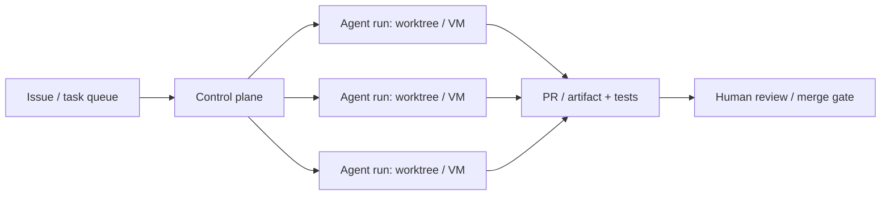
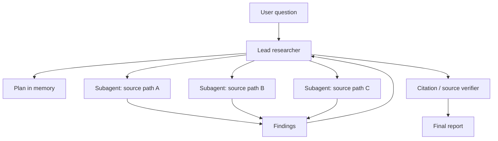
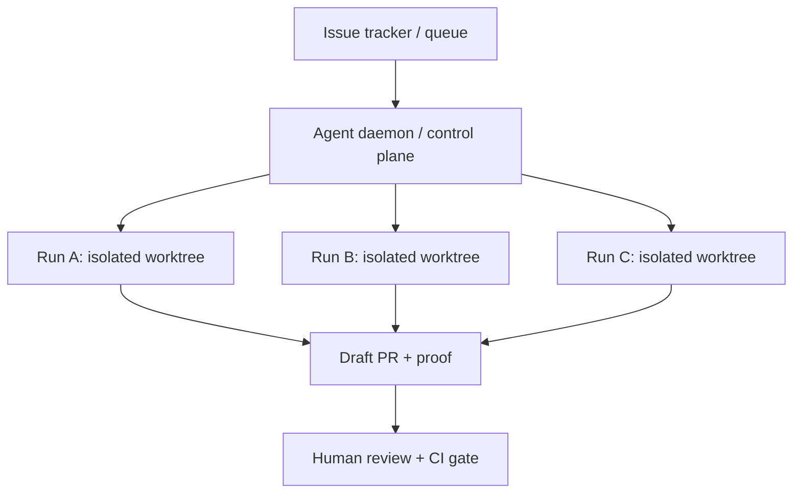
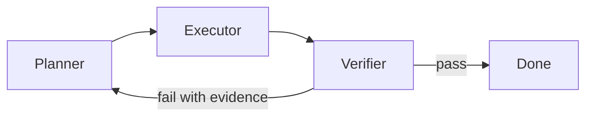
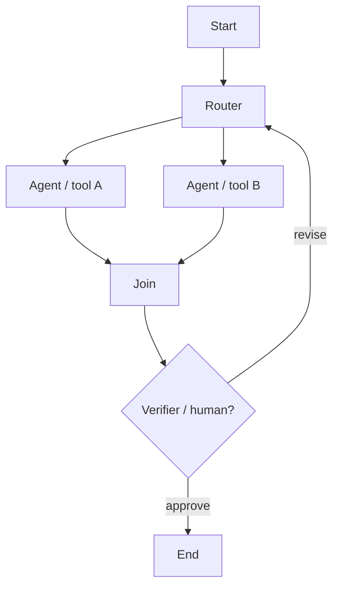
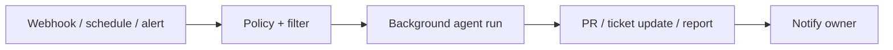

# Multi-Agent Report: Architectures, Evidence, and 2026 Build Patterns

Date: 2026-06-03
Scope: local project graph plus current official vendor/product pages checked on June 3, 2026. Strong recency bias: 2026 product systems and 2025-2026 papers are weighted above earlier role-play and debate-era systems. Direct excerpts are intentionally short; longer source arguments are summarized. Source-paper figures are embedded as local PDF page references for vault analysis; for public distribution, verify paper licenses or redraw the figures. The reusable local visual set is under `assets/multi-agent-architectures/`.

## Executive Summary

Multi-agent systems are no longer mainly a research metaphor for "several chatbots talking." In 2026, the strongest deployed pattern is a harnessed workforce: isolated agent sessions, durable state, task queues, worktrees or sandboxes, explicit verification, and human review. The architecture that matters most is often not the conversational topology; it is the operating substrate that lets many agent loops run without corrupting context, code, credentials, or each other.

The most reliable systems use multi-agent execution when the task has at least one of these properties:

- **Breadth**: many independent search, reading, or data-gathering paths.
- **Isolation**: subagents can work in separate context windows, repositories, files, VMs, or worktrees.
- **Specialization**: roles need different tools, prompts, permissions, or models.
- **Verification**: progress can be judged by tests, citations, benchmarks, rubrics, CI, or human approval.
- **Durability**: work spans more than one foreground chat turn and needs resume, audit, or scheduling.

The clearest public production evidence comes from Anthropic Research's lead/subagent research system, Kimi Agent Swarm, Cursor's parallel/background agent interfaces and kernel-optimization case study, Claude Code agent teams, Devin managing Devins, OpenAI Symphony, Codex worktrees/subagents, GitHub Copilot cloud agent, Google ADK durable agents, and framework vendors such as OpenAI Agents SDK, LangGraph, CrewAI, AutoGen, Microsoft Agent Framework/Semantic Kernel, AWS Bedrock Agents, and AgentScope.

The strongest research evidence says topology matters, but not by itself. [MultiAgentBench](../sources/MultiAgentBench.md) compares star, chain, tree, and graph protocols. [Multi-Agent Design / MASS](../sources/Multi-Agent%20Design%20-%20MASS.md) reports large gains from jointly optimizing prompts and topologies. [BAMAS](../sources/BAMAS.md) and [MasRouter](../sources/MasRouter.md) make cost-aware topology/model/role selection first-class. [Graph-of-Agents](../sources/Graph-of-Agents.md) shows graph message passing and agent selection can outperform broad mixture-style aggregation with fewer agents. The corrective papers are just as important: [Why Do Multi-Agent LLM Systems Fail?](../sources/Why%20Do%20Multi-Agent%20LLM%20Systems%20Fail.md) analyzes 1,642 failure traces and reports high failure rates across systems; [Multi-Agent Teams Hold Experts Back](../sources/Multi-Agent%20Teams%20Hold%20Experts%20Back.md) shows self-organizing teams can dilute the strongest member's expertise by large margins.

Short version:

```text
use more agents when you can split the work, isolate the context, and verify the result
avoid more agents when work is tightly sequential, same-file, ambiguous, or unverifiable
```

## Core Thesis

The useful 2026 design question is not "single agent or multi-agent?" It is:

```text
What work should be split?
Who owns each split?
How do the agents communicate?
Where does shared state live?
What verifies each handoff?
What stops the system?
What makes the run recoverable?
```

In 2024, many public multi-agent examples emphasized role-play: designer, engineer, tester, reviewer. Those systems were useful for exploring coordination, but they often relied on personas and scripted phases. In 2026, the systems that look most useful in production have shifted toward operational control:

- one session per issue, task, branch, document, or research thread;
- separate context windows and filesystem/sandbox boundaries;
- task queues, locks, mailboxes, and progress files;
- code-based orchestration when deterministic control matters;
- LLM-based delegation only when the task structure is open-ended;
- evaluators, tests, human approvals, and audit logs;
- cost-aware routing and dropout instead of unbounded agent multiplication.

This does not make older patterns obsolete. Chains, role teams, debate, voting, and group chat still matter. But they are now better understood as components inside a larger harness.

## Architecture Map

The generated architecture images are local working assets and are not part of the public vault. The textual taxonomy below preserves the same pattern IDs without depending on those SVG files. The strongest 2026 product evidence concentrates around `03 Fan-out / Gather`, `04 Hub-and-Spoke`, `08 Planner-Executor-Verifier`, `12 Message Bus`, `15 Dynamic DAG / Graph Workflow`, `20 Human-in-the-Loop Gate`, `21 Issue-Tracker Control Plane`, `24 Runtime Supervisor / Monitor`, `25 Durable Harness / Runtime`, `26 Independent Parallel`, and `29 Centralized Swarm`. `30 Ralph Loop` is included as a practical coding-agent loop pattern rather than a multi-agent topology.

The 30 active patterns should be read across two axes:

| Axis | Question | Examples |
|---|---|---|
| **Topology** | Who talks to whom? | chain, hub-and-spoke, hierarchy, graph, selector group chat, blackboard |
| **Operating mode** | What starts and sustains work? | foreground chat, background task, event-driven webhook, scheduled job, issue queue |

Some patterns deliberately sit outside pure topology. Ralph loop, issue-control plane, runtime supervisor, and durable harness are harness patterns: they describe how the run is bounded, resumed, supervised, or triggered, not just how agents exchange messages.

The "Background Agents" graphic from ONA belongs mostly to the second axis:

| ONA mode | Meaning | Closest local designs | 2026 evidence |
|---|---|---|---|
| **Swarms** | Many agents converge on one result from multiple angles. | `03 Fan-out / Gather`, `26 Independent Parallel`, `27 Voting / Ensemble`, sometimes `04 Hub-and-Spoke` | Kimi Agent Swarm; Cursor `/best-of-n`; Anthropic parallel Claude compiler prototype |
| **Fleets** | Many agents do independent background work across issues, repos, or workspaces. | `21 Issue-Tracker Control Plane`, `25 Durable Harness`, `06 Persistent Team` | Devin managing Devins; OpenAI Symphony; Codex/Cursor/GitHub background coding agents |
| **Event-driven** | Agents start from PR events, CI failures, Slack, alerts, webhooks, APIs. | `12 Message Bus`, `21 Issue Control Plane`, `24 Runtime Supervisor` | GitHub Copilot cloud agent integrations; Devin Automations; Google ADK event/dormancy patterns |
| **Scheduled** | Agents run on recurring maintenance or audit cadence. | `25 Durable Harness`, `21 Issue Control Plane`, `24 Runtime Supervisor` | Devin scheduled sessions; Google Jules scheduled tasks |

The practical lesson: a "swarm" that works in 2026 is usually not an unmanaged mesh. It is fan-out/gather or independent parallel work under a harness that can isolate sessions and compare outcomes.

## What Works by Task

| Task shape | Best architectures | Why it works | Evidence | Main risk |
|---|---|---|---|---|
| Broad research and intelligence gathering | Hub-and-spoke, fan-out/gather, independent parallel, shared state | Subagents explore independent source paths in separate context windows, then return compressed findings | [Anthropic Multi-Agent Research System](../sources/Anthropic%20Multi-Agent%20Research%20System.md), [Kimi Agent Swarm](../sources/Kimi%20Agent%20Swarm.md) | Token burn, duplicate searches, citation drift |
| Large-scale web/data collection | Swarm/fan-out, issue-control plane, durable harness | Parallel agents collect, categorize, summarize, and produce artifacts | [Kimi Agent Swarm](../sources/Kimi%20Agent%20Swarm.md) | Quota/cost, false aggregation, source quality |
| Autonomous coding across independent issues | Issue-control plane, worktree fleet, planner-executor-verifier, human gate | One workspace per task, CI/test proof, PR review, human merge | [OpenAI Symphony](../sources/OpenAI%20Symphony.md), [OpenAI Codex App Worktrees](../sources/OpenAI%20Codex%20App%20Worktrees.md), [Devin Manages Devins](../sources/Devin%20Manages%20Devins.md), [Cursor 3.2](../sources/Cursor%203.2.md), [GitHub Copilot cloud agent docs](https://docs.github.com/en/copilot/how-tos/use-copilot-agents/cloud-agent) | Merge conflicts, low-quality passing tests, review bottleneck |
| Long-running coding in one large codebase | Persistent team, task locks, durable harness, runtime supervisor | Agents loop through tasks, coordinate via files/locks, and keep progress artifacts | [Anthropic Parallel Claudes C Compiler](../sources/Anthropic%20Parallel%20Claudes%20C%20Compiler.md), [Claude Code Agent Teams](../sources/Claude%20Code%20Agent%20Teams.md) | Same-bug pileups, context pollution, unreviewed complexity |
| Measurable optimization | Parallel search, planner-worker, tournament, evaluator loop | Agents can try many variants and use benchmark feedback as objective signal | [Cursor Multi-Agent Kernels](../sources/Cursor%20Multi-Agent%20Kernels.md), [AFlow](../sources/AFlow.md) | Metric overfit, cheating evaluator, expensive search |
| Scientific hypothesis generation | Supervisor plus specialized agents, debate/tournament, ranking/evolution | Specialized roles generate, critique, rank, evolve, and meta-review hypotheses | [AI Co-Scientist](../sources/AI%20Co-Scientist.md), [Google AI Co-Scientist Article](../sources/Google%20AI%20Co-Scientist%20Article.md) | Hypothesis plausibility without real validation |
| Customer support / enterprise routing | Router, handoff, agents-as-tools, hierarchy | Clear request classes and specialist agents | [OpenAI Agents SDK Docs](../sources/OpenAI%20Agents%20SDK%20Docs.md), [AWS Bedrock multi-agent collaboration](https://docs.aws.amazon.com/bedrock/latest/userguide/agents-multi-agent-collaboration.html), [Google ADK Multi-Agent Patterns](../sources/Google%20ADK%20Multi-Agent%20Patterns.md) | Silent misrouting, policy gaps, inconsistent memory |
| High-risk or irreversible work | Planner-executor-verifier, human gate, runtime supervisor | The system pauses or rejects unsafe steps before execution | [Magentic-UI](../sources/Magentic-UI.md), [OpenAI Agents SDK Docs](../sources/OpenAI%20Agents%20SDK%20Docs.md), [Google ADK Multi-Agent Patterns](../sources/Google%20ADK%20Multi-Agent%20Patterns.md) | Human bottleneck, rubber-stamp approvals |
| Open-ended self-organizing group deliberation | Selector group chat, debate, round-robin | Useful for idea generation and critique when outcomes are subjective | [AutoGen SelectorGroupChat](../sources/AutoGen%20SelectorGroupChat.md), [MultiAgentBench](../sources/MultiAgentBench.md) | Expert dilution, consensus errors, runaway context |

## Major Players and Their Architectures

| Player / system | Current architecture signal | How they use it | Best task fit | Status / caveat |
|---|---|---|---|---|
| **Anthropic Research** | Lead researcher plus parallel subagents; memory plan; citation agent | Lead plans, spawns subagents, synthesizes, cites | Breadth-first research with many sources/tools | Production case study; reported +90.2% internal eval and about 15x chat-token use |
| **Anthropic Claude Code Agent Teams** | Team lead, independent teammates, shared task list, mailbox, hooks | Multiple Claude Code sessions coordinate directly | Research/review, independent modules, debugging hypotheses, cross-layer work | Experimental and disabled by default; docs suggest starting with 3-5 teammates |
| **Anthropic parallel compiler prototype** | Independent looping agents, containers, task locks, git sync, tests | 16 agents worked over nearly 2,000 sessions on a compiler | Large decomposable coding with strong tests | Research prototype; expensive and early |
| **OpenAI Agents SDK** | Agents as tools, handoffs, code orchestration, evaluator loops, parallel agents | Build app-level orchestration in Python | Customer support, research apps, deterministic workflows, agent composition | Production SDK; you supply evals and state design |
| **OpenAI Codex / Symphony** | Worktrees, subagents, issue-control plane, isolated runs, proof of work | Turn project tickets into agent runs and reviewed PRs | Software backlogs and maintenance | Symphony is an engineering preview; spec defaults to bounded concurrency and turn limits |
| **GitHub Copilot cloud agent** | Cloud background coding agent with issue, chat, Jira, Slack, Teams, Linear, API entrypoints | Researches, plans, edits, opens PRs for review | Low-to-medium complexity repo work | Product docs; reviewer remains responsible |
| **Cursor** | Agents window, worktrees, `/best-of-n`, `/multitask`, long-running cloud/remote sessions | Run many agents across repos/environments and compare results | Parallel coding, background work, measurable optimization | Product features plus a 38% geomean GPU-kernel case study |
| **Cognition Devin** | Main Devin managing isolated Devins; scheduled sessions; automations | Main session delegates, monitors, resolves conflicts, compiles results | Fleet-style coding and recurring tasks | Product feature; review and conflict management remain central |
| **Kimi Agent Swarm** | Commander plus up to 300 specialists; trained orchestrator; context sharding | Horizontal scaling for retrieval, writing, docs, code, office automation | Large-scale search, document processing, long outputs | Beta; reports 4.5x speedup and BrowseComp 15.9% to 33.3% |
| **Google ADK** | Sequential, routing, delegation, human-in-loop, durable agents with state machines | Builder framework for multi-agent apps | Enterprise workflows, durable/event-driven agents | Framework docs/tutorials; production quality depends on implementation |
| **Google AI Co-Scientist** | Supervisor plus generation/reflection/ranking/evolution/proximity/meta-review agents | Scientific hypothesis generation and refinement | Research ideation and experimental planning | Research/product frontier; requires scientist validation |
| **Microsoft AutoGen / Magentic-One** | Orchestrator with WebSurfer, FileSurfer, Coder, Terminal; selector group chat | Generalist multi-agent tasks and framework patterns | Web/file/code/terminal tasks, demos, benchmarks | Strong research/framework anchor; not a SaaS product by itself |
| **AWS Bedrock Agents** | Supervisor and supervisor-with-routing multi-agent collaboration | Enterprise agents coordinate specialist collaborators | Enterprise workflows with hosted infra | GA/product docs; exact architecture is managed service |
| **LangGraph** | Graph state machine, durable execution, interrupts, human-in-loop | Low-level framework for stateful workflows and multi-agent graphs | Complex workflows needing explicit state | Production framework; requires engineering discipline |
| **CrewAI** | Crews, flows, role agents, hierarchical manager process | Role-based teams and business workflows | Fast role-team prototyping, SOP-like automation | Product/framework; role design can become ceremony |
| **AgentScope** | Async framework, tool/environment interactions, MCP, sandboxing, deployment | Developer-centric multi-agent application framework | Research and production agent apps | Strong China-origin framework source |

## What the Product Sources Say

### Anthropic: Multi-Agent Research Works for Breadth

Anthropic's Research system is the clearest public production case for orchestrator-worker research. The lead agent creates a plan, stores that plan in memory, launches subagents with scoped research tasks, receives compressed findings, and passes the final report through a citation agent.

The quantitative claims matter. Anthropic reports that its multi-agent research system with Claude Opus 4 as lead and Sonnet 4 subagents outperformed single-agent Opus 4 by 90.2% on an internal research eval. It also reports that token use explains about 80% of BrowseComp performance variance, rising to about 95% when tool calls and model choice are included. In the same accounting, agents use about 4x more tokens than chat interactions and multi-agent systems use about 15x more. The source's own caveat is decisive: coding tasks often have fewer truly parallel subtasks than research, and real-time coordination remains hard.

Short source anchors: "separate context windows"; "15x more tokens"; "breadth-first queries."

Sources: [Anthropic Multi-Agent Research System](../sources/Anthropic%20Multi-Agent%20Research%20System.md), [BrowseComp](../sources/BrowseComp.md).

Pattern reference: `04 Hub-and-Spoke Orchestrator`. Hub-and-spoke is the right mental model for Anthropic Research: the lead decomposes and synthesizes, while subagents explore separate context paths.

### Kimi: Swarm as Horizontal Scaling

Kimi Agent Swarm is the boldest product claim for large-scale agent fan-out. The help center describes a commander plus specialists architecture with up to 300 subagents, more than 4,000 tool calls per task, and about 4.5x faster execution than single-agent sequential execution. It also reports BrowseComp accuracy improving from 15.9% to 33.3% in its setup and critical steps reduced by about 40%.

The important design details are not just the agent count. Kimi emphasizes training the orchestrator rather than the subagents, preventing serial collapse and fake parallelism, and sharding context so subagents keep detailed local notes while returning key conclusions to the commander.

This is product evidence for `29 Centralized Swarm`, `03 Fan-out / Gather`, `26 Independent Parallel`, and `04 Hub-and-Spoke`, not strong evidence for a fully decentralized mesh. It is still a commander-led system.

Source: [Kimi Agent Swarm](../sources/Kimi%20Agent%20Swarm.md).

Pattern reference: `29 Centralized Swarm`. Kimi-style swarm is best viewed as controlled fan-out/gather: many workers, one commander, isolated context shards, and compressed return paths.

### Coding Agents: Fleets Need Worktrees, VMs, and Review

The 2026 coding-agent pattern is a fleet, not a chatroom. Cursor, Codex, Devin, GitHub, and Claude Code all expose some version of background sessions, isolated workspaces, task queues, or parallel agents.

OpenAI Symphony is the cleanest control-plane example: it monitors an issue tracker, spawns isolated implementation runs, asks agents to produce proof of work, and expects human review before landing changes. The repository summary is explicit: Symphony lets teams manage work rather than supervise coding agents. Its warning is also important: it is a trusted-environment engineering preview. The spec's default shape is intentionally bounded: 10 concurrent agents and 20 max turns, which is a useful production lesson even if the exact numbers change.

Devin's managed-Devins pattern is similar at the product level. One main Devin delegates to a team of isolated Devin sessions, monitors progress, resolves conflicts, and compiles results. GitHub Copilot cloud agent can be started from GitHub, IDEs, Issues, Jira, Slack, Teams, Linear, Azure Boards, and API entrypoints. Cursor 3.0/3.2 turns the IDE into an agent command center with worktrees, cloud/remote environments, and multiple parallel agent surfaces.

The architecture is:



Sources: [OpenAI Symphony](../sources/OpenAI%20Symphony.md), [OpenAI Codex App Worktrees](../sources/OpenAI%20Codex%20App%20Worktrees.md), [OpenAI Codex Subagents](../sources/OpenAI%20Codex%20Subagents.md), [Devin Manages Devins](../sources/Devin%20Manages%20Devins.md), [Cursor 3.2](../sources/Cursor%203.2.md), [Cursor 3 Agents Window](../sources/Cursor%203%20Agents%20Window.md), [GitHub Copilot cloud agent docs](https://docs.github.com/en/copilot/how-tos/use-copilot-agents/cloud-agent).

Pattern reference: `21 Issue-Tracker Control Plane`. Issue tracker as control plane is the strongest 2026 background-agent pattern for software work.

### Claude Code Agent Teams: Peer Communication Is Powerful but Expensive

Claude Code's agent-team docs explicitly separate subagents from teammates. Subagents have their own context but only report back to the caller. Agent-team teammates are independent Claude Code sessions, can message each other directly, share a task list, and run with lead coordination.

The docs' use-case guidance is pragmatic: teams are strongest for research/review, new modules, competing debugging hypotheses, and cross-layer coordination. They are weaker for sequential work, same-file edits, and tightly dependent tasks. They also cost more than subagents because every teammate is a separate Claude instance. The recommended starting shape is small: 3-5 teammates, with roughly 5-6 tasks per teammate before coordination overhead and diminishing returns dominate.

The architecture is not just "many agents." It includes a team lead, teammates, task list, mailbox, task dependencies, file locks for task claiming, plan approval for teammates, and hooks for quality gates.

Source: [Claude Code Agent Teams](../sources/Claude%20Code%20Agent%20Teams.md).

Pattern reference: `06 Persistent Team Workforce`. Peer teams are valuable when teammates need to communicate and own separate work, but they add coordination overhead.

### Anthropic C Compiler: Parallel Agents Need Better Harnesses Than Prompts

Anthropic's C compiler experiment is one of the strongest 2026 examples of autonomous agent-team coding. The source reports 16 agents, nearly 2,000 Claude Code sessions, about $20,000 in API costs, and a 100,000-line Rust-based C compiler that can build Linux 6.9 on x86, ARM, and RISC-V.

The important lesson is not that every team should run 16 agents. The article is mostly about the harness: containers, task locks, git synchronization, high-quality tests, progress files, clean environments, limited output, fast deterministic subsampling, and oracle-based decomposition when all agents were otherwise stuck on the same Linux-kernel bug.

This is the clearest warning against naive parallelism. When there were many independent failing tests, agents could split naturally. When the task became one giant bottleneck, more agents duplicated work and overwrote each other. The system needed a new evaluator/oracle to create parallelizable slices.

Source: [Anthropic Parallel Claudes C Compiler](../sources/Anthropic%20Parallel%20Claudes%20C%20Compiler.md).

Pattern reference: `26 Independent Parallel`. Independent parallelism is effective only when the task can be split into independently verifiable slices.

### Cursor Kernels: Measurable Optimization Is a Sweet Spot

Cursor's GPU-kernel case study is a strong 2026 data point because the objective was measurable. The system optimized 235 CUDA kernel problems on Blackwell GPUs, reported a 38% geomean speedup, beat baselines on 149 of 235 problems, and achieved more than 2x improvement on 45 problems.

The coordination protocol lived in a markdown file, while a planner distributed and rebalanced work across workers based on benchmark performance. This fits the broader thesis: multi-agent systems work best when they can explore multiple variants and receive hard feedback.

Source: [Cursor Multi-Agent Kernels](../sources/Cursor%20Multi-Agent%20Kernels.md).

### Google AI Co-Scientist: Specialized Agents for Hypotheses

Google's AI Co-Scientist is the strongest domain-specific research example in the graph. It uses a supervisor and specialized agents for generation, reflection, ranking, evolution, proximity, and meta-review. The architecture is not a generic software team; it mirrors parts of scientific method: generate hypotheses, criticize them, rank them, evolve them, and use tournament-style comparison to focus compute.

The lesson for builders is to design roles around the domain's actual evaluation loop. Scientific research is not just "researcher + writer." It needs novelty, plausibility, literature grounding, review, prioritization, and experimental planning.

Sources: [AI Co-Scientist](../sources/AI%20Co-Scientist.md), [Google AI Co-Scientist Article](../sources/Google%20AI%20Co-Scientist%20Article.md).

![[raw/papers/Towards an AI Co-Scientist.pdf#page=9]]

Figure 7. AI Co-Scientist architecture page showing specialized agents and feedback loops. Source: [Towards an AI Co-Scientist](../raw/papers/Towards%20an%20AI%20Co-Scientist.pdf).

## What the Research Sources Add

### MultiAgentBench: Coordination Protocol Is an Experimental Variable

MultiAgentBench evaluates collaboration and competition across domains while varying coordination protocols including star, chain, tree, and graph. The key point is methodological: topology is measurable. It is not a diagram choice.

The paper's results should not be reduced to "graph always wins." It finds protocol effects vary by task and metric, but the graph protocol had the best task/planning/token profile in the Research scenario. The paper also shows a scaling lesson: going from one to three agents improved coordination, while adding more agents produced slower KPI gains and worsening coordination. That matters for builders: evaluate topology against the task, not against a universal taste for more connected graphs.

![[raw/papers/MultiAgentBench - Evaluating the Collaboration and Competition of LLM agents.pdf#page=4]]

Figure 8. MultiAgentBench coordination-protocol diagrams: centralized and decentralized structures. Source: [MultiAgentBench](../raw/papers/MultiAgentBench%20-%20Evaluating%20the%20Collaboration%20and%20Competition%20of%20LLM%20agents.pdf).

![[raw/papers/MultiAgentBench - Evaluating the Collaboration and Competition of LLM agents.pdf#page=7]]

Figure 9. MultiAgentBench protocol comparison and results table. Source: [MultiAgentBench](../raw/papers/MultiAgentBench%20-%20Evaluating%20the%20Collaboration%20and%20Competition%20of%20LLM%20agents.pdf).

### MASS: Optimize Prompts Before Multiplying Agents

MASS is one of the most important 2026-framed sources because it does not treat topology as independent of prompts. Its analysis says prompts frequently dominate MAS performance, and influential topologies are a small fraction of the design space. The design method interleaves local prompt optimization, topology optimization, and global prompt optimization. The reported average score moves from 65.28 for chain-of-thought and 70.26 for debate to 78.79 for MASS. The stage ablation is instructive in the opposite direction from the usual "add agents" intuition: block-level prompt optimization supplies the largest single gain, topology optimization adds a smaller increment on top, and workflow-level prompt optimization adds a little more. The paper's own framing is that prompts are frequently the dominant design component and that influential topologies are only a small fraction of the search space — which is exactly why the method optimizes prompts first and searches topologies second.

The practical lesson is blunt: do not add agents to compensate for weak instructions, unclear tools, or bad role definitions. Optimize the local agent first, then scale the topology.

![[raw/papers/Multi-Agent Design - Optimizing Agents with Better Prompts and Topologies.pdf#page=1]]

Figure 10. MASS frames prompts and topologies as joint design variables. Source: [Multi-Agent Design](../raw/papers/Multi-Agent%20Design%20-%20Optimizing%20Agents%20with%20Better%20Prompts%20and%20Topologies.pdf).

![[raw/papers/Multi-Agent Design - Optimizing Agents with Better Prompts and Topologies.pdf#page=5]]

Figure 11. MASS framework and search space. Source: [Multi-Agent Design](../raw/papers/Multi-Agent%20Design%20-%20Optimizing%20Agents%20with%20Better%20Prompts%20and%20Topologies.pdf).

### AFlow and ADAS: Search the Workflow, Not Just the Prompt

AFlow and ADAS are useful because they move agent design from hand-crafted recipes to search. AFlow represents workflows in code and uses execution feedback to search over workflow structures. ADAS frames agent-system design as a meta-search problem.

This is most useful when the task has a stable evaluator. For math, coding, QA, benchmark tasks, or internal workflows with clear rubric scores, search can discover non-obvious chains, branches, and repair loops. AFlow's reported averages beat common hand-designed baselines in its benchmark suite, but the warning is the same as all search-based design: for ambiguous work, search can overfit to a weak metric.

Sources: [AFlow](../sources/AFlow.md), [ADAS](../sources/ADAS.md), [methods/agentic workflow search](../methods/agentic%20workflow%20search.md).

![[raw/papers/AFlow - Automating Agentic Workflow Generation.pdf#page=5]]

Figure 12. AFlow's workflow-search framework. Source: [AFlow](../raw/papers/AFlow%20-%20Automating%20Agentic%20Workflow%20Generation.pdf).

### MasRouter and BAMAS: Cost Is Part of Correctness

MasRouter and BAMAS are production-relevant because they treat routing, model assignment, role assignment, topology, and budget as a joint problem. Multi-agent systems can be too expensive even when they work.

MasRouter routes across collaboration mode, roles, and LLM choice. It reports an average 85.93 score against lower routing baselines, with 17%-28% lower cost on some tasks. BAMAS constructs budget-aware MAS by provisioning models and selecting a collaboration topology under a cost budget. Its reported tradeoffs are exactly the kind production builders need: GSM8K at 95.3 average with 542.9 average cost versus a similar AutoGen result at 1425.3, and MBPP 82.6 at 529.2 versus a stronger-cost baseline above 3700. In its topology selection, feedback-style designs were favored for math, linear designs for code, and planner-driven designs were often too costly or unstable.

For builders, this becomes a required design step:

```text
choose topology = choose quality + latency + cost + observability + failure mode
```

Sources: [MasRouter](../sources/MasRouter.md), [BAMAS](../sources/BAMAS.md), [operations/cost control](../operations/cost%20control.md), [methods/runtime routing](../methods/runtime%20routing.md).

![[raw/papers/BAMAS - Structuring Budget-Aware Multi-Agent Systems.pdf#page=3]]

Figure 13. BAMAS budget-aware MAS construction. Source: [BAMAS](../raw/papers/BAMAS%20-%20Structuring%20Budget-Aware%20Multi-Agent%20Systems.pdf).

![[raw/papers/BAMAS - Structuring Budget-Aware Multi-Agent Systems.pdf#page=7]]

Figure 14. BAMAS topology distributions across datasets and budgets. Source: [BAMAS](../raw/papers/BAMAS%20-%20Structuring%20Budget-Aware%20Multi-Agent%20Systems.pdf).

### Graph-of-Agents: Select Agents and Pass Messages Sparingly

Graph-of-Agents is a 2026 graph-message-passing framework over a pool of heterogeneous models. It selects relevant agents, constructs directed edges, performs forward and reverse message passing, then pools outputs. The important production direction is efficiency: use fewer selected agents and structured communication, not full all-to-all chatter. The paper reports that a three-agent GoA setting can beat or match six-agent baselines; on MMLU-Pro, the reported GoAMax result uses fewer calls and far fewer tokens than a MoA-style baseline while scoring higher.

This is the research counterpart to product systems that use routers and specialists. It supports `15 Dynamic DAG / Graph Workflow`, `16 Adaptive Routing`, and `18 Heterogeneous Model Assignment`.

Source: [Graph-of-Agents](../sources/Graph-of-Agents.md).

![[raw/papers/Graph-of-Agents - A Graph-based Framework for Multi-Agent LLM Collaboration.pdf#page=4]]

Figure 15. Graph-of-Agents pipeline: node sampling, edge sampling, message passing, graph pooling. Source: [Graph-of-Agents](../raw/papers/Graph-of-Agents%20-%20A%20Graph-based%20Framework%20for%20Multi-Agent%20LLM%20Collaboration.pdf).

![[raw/papers/Graph-of-Agents - A Graph-based Framework for Multi-Agent LLM Collaboration.pdf#page=8]]

Figure 16. Graph-of-Agents efficiency analysis. Source: [Graph-of-Agents](../raw/papers/Graph-of-Agents%20-%20A%20Graph-based%20Framework%20for%20Multi-Agent%20LLM%20Collaboration.pdf).

### MAST: Failure Modes Are Architectural

Why Do Multi-Agent LLM Systems Fail? is the main failure-taxonomy source. It introduces MAST-Data with 1,642 annotated traces across seven open-source MAS frameworks, and groups failures into specification/system design, inter-agent misalignment, and task verification. The paper reports failure rates from 41% to 86.7% across systems, with leading failure groups around poor specification/system design, inter-agent misalignment, and task verification. Its interventions are practical rather than cosmetic: reported case studies improve AG2 on GSM-Plus from 84.75 to 89.75 and ChatDev ProgramDev from 25.0 to 40.6.

The builder lesson: most failures cannot be fixed by asking agents to "collaborate better." They require clearer specs, better decomposition, stronger tools, better state, termination checks, and verifiers.

![[raw/papers/Why Do Multi-Agent LLM Systems Fail.pdf#page=2]]

Figure 17. MAST taxonomy of MAS failure modes. Source: [Why Do Multi-Agent LLM Systems Fail?](../raw/papers/Why%20Do%20Multi-Agent%20LLM%20Systems%20Fail.pdf).

### Expert Dilution: More Voices Can Make the Team Worse

Multi-Agent Teams Hold Experts Back is the sharpest 2026 corrective to unconstrained deliberation. It finds that self-organizing LLM teams often fail to match the strongest individual member, even when told who the expert is. The reported performance loss reaches up to 37.6% on HLE and 15.2% on MATH-500, and the main bottleneck is leveraging expertise rather than identifying it.

This is directly relevant to selector group chat, round-robin teams, dense all-to-all discussion, and debate. Discussion can average away the best signal. If expertise matters, the architecture needs explicit weighting, authority, routing, or acceptance criteria.

![[raw/papers/Multi-Agent Teams Hold Experts Back.pdf#page=3]]

Figure 18. Teams fail to leverage expertise and can dilute the best member. Source: [Multi-Agent Teams Hold Experts Back](../raw/papers/Multi-Agent%20Teams%20Hold%20Experts%20Back.pdf).

## Architecture Patterns: When to Use Each

| Pattern | Use when | Avoid when | Strong examples |
|---|---|---|---|
| **Ralph Loop** | One coding agent needs restartable file-by-file progress | Weak tests or checkpoints without evidence | Ralph Playbook, Codex-style coding loops |
| **Fixed Chain** | Stages are stable: classify, retrieve, draft, review | Branching and discovery dominate | OpenAI code-orchestrated chains; ADK sequential pattern |
| **Router / Dispatcher** | Request classes are clear and specialists differ | Misclassification is costly or labels are fuzzy | OpenAI handoffs; AWS Bedrock routing supervisor; ADK dispatcher |
| **Fan-out / Gather** | Subtasks independent and final answer synthesizable | Shared mutable files or dependencies dominate | Anthropic Research, Kimi, Cursor best-of-N |
| **Centralized Swarm** | Many specialists should work in isolated context under one accountable commander | Merge criteria are weak or commander bottleneck dominates | Kimi Agent Swarm, Anthropic Research-style broad research |
| **Hub-and-Spoke** | One lead should own final synthesis and guardrails | Lead bottleneck loses too much detail | Anthropic Research, Magentic-One |
| **Hierarchy** | Work is large enough for managers and subteams | Latency and overhead exceed benefit | Devin managing Devins, CrewAI hierarchy, LangGraph supervisors |
| **Planner-Executor-Verifier** | Plans and outputs can be checked | Bad verifier or subjective output | MiniMax, Magentic-One, coding agents with CI |
| **Generator-Critic Loop** | Iteration improves measurable quality | No stopping rule or weak feedback | Devin Review, evaluator-feedback loops |
| **Debate / Vote** | Need adversarial perspectives or uncertainty reduction | Expert weighting matters | Research debate, group chat, idea generation |
| **Selector Group Chat** | Dynamic turn-taking is useful | Context pollution or endless discussion likely | AutoGen SelectorGroupChat |
| **Message Bus** | Events should trigger independent handlers | Tracing and cascading side effects are weak | Devin Automations, GitHub/Slack/Jira/Linear integrations |
| **Shared State / Blackboard** | Agents coordinate through artifacts | Stale state and write conflicts unmanaged | Claude Code team task list, memory stores, progress files |
| **Decentralized Agent Mesh** | Cross-org, fault tolerance, no central controller | Need strong security and final accountability | AgentNet-style research; weak production evidence |
| **Dynamic DAG / Graph Workflow** | Dependencies, branching, retries, human interrupts | Simple pipeline is enough | LangGraph, CrewAI Flows, AutoGen GraphFlow |
| **Adaptive Routing / Dropout** | Cost or expertise varies by task | Router may hide needed expertise | MasRouter, BAMAS, Graph-of-Agents |
| **Workflow / Topology Search** | Stable evaluator exists | Metric overfit likely | AFlow, ADAS, MASS |
| **Heterogeneous Model Assignment** | Models differ in skill/cost | Benchmarking absent | MasRouter, Graph-of-Agents, OpenAI model selection |
| **Cross-Team Tournament** | Many solution paths should compete | Integration cost too high | Croto, AI Co-Scientist evolution/ranking |
| **Human-in-the-Loop Gate** | Risk, ambiguity, irreversible action | Throughput is the only goal | Magentic-UI, OpenAI HITL, ADK HITL |
| **Issue-Tracker Control Plane** | Backlog work maps to tickets/artifacts | Specs and tests are poor | Symphony, Copilot cloud agent, Devin, Cursor |
| **Protocol-Mediated Collective** | Agents/tools cross org boundaries | Identity, quota, and trust unresolved | MCP, A2A, ACP-style protocols |
| **Environment-Mediated Society** | Simulations/social behavior are the target | Deterministic delivery required | Generative agents, social simulation |
| **Runtime Supervisor / Monitor** | Need cost, safety, retries, stopping control | Sidecar lacks signal or authority | Managed agents, hooks, observability systems |
| **Durable Harness / Runtime** | Work spans turns, events, schedules, or failures | One-shot answer is enough | Google ADK durable agents, LangGraph, Managed Agents, Codex |
| **Independent Parallel** | Embarrassingly parallel work | Results need mutual correction | Subagents, best-of-N, compiler task locks |
| **Voting / Ensemble** | Answers can be independently ranked | Errors are correlated | Self-consistency, MoA, simple candidate selection |
| **Role-Based SOP Team** | Work phases are known | Roles are fake ceremony | MetaGPT, ChatDev, CrewAI crews |

## Tooling Guide

### OpenAI Agents SDK

Use it when you want a lightweight Python framework with handoffs, agents-as-tools, guardrails, tracing, sessions, MCP, and code-level orchestration. The docs distinguish LLM-directed orchestration from code-directed orchestration. The two core multi-agent patterns are:

- **Agents as tools**: manager keeps control and calls specialists for bounded subtasks.
- **Handoffs**: a triage agent transfers the active conversation to a specialist.

Best for: production apps where you want explicit tool/control surfaces but still use LLM delegation.

Sources: [OpenAI Agents SDK Docs](../sources/OpenAI%20Agents%20SDK%20Docs.md), [official orchestration docs](https://openai.github.io/openai-agents-python/multi_agent/), [handoffs docs](https://openai.github.io/openai-agents-python/handoffs/).

### LangGraph

Use it when you need stateful graphs, durable execution, interrupts, human-in-loop, explicit branches, and recoverable workflows. LangGraph is strongest when the graph itself is the product architecture. The Deep Agents v0.6 source is relevant because it shows the framework direction: subagents, context isolation, filesystem/state tools, middleware, and storage/checkpoint optimization rather than only conversational graphs.

Best for: complex graph workflows, supervisor architectures, long-running task state, and systems that need to resume.

Sources: [LangGraph Docs](../sources/LangGraph%20Docs.md), [LangChain Deep Agents v0.6](../sources/LangChain%20Deep%20Agents%20v0.6.md).

### CrewAI

Use it when you want role-based teams, crews, flows, memory, guardrails, and a high-level business-process abstraction. CrewAI is easiest when the workflow naturally resembles roles and phases.

Best for: SOP-style workflows, business process automation, fast role-team prototypes.

Source: [CrewAI Docs](../sources/CrewAI%20Docs.md).

### AutoGen

Use it when you want research-grade multi-agent conversation patterns, group chats, selector group chat, round-robin teams, and Magentic-One-style orchestrator systems.

Best for: experimentation, interactive group-chat patterns, Magentic-One-like generalist tasks.

Sources: [AutoGen SelectorGroupChat](../sources/AutoGen%20SelectorGroupChat.md), [Magentic-One](../sources/Magentic-One.md).

![[raw/papers/Magentic-One - A Generalist Multi-Agent System for Solving Complex Tasks.pdf#page=5]]

Figure 19. Magentic-One's orchestrator-and-specialists design. Source: [Magentic-One](../raw/papers/Magentic-One%20-%20A%20Generalist%20Multi-Agent%20System%20for%20Solving%20Complex%20Tasks.pdf).

### Google ADK

Use it when you want official Google patterns for sequential pipelines, routing, delegation, human-in-loop, durable agents, state machines, and event/dormancy patterns.

Best for: enterprise workflows, durable/event-driven agents, Google ecosystem integration.

Sources: [Google ADK Multi-Agent Patterns](../sources/Google%20ADK%20Multi-Agent%20Patterns.md), [Google ADK Durable Agents](../sources/Google%20ADK%20Durable%20Agents.md).

### AWS Bedrock Agents

Use it when you want managed multi-agent collaboration under AWS infrastructure. Bedrock exposes supervisor and supervisor-with-routing collaboration modes for specialist agents.

Best for: enterprise AWS-hosted agents with managed collaboration.

Sources: [AWS announcement](https://aws.amazon.com/about-aws/whats-new/2025/03/amazon-bedrock-multi-agent-collaboration/), [AWS Bedrock docs](https://docs.aws.amazon.com/bedrock/latest/userguide/agents-multi-agent-collaboration.html).

### Product-Specific Coding-Agent Harnesses

Use Codex, Claude Code, Cursor, Devin, GitHub Copilot cloud agent, or Jules when the problem is software work and the product already supplies repository context, shell/filesystem access, worktrees, PRs, review surfaces, skills, and background sessions.

Best for: real repos, backlog execution, code maintenance, PR production, repeated engineering tasks.

The build-versus-buy rule:

```text
If the task is software engineering inside a repo, start with a coding-agent product.
If the task is an application workflow, use an agent framework.
If the task is novel research, build a harness and eval first.
```

## Building MAS From the Ground Up

### Step 1: Classify the Task

Ask five questions before choosing a topology:

| Question | If yes | Architecture implication |
|---|---|---|
| Can the work split into independent subtasks? | Use fan-out, independent parallel, or issue-control plane | Assign owners; avoid same-file conflicts |
| Does one entity need final accountability? | Use hub-and-spoke or planner-executor-verifier | Keep synthesis and guardrails centralized |
| Are there stable phases? | Use fixed chain or role-based SOP team | Make artifacts explicit between phases |
| Does the route depend on runtime findings? | Use router, graph workflow, adaptive routing | Instrument route decisions |
| Is the work long-running or background? | Use durable harness, control plane, event/schedule triggers | Store state outside chat |

### Step 2: Pick the Operating Mode

| Mode | Trigger | State | Review surface |
|---|---|---|---|
| Foreground assistant | User turn | Conversation/session | Direct answer |
| Background task | User delegates task | Session/worktree/sandbox | PR/artifact/report |
| Event-driven | Webhook, CI, Slack, alert | Event log + task state | Incident report, PR, ticket |
| Scheduled | Cron/recurrence | Durable run history | Maintenance report, PR, audit |
| Continuous control plane | Issue board / queue | One run per item | Review queue |

### Step 3: Define Agent Contracts

Every worker needs:

- objective;
- scope and boundaries;
- allowed tools;
- input artifacts;
- output format;
- stop condition;
- verification standard;
- escalation rule.

Anthropic Research's lesson is directly applicable: vague subtasks produce duplicate work and missed coverage. The lead should tell each subagent what to investigate, which tools and sources to use, what to return, and what not to touch.

### Step 4: Decide Where State Lives

| State type | Good storage |
|---|---|
| Current reasoning | agent context window |
| Task queue | issue tracker, shared task list, workflow DB |
| Work artifacts | files, branches, PRs, object store |
| Progress | progress files, ledgers, checkpoints |
| Coordination | locks, mailbox, message bus |
| Long-term memory | explicit memory store with provenance |
| Verification | CI, tests, eval traces, human approval |

Do not use a raw chat transcript as the only state container for long-running work. Google ADK durable agents and Anthropic Managed Agents both point toward explicit durable state.

### Step 5: Add Verification Before Scaling

Multi-agent systems amplify both work and mistakes. Add:

- unit/integration tests for code;
- source/citation checks for research;
- benchmark functions for optimization;
- rubric graders for documents;
- human gates for irreversible actions;
- trace inspection for failures;
- budget and timeout limits.

### Step 6: Add Cost Controls

Start with a single strong baseline, then add agents only where the eval says parallelism helps. Add:

- max subagents by task class;
- max tool calls per worker;
- cheap model for router/critic where safe;
- expensive model for planner or verifier only where justified;
- dropout/pruning of redundant agents;
- budget-aware topology selection.

The BAMAS and MasRouter papers are useful because they make this explicit. Cost is not an operations afterthought; it changes the architecture.

### Step 7: Observe and Repair

Log:

- which topology ran;
- why the router chose it;
- which agents were spawned;
- tool calls and failures;
- token/cost totals;
- time-to-first-useful-artifact;
- verification result;
- human feedback;
- repair loops.

This is how product teams move from "the agents behaved strangely" to actionable fixes.

## Build Recipes

### Recipe A: Research Agent System

Use for: market maps, due diligence, literature review, source-heavy synthesis.

Architecture:



Use a lead agent, subagents with separate context windows, per-subtask output schemas, source-quality heuristics, and a citation verifier. Cap subagent count by query complexity.

Use tooling: OpenAI Agents SDK agents-as-tools, Claude/Codex subagents, LangGraph for graph state, Google ADK delegation, or a simple custom harness.

### Recipe B: Background Coding Fleet

Use for: ticket backlog, dependency updates, test coverage, small-to-medium bugs, repeated maintenance.

Architecture:



Use one workspace per issue, branch/worktree isolation, CI as verifier, proof-of-work template, review queue, and merge conflict handling.

Use tooling: OpenAI Symphony, Codex worktrees, GitHub Copilot cloud agent, Devin, Cursor agents, Claude Code teams.

### Recipe C: Planner-Executor-Verifier

Use for: tasks where plan quality and output correctness matter.

Architecture:



Use plan approval for risky work, structured acceptance criteria, and evidence-carrying verifier feedback. Keep verifier authority real; a critic that cannot stop the system is decoration.

Use tooling: OpenAI code orchestration, LangGraph loops, CrewAI hierarchical manager, Magentic-One, MiniMax-style Leader/Worker/Verifier, CI/hooks.

### Recipe D: Graph Workflow

Use for: branching workflows, dependency-aware tasks, human interrupts, retries, and stateful apps.

Architecture:



Use explicit graph state and route decisions. Prefer code-directed graph control when cost, reliability, or compliance matters.

Use tooling: LangGraph, CrewAI Flows, AutoGen GraphFlow, Google ADK workflows, custom state machine.

### Recipe E: Event-Driven / Scheduled Agents

Use for: CI failure triage, incident response, nightly audits, dependency updates, stale issue cleanup, weekly reports.

Architecture:



Use event filters, invocation caps, scoped permissions, audit logs, failure-only notifications, and artifact-based outputs.

Use tooling: Devin Automations/Scheduled Sessions, GitHub Copilot cloud agent integrations, Google ADK durable agents, LangGraph durable workflows, Cloudflare Workers/Durable Objects style runtimes.

## Design Rules

1. **Do not add agents before the task is decomposed.** More agents amplify vague specs.
2. **Use separate context windows for independent work.** This is the main benefit of subagents in research and coding.
3. **Use artifacts to avoid lossy telephone.** Subagents should write reports, files, test outputs, or structured findings, not only chat summaries.
4. **Centralize final accountability unless the product is a simulation.** A lead, verifier, or human gate should own the final output.
5. **Prefer code control for known workflows.** Let models choose steps only where the path is genuinely open-ended.
6. **Make cost a topology input.** Some topologies are correct only at high budget.
7. **Do not trust self-organizing discussion to use expertise correctly.** Weight experts, route to them, or make authority explicit.
8. **Use tests and evals as coordination tools.** They tell parallel agents where progress is real.
9. **Treat event payloads as untrusted input.** Webhooks and issue comments can be prompt injection surfaces.
10. **Design for shutdown.** Long-running teams need stop, cleanup, retry, resume, and blocked states.

## Failure Modes

| Failure | Symptom | Design fix |
|---|---|---|
| Duplicate work | Subagents search or edit the same thing | Scoped tasks, locks, explicit coverage map |
| Expert dilution | Team averages away best answer | Authority weighting, router, expert verifier |
| Context pollution | Huge logs and chats overwhelm agents | Artifact references, compaction, tool-result clearing |
| Silent misrouting | Wrong specialist owns the task | Router evals, confidence thresholds, fallback |
| Verification theater | Critic comments but cannot stop bad work | Give verifier stop/reject power |
| Same-file conflicts | Parallel coders overwrite each other | Worktree isolation, file ownership, issue slicing |
| Cost explosion | Success depends on unbounded tokens | Budget-aware routing, subagent caps, dropout |
| Runaway loops | Agents keep revising without convergence | Stop rules, max iterations, external evaluator |
| Unsafe automation | Event/schedule triggers bad actions repeatedly | Permissions, approval gates, audit, rate limits |
| Metric overfit | Agents optimize evaluator quirks | Hidden tests, human spot checks, adversarial evals |

## Evidence Ranking

| Evidence tier | Meaning | Sources in this report |
|---|---|---|
| **Tier 1: 2026 product / official docs** | Shipped or official feature with current docs | Claude Code Agent Teams, Codex worktrees/subagents, Cursor 3.2, Devin manages Devins, Kimi Agent Swarm, Google ADK durable agents, GitHub Copilot cloud agent |
| **Tier 2: 2026 production-style case study** | Real hard task or internal production evidence, but not a general product claim | Anthropic C compiler, Cursor GPU kernels, OpenAI Symphony |
| **Tier 3: 2025-2026 research paper with evals** | Benchmark or architecture paper with experimental results | MultiAgentBench, MASS, BAMAS, MasRouter, Graph-of-Agents, MAST, AI Co-Scientist |
| **Tier 4: framework docs** | Useful implementation primitives, adoption depends on builder | OpenAI Agents SDK, LangGraph, CrewAI, AutoGen, AgentScope, AWS Bedrock |
| **Tier 5: older foundational systems** | Still conceptually useful but weaker recency weight | MetaGPT, ChatDev, early debate/role-play systems |

## Bottom Line

The 2026 answer to "what multi-agent architecture works?" is task-dependent, but the strongest center of gravity is clear:

```text
durable harness + isolated workers + explicit artifacts + verifiable handoffs
```

For broad research, use orchestrator-subagents with separate context windows and citation verification. For software, use issue-control planes, worktrees/VMs, CI, and human PR review. For optimization, use many parallel attempts against a hard evaluator. For enterprise apps, use routers, handoffs, durable graph workflows, and permissioned tools. For scientific or creative ideation, use specialized roles with ranking, reflection, and expert validation.

The weakest pattern is unstructured group chat with no authority, no evaluator, and no artifact contract. It can generate ideas, but it is not enough for reliable production work.

## Source Index

Core production/product sources:

- [Anthropic Multi-Agent Research System](../sources/Anthropic%20Multi-Agent%20Research%20System.md)
- [Anthropic Multi-Agent Coordination Patterns](../sources/Anthropic%20Multi-Agent%20Coordination%20Patterns.md)
- [Anthropic Parallel Claudes C Compiler](../sources/Anthropic%20Parallel%20Claudes%20C%20Compiler.md)
- [Claude Code Agent Teams](../sources/Claude%20Code%20Agent%20Teams.md)
- [Anthropic Managed Agents](../sources/Anthropic%20Managed%20Agents.md)
- [OpenAI Symphony](../sources/OpenAI%20Symphony.md)
- [OpenAI Agents SDK Docs](../sources/OpenAI%20Agents%20SDK%20Docs.md)
- [OpenAI Unlocking Codex Harness](../sources/OpenAI%20Unlocking%20Codex%20Harness.md)
- [OpenAI Codex Subagents](../sources/OpenAI%20Codex%20Subagents.md)
- [OpenAI Codex App Worktrees](../sources/OpenAI%20Codex%20App%20Worktrees.md)
- [Cursor 3 Agents Window](../sources/Cursor%203%20Agents%20Window.md)
- [Cursor 3.2](../sources/Cursor%203.2.md)
- [Cursor Multi-Agent Kernels](../sources/Cursor%20Multi-Agent%20Kernels.md)
- [Devin Manages Devins](../sources/Devin%20Manages%20Devins.md)
- [Kimi Agent Swarm](../sources/Kimi%20Agent%20Swarm.md)
- [Google ADK Multi-Agent Patterns](../sources/Google%20ADK%20Multi-Agent%20Patterns.md)
- [Google ADK Durable Agents](../sources/Google%20ADK%20Durable%20Agents.md)
- [Google AI Co-Scientist Article](../sources/Google%20AI%20Co-Scientist%20Article.md)
- [GitHub Copilot cloud agent docs](https://docs.github.com/en/copilot/how-tos/use-copilot-agents/cloud-agent)
- [AWS Bedrock multi-agent collaboration docs](https://docs.aws.amazon.com/bedrock/latest/userguide/agents-multi-agent-collaboration.html)

Core research and evaluation sources:

- [MultiAgentBench](../sources/MultiAgentBench.md)
- [Multi-Agent Design / MASS](../sources/Multi-Agent%20Design%20-%20MASS.md)
- [AFlow](../sources/AFlow.md)
- [ADAS](../sources/ADAS.md)
- [MasRouter](../sources/MasRouter.md)
- [BAMAS](../sources/BAMAS.md)
- [Graph-of-Agents](../sources/Graph-of-Agents.md)
- [AgentDropout](../sources/AgentDropout.md)
- [Stop Wasting Your Tokens](../sources/Stop%20Wasting%20Your%20Tokens.md)
- [X-MAS](../sources/X-MAS.md)
- [VeriMAP](../sources/VeriMAP.md)
- [TAMAS](../sources/TAMAS.md)
- [A2ASecBench](../sources/A2ASecBench.md)
- [AgentNet](../sources/AgentNet.md)
- [Magentic-One](../sources/Magentic-One.md)
- [Magentic-UI](../sources/Magentic-UI.md)
- [AI Co-Scientist](../sources/AI%20Co-Scientist.md)
- [Why Do Multi-Agent LLM Systems Fail?](../sources/Why%20Do%20Multi-Agent%20LLM%20Systems%20Fail.md)
- [Multi-Agent Teams Hold Experts Back](../sources/Multi-Agent%20Teams%20Hold%20Experts%20Back.md)
- [Croto](../sources/Croto.md)
- [OWL](../sources/OWL.md)
- [ChatDev](../sources/ChatDev.md)
- [MetaGPT](../sources/MetaGPT.md)

Core tooling sources:

- [LangGraph Docs](../sources/LangGraph%20Docs.md)
- [LangChain Deep Agents v0.6](../sources/LangChain%20Deep%20Agents%20v0.6.md)
- [CrewAI Docs](../sources/CrewAI%20Docs.md)
- [AutoGen SelectorGroupChat](../sources/AutoGen%20SelectorGroupChat.md)
- [Microsoft Agent Framework Docs](../sources/Microsoft%20Agent%20Framework%20Docs.md)
- [Microsoft Agent Framework Skills Docs](../sources/Microsoft%20Agent%20Framework%20Skills%20Docs.md)
- [AgentScope 1.0](../sources/AgentScope%201.0.md)
- [AgentScope Docs](../sources/AgentScope%20Docs.md)
