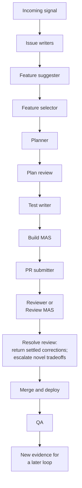

# Agentic Software Change Review

An implementation can be correct and still be the wrong change for the system.

This note proposes an operating doctrine for reviewing agent-produced software changes. It is Matan Goldberg's synthesis of established code-review, software-factory, specification, evaluation, and human-oversight ideas, plus several proposed mechanisms that are not yet validated as an integrated system.

The central claim is that code review must judge the whole proposed change—not only whether the diff compiles or passes tests. A technically sound implementation may still:

- solve a different problem from the one that caused the work;
- quietly weaken encryption, authorization, privacy, compatibility, or another important system property;
- impose permanent complexity out of proportion to the feature's value;
- rewrite a neighboring system to solve a local byproduct;
- avoid a necessary foundational change by accumulating special cases and parallel paths; or
- include material changes that cannot be traced to an authorized reason.

The system therefore separates four responsibilities:

1. The planning and building loop performs the work.
2. A PR submitter reconstructs and presents why the work happened and what interpretation drove it.
3. An independent reviewer evaluates the delivered change against primary evidence, the codebase, its protected properties, and its long-term costs.
4. The responsible human owner decides novel tradeoffs that exceed delegated implementation policy.

The builder builds. The PR submitter preserves provenance. The reviewer judges the change. The responsible owner decides what the agents are not authorized to decide.

## 1. Research Position

The vault contains strong support for the doctrine's diagnosis and many of its component practices. It does not contain direct empirical validation of the complete provenance–protected-property–complexity–routing system as one integrated review method.

| Evidence status | Assessment |
| --- | --- |
| Established or strongly precedented | Durable intent, implementation-independent validation, codebase-specific review rules, small and comprehensible review units, independent acceptance authority, selective human escalation, production feedback, and retiring noisy automated rules |
| Plausible synthesis with adjacent evidence | A dedicated PR-submitter role, bidirectional semantic change accounting, a protected-property constitution, a permanent-complexity ledger, explicit routing to the earliest responsible stage, and replay of invalidated downstream artifacts |
| Not yet established | That this complete doctrine outperforms simpler review; that a Review MAS reliably beats one strong calibrated reviewer; that fresh LLM sessions provide statistically independent judgment; and that agents can reliably judge product or architectural tradeoffs without accountable human authority |

### 1.1 Closest prior work

The surrounding lifecycle already exists in [[concepts/code factories]] and [[maps/Code Factory Playbook]]: incoming signals, triage, durable intent, planning, implementation, verification, review, release, monitoring, and feedback. [[concepts/issue tracker control plane]] establishes that work may originate in a human request, ticket, runtime error, alert, CI failure, incident, or another automated loop.

The closest deployed review analogue is [[sources/Intercom AI Approving Pull Requests]], which decomposes review into problem-statement quality, diff-to-intent alignment, safety, correctness, and codebase-specific practices, and traces implications beyond the visible diff. [[sources/Factory How Missions Work]] is the closest role-separation analogue: an implementation-independent validation contract precedes decomposition, workers do not hold final acceptance authority, and fresh validators report gaps without repairing them.

### 1.2 Supporting evidence

| Doctrine element | Supporting work | What the evidence supports | Boundary of the evidence |
| --- | --- | --- | --- |
| Durable intent and provenance | [[sources/Microsoft Spec-Driven AI-Native Engineering]], [[concepts/issue tracker control plane]] | Prompt-only intent is too fragile; requirements, decisions, architecture, implementation, tests, and validation need durable artifacts | Microsoft is methodology guidance, not a controlled agent-specific study |
| Independent acceptance authority | [[sources/Factory How Missions Work]], [[concepts/evaluator reliability]] | Fresh validators can judge an implementation without also owning its repair; execution evidence is stronger than another unsupported model opinion | Factory reports one vendor-selected run without a controlled baseline |
| Diff-to-intent review and specialized lenses | [[sources/Intercom AI Approving Pull Requests]] | Review can separately assess the problem statement, intent alignment, safety, correctness, and local practices, including execution paths beyond the diff | First-party deployment; favorable revert rates may partly reflect selection by the size gate |
| Codebase-specific protected properties | [[sources/Cursor Building Better Bugbot]], [[sources/Intercom AI Approving Pull Requests]], [[sources/Modern Code Review at Google]] | Reviewers need repository-specific invariants, internal-API rules, ownership, and organization guidance rather than a generic checklist | The three-level constitution proposed here is not present in these sources |
| Change size as an investigative signal | [[sources/Modern Code Review at Google]], [[sources/Intercom AI Approving Pull Requests]] | Small, coherent changes are easier and faster to review; overly broad changes should trigger decomposition | Google is pre-agent and organization-specific; neither source proves a universal line threshold |
| Sprawl as an architecture signal | [[sources/Cursor Agent Swarm Model Economics]] | In one same-task comparison, the weaker harness produced far more conflicts, crates, commits, and code while achieving worse results | One exceptional vendor-run task with no component ablation or independent audit |
| Complexity and comprehension debt | [[sources/Armin Ronacher The Coming Loop]], [[sources/DORA ROI of AI-assisted Software Development]], [[sources/DORA State of AI-assisted Software Development 2025]] | Long-running coding loops can amplify local defenses, duplication, poor abstractions, verification cost, and downstream instability | Ronacher is practitioner analysis; DORA is large-scale but correlational and partly self-reported |
| Tests do not settle intent | [[sources/OpenAI SWE-bench Pro Audit]], [[concepts/evaluator reliability]] | Tests may enforce unstated choices, omit hidden requirements, or pass incomplete work; task and verifier must be audited together | Benchmark evidence does not directly measure production PR review |
| Test and validation definition before implementation | [[sources/Factory How Missions Work]], [[sources/TestGen-LLM]], [[methods/automated program repair]] | Observable success should be defined before building, and generated tests need build, reliability, and adequacy filters | No source establishes that every test must fail or that the test writer must always be a separate agent |
| Human escalation at ambiguity and authority boundaries | [[concepts/human-in-the-loop agents]], [[sources/Bias in the Loop]] | Human attention should be reserved for genuine judgment boundaries, and rejection must be as easy as approval | The controlled bias study used crowd data-review work, not professional code review |
| Learning repository rules from review | [[sources/Cursor Bugbot Learned Rules]], [[sources/Modern Code Review at Google]] | Repeated feedback can become candidate rules; rules and analyzers should be disabled when they become noisy | Cursor's resolution metric is LLM-judged and action on a comment is not identical to correctness |
| Review followed by deployment evidence | [[operations/release engineering]], [[sources/DORA State of AI-assisted Software Development 2025]] | Review is one layer before canarying, monitoring, rollback, and QA; AI volume worsens stability when feedback controls are weak | The causal contribution of each organizational control is not isolated |

The login-gated [DeepLearning.AI AI Code Review course](https://learn.deeplearning.ai/courses/ai-code-review/lesson/jcm17p/ai-code-review-best-practices-%E2%80%93-part-2) reinforces independent review, relevant repository and organization context, risk triage, interactive clarification, and promotion of recurring owner-confirmed findings into reusable rules. It is not currently represented by a dedicated source card or raw course artifact in this vault.

### 1.3 Contradicting and limiting evidence

The counter-evidence does not refute provenance-aware review, protected-property visibility, or complexity judgment. It refutes the simpler assumption that more agents, more review comments, green tests, or a human approval click automatically create trustworthy control.

| Challenge | Contradicting or limiting work | Consequence for this doctrine |
| --- | --- | --- |
| Procedural separation is not statistical independence | [[sources/Correlated Errors in Large Language Models]], [[concepts/evaluator reliability]] | A fresh reviewer can reproduce the builder's error, even across model families. Important findings need execution, tests, state checks, or another evidence channel that does not share the model's failure distribution. |
| More reviewers can make results worse | [[sources/Towards a Science of Scaling Agent Systems]], [[sources/Do More Agents Help]], [[sources/Multi-Agent Teams Hold Experts Back]], [[claims/Claim - Coordination is a cost the task must justify]] | A Review MAS is optional. It must beat a calibrated single-reviewer baseline at matched cost and preserve one explicit synthesis owner. Reviewer count is not confidence. |
| Post-hoc intent reconstruction is lossy | [[sources/Microsoft Spec-Driven AI-Native Engineering]], [[sources/Context Rot]], [[sources/Lost in the Middle]], [[concepts/agent failure modes]] | The PR submitter's interpretation remains labeled synthesis. Primary tickets, decisions, plans, and trace excerpts stay canonical, and material ambiguity blocks merge. |
| Tests can encode the wrong contract | [[sources/OpenAI SWE-bench Pro Audit]] | Independent test authorship does not make a test authoritative. The originating evidence, accepted solution space, and verifier must agree. |
| Visible evaluators can be gamed | [[safety/reward hacking]], [[sources/METR Recent Reward Hacking]], [[sources/ImpossibleBench]] | Red-to-green evidence needs protected evaluators where risk warrants it: read-only tests, tamper detection, inaccessible holdouts, and investigation of anomalously good results. Benchmark hacking rates must not be generalized to ordinary PR incidence. |
| Human gates can become ceremonial | [[sources/How Humans Review AI-Generated Pull Requests]], [[sources/Bias in the Loop]], [[concepts/human-in-the-loop agents]] | Record who actually reviewed, make rejection cheap, and measure corrections, overrides, undercorrection, and decision latency rather than approval volume. |
| Human review capacity is scarce | [[sources/Modern Code Review at Google]], [[sources/DORA ROI of AI-assisted Software Development]] | Human attention is a risk budget. Escalating every uncertainty will create queues or rubber-stamping; route settled corrections to agents and reserve humans for novel authority decisions. |
| Small-diff rules can conceal architectural underreach | [[sources/Modern Code Review at Google]], [[sources/Intercom AI Approving Pull Requests]] | Prefer coherent conceptual seams, not rigid line thresholds. A larger foundational change may be safer than a small permanent bypass, but should be planned, authorized, and staged for reviewability. |
| Reviewer metrics may reward compliance rather than truth | [[sources/Cursor Building Better Bugbot]], [[sources/Cursor Bugbot Learned Rules]], [[concepts/evaluator reliability]] | Resolution rate and comment count are insufficient. Calibrate against owner-reviewed samples and track false negatives, escaped defects, reversals, and accepted risk. |
| Learned rules can institutionalize bias | [[sources/Cursor Bugbot Learned Rules]], [[sources/Bias in the Loop]] | Rule promotion must be versioned, owner-authorized when it changes policy, reversible, periodically recalibrated, and sensitive to missing feedback. This risk is an inference, not a measured Bugbot failure. |
| Review agents may share the builder's architectural weakness | [[sources/Armin Ronacher The Coming Loop]] | Architecture findings need explicit counterfactuals and accountable ownership, not reviewer consensus alone. |
| Functional benchmarks do not establish maintainability | [[sources/LoopsBench]] | Correctness and regression results remain separate from maintainability, security, deployment readiness, and architectural fitness. |
| PR review cannot catch production unknowns | [[sources/Intercom AI Approving Pull Requests]], [[sources/DORA State of AI-assisted Software Development 2025]] | Merge is followed by progressive release, monitoring, QA, and rollback. Production evidence restarts the issue loop. |

### 1.4 What is distinctive in this synthesis

The component ideas are established or precedented. Their integration into one change-governance doctrine is the original contribution here, especially:

- a PR submitter as a provenance-reconstruction role separate from both builder and reviewer;
- explicit separation of originating evidence, selected response, operational interpretation, authorized changes, and delivered code;
- PR statements labeled as direct source, recorded decision, synthesis, or unknown/conflicting;
- bidirectional semantic accounting: requested behavior without implementation is an omission, while material implementation without an attributable reason is unexplained scope;
- a compact review constitution with invariant, decision-gated, and visibility-required protected properties;
- complexity as a first-class project cost rather than a style complaint;
- symmetric architecture review for both overreach and underreach;
- counterfactuals that may include reducing requirements, providing a deliberately limited mode, deferring work, or dropping a feature;
- independent axes for severity, evidence status, merge blocking, remediation route, and decision authority;
- routing to the earliest stage capable of correcting the underlying cause;
- replay of affected downstream artifacts when an upstream decision changes; and
- the E2EE example's combination of guarantee visibility, architecture, complexity, and feature-selection authority.

## 2. Governing Principles

### 2.1 Review the change, not only the code

The review object is the proposed system change: its cause, selected intent, implementation, verification, architectural effects, and operational consequences. The diff is central evidence, but it is not the whole object.

### 2.2 Preserve lineage instead of inventing a retrospective story

The work may begin with a prompt, issue, ticket, exception, alert, failed test, incident, support report, QA evidence, or another loop. These are originating signals, not necessarily complete specifications.

The original evidence remains visible. Later interpretation may explain it, but does not overwrite it. Contradictions, ambiguity, missing records, and changes of direction are part of the provenance.

### 2.3 Separate generation, PR synthesis, and authoritative review

Builder self-review may improve work before submission, but it is not the authoritative review gate. The PR submitter's reconstruction is also a claim that review must be able to audit. Except for policy-defined mechanical work, the authoritative reviewer is distinct from the implementation author and PR submitter and does not approve its own fixes.

This separation is procedural, not proof of independent judgment. Important conclusions should be grounded in primary evidence and at least one non-LLM verification channel where feasible. A Review MAS earns its additional agents only if measured against a strong single-reviewer baseline.

### 2.4 Establish a small review constitution

Each project should maintain a small, versioned constitution of product and system properties that must remain stable or become highly visible when changed. It maps each property to its scope, affected components or data flows, enforcement level, evidence method, owner, and exception authority.

Absence from the registry does not prove a property unimportant. When the constitution is missing or incomplete, the reviewer inspects architecture, product promises, and code behavior, reports the limitation, and surfaces candidate properties without silently creating policy.

### 2.5 Treat complexity as a project cost

Correctness does not settle whether a feature is worth its permanent state, coupling, dependencies, test matrix, migration burden, failure modes, and operational load. A useful complexity finding makes that cost legible and offers a credible counterfactual.

### 2.6 Look for architectural overreach and underreach

Small diffs are not automatically better, and foundational changes are not automatically wiser. Review must detect both an unjustified core rewrite and a local workaround that avoids a necessary core change.

### 2.7 Separate severity, gating, routing, and authority

Severity asks how much a finding matters. Merge gating asks whether work may proceed. Routing asks which stage can correct the cause. Authority asks who may make the required decision. These are independent axes.

### 2.8 Route failure to its cause

Send findings to the earliest stage capable of correcting their underlying cause. A bad source issue should not be patched indefinitely by the builder; an implementation bug should not consume a human product decision.

### 2.9 Keep evidence, coverage, and uncertainty visible

The reviewer identifies the evidence behind material claims, what it examined, and what remains unverified. "No findings" means only that no issue was established within the reviewed scope; it is not proof of universal safety.

## 3. Optional End-to-End Change Pipeline

The fullest logical pipeline is:



These are logical responsibilities, not a demand for the maximum number of agents. Low-risk work may combine issue writing, selection, planning, testing, building, and PR formation. Complex or high-risk work may separate them. Combining roles must not erase artifact and authority boundaries; authoritative review remains independent for non-mechanical changes.

`MAS` means multi-agent system; an MAS-labelled stage may still be implemented by one agent. `AQ`, when present in a particular system, is treated here only as an upstream producer of evidence or candidate work. Any qualifying signal can begin the issue-writing loop.

### 3.1 Role contracts

| Role                        | Owns                                                                                                              | Does not own                                                             |
| --------------------------- | ----------------------------------------------------------------------------------------------------------------- | ------------------------------------------------------------------------ |
| Issue-writer team           | Turns raw evidence into a legible problem statement while retaining its source                                    | Selecting a feature or implementation                                    |
| Feature suggester           | Offers plausible responses, including reduced, deferred, and do-nothing options                                   | Choosing project direction                                               |
| Feature selector            | Selects, combines, reduces, defers, or rejects within delegated product and cost policy                           | Novel tradeoffs outside delegated policy                                 |
| Planner                     | Converts selected intent into an actionable design and plan                                                       | Independent approval of its own plan or code                             |
| Plan review                 | Challenges intent alignment, protected properties, architecture, complexity, and validation before implementation | Building the change                                                      |
| Test writer                 | Encodes independently testable expected behavior                                                                  | Making tests pass or silently settling disputed product behavior         |
| Build MAS                   | Implements the authorized plan and satisfies its validation contract                                              | Authoritative review or undelegated product and architecture decisions   |
| PR submitter                | Reconstructs provenance, identifies the exact change set, and packages a reviewable PR                            | Deciding correctness, safety, proportionality, or architectural fitness  |
| Reviewer or Review MAS      | Independently evaluates the realized change and routes findings                                                   | Silently changing intent, waiving guarantees, or approving its own fixes |
| Human decision owner        | Resolves novel product, scope, guarantee, architecture, and complexity-budget choices                             | Substituting for implementation work                                     |
| Merge and deployment agents | Integrate, release, observe, and roll back approved changes                                                       | Treating merge as acceptance of an unresolved decision                   |
| QA                          | Compares deployed behavior with authorized intent and produces new evidence                                       | Retrofitting a favorable interpretation onto the change                  |

An agent may apply an explicit, bounded, pre-existing policy. It may not convert execution authority into ownership of a novel tradeoff. The accountable human owner may be in product, security, privacy, architecture, operations, or another domain; it need not be the person who initiated the work.

### 3.2 Red-to-green validation

When the test-writer stage applies, each new acceptance test for changed or missing behavior should fail against the pre-change baseline for the expected semantic reason. Existing regression tests remain green. The builder then makes the new tests pass without regressing the existing suite.

"All tests must fail" is too broad. Setup failures prove nothing. Pure refactors, documentation changes, and tests documenting already-supported behavior may have no legitimate red phase. Passing tests are evidence, not authorization.

For material risks, the validation channel should be protected from the builder: read-only tests, tamper detection, hidden or holdout cases, and review of anomalously strong results. Test design itself remains subject to intent review.

## 4. Intent Lineage and PR Formation

### 4.1 Intent lineage

Review needs a durable chain between the event that caused work and the code proposed for merge:

1. **Originating evidence** — prompt, conversation, issue, ticket, exception, alert, incident, failed test, QA report, or other signal.
2. **Selected response** — feature, fix, investigation, deferral, or other response chosen to address it.
3. **Approved plan** — authorized implementation direction, if a planning stage exists.
4. **Authorized changes during execution** — clarifications, deviations, scope changes, and attributed decisions.
5. **Delivered change** — exact commits, diff, configuration, migrations, tests, and deployment behavior.

The **operational interpretation** is the understanding that actually drove planning and implementation. It may be explicit in a plan or reconstructed from contemporaneous sessions, messages, tool results, and decisions. Tests and commits corroborate what was implemented; they cannot establish why it was authorized.

These layers must not collapse:

- An exception trace is evidence of failure, not automatically a complete acceptance criterion.
- A selected feature is a response to a need, not proof that the need was understood correctly.
- An approved plan authorizes an approach, but does not prove the implementation followed it or that emergent costs are acceptable.
- A PR summary is a synthesis, not a replacement for primary evidence.
- Final code shows what was built, not why it was authorized.

The trace is bidirectional. Requirements without implementation or verification are omissions. Material implementation without an attributable requirement, prerequisite, authorized foundational purpose, validation purpose, or mechanical cause is unexplained scope.

### 4.2 The PR submitter is a provenance role

The planner and builder do not need to write special review prose or know the review framework. Their ordinary work traces remain evidence. A separate PR submitter may inspect those traces after implementation and assemble the pull request.

Planning and building may be performed by the same or different agents. Planning selects an approach; building executes it and may adjust tactics within the authorized envelope. Neither silently changes feature scope, protected guarantees, or architectural direction.

The PR submitter gathers, as available:

- originating prompts, issues, tickets, alerts, errors, incidents, and QA reports;
- feature suggestions and selection or prioritization decisions;
- planning and plan-review artifacts;
- planning and building sessions;
- clarifications, rejected options, deviations, and later decisions;
- exact branch, merge base, commits, and final diff;
- test definitions and baseline/current results;
- migrations, configuration, dependencies, permissions, APIs, schemas, and deployment changes; and
- repository PR conventions.

Use safe excerpts or access-controlled links. Do not copy secrets, credentials, private user data, or sensitive session content into a broadly visible PR.

### 4.3 Required PR context

The PR contains or links to:

1. Originating evidence and material clarifications in chronological order.
2. The selected response and the owner or policy that selected it.
3. The reconstructed operational interpretation.
4. The plan and authorized changes, including deviations.
5. A factual implementation summary without a review judgment.
6. Verification evidence, including baseline red evidence where applicable and known gaps.
7. Exact commits and merge base.
8. Missing sessions, contradictory instructions, unresolved assumptions, and uncertain provenance.
9. Repository-standard tickets, risk fields, rollout notes, screenshots, and other metadata.

Every provenance statement is distinguishable as:

- **Direct source**
- **Explicit recorded decision**
- **PR-submitter synthesis**
- **Unknown or conflicting**

An agent's reconstruction may explain source material; it must not overwrite it.

### 4.4 PR-submitter prohibitions

The PR submitter is not an architecture or quality gate. It must not:

- invent a clean rationale when traces conflict;
- rewrite the originating signal to fit the implementation;
- retroactively present unexpected work as planned;
- decide that a deviation, security effect, or architecture tradeoff is acceptable;
- convert a missing decision into an assumption;
- claim that passing checks proves intent alignment; or
- materially fix the implementation and then present itself as independent.

Missing, stale, or unrelated commits are packaging discrepancies and return to the branch owner without a correctness judgment. Suspected behavioral, security, or architectural defects remain visible for the reviewer. Omitted available provenance is repaired by the PR submitter; absent or genuinely contradictory primary evidence routes to the issue writer or decision owner.

After a material revision, the PR submitter refreshes its synthesis and change-set identity before review runs again.

## 5. Independent Review

### 5.1 Mission

The reviewer determines whether the delivered change:

- is traceable from originating evidence through the selected response and authorized intent;
- matches the authorized interpretation and plan;
- is functionally and operationally correct;
- preserves or authoritatively changes protected system properties;
- introduces a justified kind and amount of permanent complexity;
- operates at the appropriate architectural level;
- contains only attributable work;
- has sufficient evidence; and
- needs a settled correction or a decision from a more authoritative owner.

The governing question is:

> Is this implementation traceable from originating evidence through authorized intent, and are its effects on protected properties, architecture, and permanent project complexity either justified by existing decisions or explicitly routed to the appropriate decision owner?

### 5.2 Independence and evaluator integrity

Except for policy-defined mechanical work, the authoritative reviewer is not the builder, PR submitter, or sole plan author. It receives primary evidence, checks the PR reconstruction independently, and has not committed to defending the implementation.

A clean session reduces framing bias but does not eliminate correlated model errors. Where feasible, use a different model family for high-risk judgment and require a non-LLM evidence channel such as execution, state inspection, static analysis, or protected tests. Model agreement alone is weak evidence.

The reviewer remains read-only in its authoritative role. Even a trivial fix becomes a builder action and receives review against the resulting commit.

### 5.3 Reviewer inputs

#### Work provenance

- originating evidence;
- selected response;
- plan and plan-review result;
- PR submitter's operational-interpretation synthesis;
- clarifications, deviations, and authorized decisions; and
- unresolved ambiguity and provenance gaps.

The PR is an index into evidence, not ground truth.

#### Delivered change

- exact merge base, HEAD, commits, and diff;
- tests and baseline/current results;
- migrations, configuration, dependencies, permissions, schemas, APIs, and deployment changes;
- generated or mechanical outputs distinguished from semantic changes; and
- CI, preview, runtime, and rollback evidence where relevant.

#### Relevant system context

- architecture documents and accepted design decisions;
- protected-property definitions;
- authority maps for product, scope, guarantees, architecture, and complexity budgets, including a default human escalation owner;
- trust boundaries and data flows;
- repository and organization rules;
- related execution paths, repositories, and services; and
- operational, compatibility, migration, observability, and rollback constraints.

Retrieve context selectively. Diff-only review misses indirect effects, but dumping every session and document into context imports the builder's framing and causes context degradation. The reviewer records what it used and could not obtain.

### 5.4 Risk-scaled depth

Every non-mechanical PR receives a basic lineage, change-surface, and protected-property scan. Ambiguous intent, proximity to a protected property, persistent-data or migration effects, cross-owner contracts, broad subsystem reach, difficult rollback, or substantial permanent complexity trigger deeper or specialized review. Risk triage allocates attention; it does not waive a guarantee or convert missing evidence into safety.

## 6. Review Procedure

### Step 1: Establish the exact review object

Bind the report to the merge-base and HEAD commit identifiers. Identify generated artifacts, configuration, migrations, and deployment effects. Prior approval does not carry automatically to a materially changed object.

### Step 2: Reconstruct and test intent lineage

Compare originating evidence, selected response, approved plan, authorized changes, PR synthesis, and delivered behavior. Do not manufacture consistency where they conflict.

Ask:

- What caused the work?
- What response was selected, by whom, and within what authority?
- What interpretation drove implementation?
- Did it expand, reduce, or redirect the need?
- Were deviations authorized?
- Is the evidence sufficient to evaluate the delivered behavior?

### Step 3: Map semantic and indirect change surface

For each accepted requirement, find corresponding behavior and verification. Classify each material semantic change as:

- direct requested behavior;
- necessary implementation prerequisite;
- authorized foundational change;
- testing or verification;
- generated or mechanical work;
- unrelated cleanup; or
- unexplained change.

A change is material when it can affect accepted behavior, state, an API or schema, dependency, permission, data flow, cross-owner contract, persistent data, deployment or rollback, a protected property, or permanent complexity, regardless of line count.

Trace callers, consumers, data paths, configuration, schemas, permissions, deployment topology, runtime failure modes, and external contracts. A one-line edit can alter a guarantee; a large generated diff can have little semantic effect.

Unrelated cleanup normally splits. Unexplained change is removed, split, or justified through the proper authority path.

### Step 4: Review correctness and validation

Inspect functional behavior, failure handling, state transitions, concurrency, security, privacy, compatibility, migrations, rollback, observability, and repository-specific standards as relevant.

Verify that new acceptance tests distinguish old from new behavior for the expected reason. Audit task–grader agreement and evaluator integrity when the builder could optimize or tamper with the gate. Passing tests are evidence of behavior, not proof that the right behavior was selected or that its architecture is acceptable.

### Step 5: Review protected properties

Identify each property touched directly or indirectly. Trace execution paths, data flows, recipients, storage, permissions, keys, schemas, and service boundaries.

Report each applicable property as:

`preserved | authorized change | violated | unverified`

An authorized change requires a recorded decision or standing policy whose disclosure and control requirements are satisfied. Silence and confident inference are not authorization.

### Step 6: Evaluate complexity and architecture

Account for breadth and permanent obligations. Decide whether complexity is essential, accidental, or strategic, and whether the implementation operates at the right architectural layer. Examine both overreach and underreach. When cost is material, compare credible counterfactuals.

### Step 7: Synthesize, route, and conclude

Deduplicate overlapping findings. Separate observation from inference, severity from gating, and correction from decision. Route each issue to the earliest role that can correct its cause. State coverage, uncertainty, unresolved decisions, merge state, and all blocking reasons.

## 7. Protected System Properties

The review constitution is codebase-specific policy, not a universal checklist. Examples include:

- end-to-end encryption;
- authentication and authorization boundaries;
- privacy, consent, data residency, and data ownership;
- durability, consistency, and loss-prevention guarantees;
- public API and backward-compatibility commitments;
- tenant, process, repository, and environment isolation;
- auditability and evidence integrity;
- availability, rollback, and deployment assumptions; and
- safety-critical domain constraints.

Each property states its scope, rationale, enforcement level, owner, evidence method, and exception procedure.

### 7.1 Enforcement levels

- **Invariant:** cannot change under current authorization. A proposed violation remains blocked unless a separate governance action changes the policy or project regime.
- **Decision-gated:** may change only through an explicit decision by the named human owner.
- **Visibility-required:** standing policy permits change, but the effect must be disclosed prominently to a named audience and acknowledged where policy requires it.

Every affected review places this matrix near the top of its final report:

| Property | Level | Status | Evidence and consequence | Owner, disclosure, or required action |
| --- | --- | --- | --- | --- |
| Named property | Invariant, decision-gated, or visibility-required | Preserved, authorized change, violated, or unverified | Exact code path, data flow, test, or gap | Named route and closure condition |

### 7.2 Gating behavior

| Outcome | Route and merge effect |
| --- | --- |
| Invariant violated | Builder or planner correction; blocked. Only separate governance can redefine the invariant. |
| Decision-gated change | Named human owner; blocked until the decision is recorded. |
| Visibility-required change missing disclosure | PR submitter repairs disclosure; blocked until required visibility or acknowledgment is complete. |
| Visibility-required change within policy and fully disclosed | May approve if no other blocker remains. |
| Material property effect unverified | Blocked for insufficient evidence and routed to the owner of the missing evidence. |

The reviewer may discover a candidate property but does not silently promote it into policy.

## 8. Complexity, Sprawl, and Architecture

### 8.1 Complexity types

- **Essential complexity** is inherent in the selected capability or domain.
- **Accidental complexity** is produced by this implementation and can be avoided without changing the selected outcome.
- **Strategic complexity** is an intentional present investment in an accepted product or architectural direction.

Calling complexity strategic requires present evidence: multiple current consumers, repeated existing workarounds, an accepted direction, inability to preserve a protected property otherwise, or a clear reduction in permanent branching. Hypothetical future scale is insufficient.

Avoidable accidental complexity within settled intent is an implementation correction. Unauthorized essential or strategic cost is a decision finding.

### 8.2 Complexity ledger

Examine permanent additions and removals:

- concepts, abstractions, and state transitions;
- branches, modes, flags, and exceptional paths;
- coupling and ownership boundaries;
- dependencies and vendor commitments;
- APIs, schemas, storage, queues, and background jobs;
- permissions, secrets, recipients, and trust boundaries;
- migration, compatibility, rollout, and rollback paths;
- observability, debugging, incident response, and on-call burden;
- test combinations and long-term maintenance surface; and
- obsolete paths, duplicated logic, and complexity removed.

A useful finding connects cost to the requirement or design decision that creates it, distinguishes temporary from permanent cost, and names what a simpler choice would sacrifice.

### 8.3 Counterfactuals

A material complexity objection is incomplete without a credible alternative. Compare the relevant options:

1. **Smallest correct local change** — bounded implementation satisfying selected intent.
2. **Foundational change** — core architecture supporting the capability without parallel paths.
3. **Reduced requirement** — weaken or remove the demand responsible for disproportionate cost.
4. **Limited mode** — deliberately relax a guarantee with explicit disclosure and authority, when policy permits it.
5. **Deferred or rejected change** — decide the capability is not worth its cost.

The reviewer may recommend; it does not silently choose outside delegated authority.

### 8.4 Change proportionality

Review gross additions and removals, files and subsystems touched, dependencies, schemas, APIs, permissions, trust boundaries, duplicated state and logic, adapters, compatibility layers, unrelated cleanup, and work required only by byproducts of the chosen approach.

Line count and breadth trigger investigation; they are not scores. A small change can compromise authorization. A large deletion can simplify a system. Duplication may cost less than a premature shared abstraction, but repeated or divergent copies can reveal a missing boundary.

Split changes along coherent architectural seams, not arbitrary line thresholds.

### 8.5 Overreach and underreach

**Overreach** occurs when a local request causes a broad rewrite, core-system change, or large permanent obligations without evidence that they are necessary for current authorized intent.

Ask whether the systemic change is required, whether another subsystem is being redesigned only to repair a byproduct, whether a bounded solution exists, and whether the justification rests on present evidence or vague scalability.

**Underreach** occurs when implementation avoids a necessary foundational change through duplicate state, parallel data paths, one-off adapters, exceptions, bypasses, or repeated special cases. The local diff may appear safer while kneecapping the feature and future work in its direction.

Ask whether the feature exposes a missing seam, creates permanent divergence, repeats an existing workaround, follows an accepted product direction, requires core change to preserve a protected property, or would reduce total permanent branching through foundational work.

Plan review considers these questions prospectively. PR review judges the realized diff and emergent costs. Accepted tradeoffs are not relitigated without new evidence, but plan approval does not exempt implementation from review.

## 9. Findings, Routing, and Merge State

### 9.1 Finding schema

Every substantive finding contains:

```text
Finding ID and title:
Claim and affected behavior:
Evidence:
Evidence status: established | inferred | unverified
Intent-lineage point or protected property affected:
Consequence:
Severity:
Disposition: correction required | decision required | advisory
Merge blocking: yes | no
Primary route:
Decision authority required: none | named human owner or governing policy
Resolution condition:
Dependent or replay routes, when needed:
Alternatives and reviewer recommendation, when a tradeoff exists:
```

Preference alone is not a finding. Inferences are labeled. Minor style notes need not use the full schema; blockers, guarantee changes, and material architecture or complexity findings do.

Evidence status, disposition, severity, merge gating, route, and decision authority remain independent:

- **Established** directly supports the claim.
- **Inferred** is a reasoned conclusion with incomplete evidence.
- **Unverified** means the material fact cannot be established.
- **Correction required** means desired behavior is settled and a stage must fix its work.
- **Decision required** means resolution changes or authorizes intent, scope, a protected property, architecture, or complexity budget.
- **Advisory** is a bounded improvement that does not block the authorized outcome.

A material unverified claim blocks for insufficient evidence. A non-material unknown is a disclosed coverage limitation. Severity alone never determines route or merge state.

### 9.2 Routing rule

> When desired behavior is settled, return the problem to the role responsible for implementing it. When resolution changes intent, scope, guarantees, architecture, or accepted complexity, escalate it to the responsible human owner.

| Root cause | Lead owner | Next gate or replay |
| --- | --- | --- |
| Available evidence omitted or misstated in PR synthesis | PR submitter | Refresh context, then re-review |
| Primary evidence absent or problem statement malformed | Issue-writer team | Human owner if intent remains unsettled; replay selection onward |
| Instructions conflict or a novel product/architecture choice is required | Named human owner | Record decision; invalidate and replay affected downstream artifacts |
| Feature can be changed within delegated selection policy | Feature selector | Replay planning onward |
| Feature value or cost exceeds delegated policy | Named human product owner | Return an authorized selection to feature selection or planning |
| Plan is invalid, infeasible, or contradicted by discovered architecture | Planner | Plan review, then affected tests and implementation |
| Implementation is wrong, incomplete, avoidably complex, or violates a valid plan | Build MAS | Refresh PR and re-review the new commit |
| Acceptance coverage invalid while behavior is settled | Test writer | Replay affected build, PR formation, and review |
| Test design reveals disputed behavior | Named human owner | Planning and plan review before tests change |
| Commit range stale, incomplete, or unrelated | PR submitter | Branch owner repairs composition; refresh review object |
| Settled invariant accidentally violated with determined correction | Build MAS | Re-run protected-property review |
| Guarantee exception or intentional property change proposed | Named human property owner | Record decision, then replay affected plan, tests, build, PR, and review |
| Merge, rollout, environment, or rollback fails | Merge/deployment agents | Re-review if semantics change; otherwise continue to QA |
| Deployed behavior mismatches intent or creates a new failure | QA | Issue-writer team begins a new lineage |

### 9.3 Merge state

The review reports one state:

- **Approve:** no correction, unresolved decision, or material evidence gap remains. Advisories and non-material coverage limits may remain.
- **Blocked:** one or more blocking reasons remain.

Blocking reasons are multi-select:

- **Changes required**
- **Decision required**
- **Insufficient evidence**

Merge does not imply acceptance of an unresolved tradeoff.

The final report summarizes intent alignment, protected-property status, change-surface ledger, correctness evidence, architecture and complexity, findings and routes, examined coverage, remaining uncertainty, merge state, and every blocker.

### 9.4 Review iteration

Every report is bound to exact merge-base and HEAD identifiers.

1. A finding closes only when its resolution condition has evidence.
2. A decision enters intent lineage with owner, scope, and rationale.
3. Changed upstream artifacts invalidate and replay affected plans, tests, implementation, PR context, and review downstream.
4. Any semantic change after review requires review of the new object.
5. A decision authorizing a tradeoff does not approve its implementation.
6. Accepted exceptions retain owner and scope so they are not reopened without new evidence.

## 10. Worked Example: E2EE and Server-Side Processing

Suppose an issue requests semantic search across message history, including cross-device availability and background indexing. The implementation is clean, tested, and operationally sound: clients upload plaintext to a server-side index.

Review cannot stop at "the feature works."

### 10.1 Intent and protected-property analysis

The reviewer establishes:

- whether the product promises end-to-end encryption for message content;
- whether the issue, feature selection, plan, or standing policy authorizes an exception;
- where plaintext exists, which principals can access it, retention, logs, backups, and third parties;
- whether the PR reconstruction matches source sessions; and
- whether tests exercise only search behavior or also the encryption boundary.

If E2EE is invariant, server-visible plaintext violates current authorization. If decision-gated, it requires the named human owner. If policy permits a visible limited mode, the exception, scope, data flow, disclosure, controls, and owner become explicit.

### 10.2 Complexity and alternatives

Preserving E2EE may require client-side indexing, encrypted-index synchronization, new key lifecycle, conflict resolution, device recovery, and a much larger test and operational matrix. That complexity may be essential to the full demand set; saying "keep it encrypted" does not erase it.

The reviewer makes the options legible:

1. Build the full encrypted design and accept its cost.
2. Reduce the feature to device-local search or remove background server indexing.
3. Create an explicit, narrowly scoped non-E2EE mode, if product policy permits it.
4. Defer or drop the feature because its value does not justify the guarantee change or encrypted implementation cost.

The reviewer recommends; the owner decides.

### 10.3 Architectural symmetry

The opposite implementation also deserves scrutiny. If the builder preserves E2EE through feature-specific keys, a duplicate client database, a parallel synchronization protocol, and one-off recovery paths, this may be accidental complexity, evidence that a reusable encrypted-derived-data architecture is necessary, or evidence that requirements should be reduced.

If several current encrypted-derived-data features already establish a product direction, avoiding foundational work may be underreach. If search is the only current consumer and reuse is speculative, a core rewrite may be overreach.

### 10.4 Example routing

- Accidental plaintext exposure under a settled invariant goes to the builder.
- A proposed E2EE exception goes to the named product/security owner.
- Disproportionate encrypted-design cost goes to feature selection or the human owner with reduced and no-build alternatives.
- Failure to follow a valid foundational plan goes to the builder; it returns to plan review only if the plan itself proved invalid or infeasible.
- A PR that hides the plaintext path goes to the PR submitter for provenance repair and still produces a guarantee finding for the property owner.

## 11. Review MAS, Human Gates, and Learning

### 11.1 Review MAS design

A single independent reviewer may run the full sequence. Complex or high-risk work may use specialized lenses for:

- intent and provenance;
- correctness and security;
- protected properties and trust boundaries;
- tests and evaluator integrity;
- architecture and complexity;
- migration, deployment, and operability; and
- synthesis, deduplication, merge state, and routing.

Specialization is useful only when it buys different evidence, context, or expertise. The synthesizer preserves evidence, reconciles conflicts, deduplicates findings, distinguishes speculation from confirmation, and owns the final result. Multiple similar model votes do not establish truth.

Before adopting a Review MAS, compare it with one strong calibrated reviewer at matched cost. Track additional issues found, false positives, false negatives, latency, decision quality, and escaped defects.

### 11.2 Human gate design

A "human required" status is meaningful only if the human can genuinely disagree:

- rejection must be as easy as approval;
- the actual reviewer identity is recorded;
- the interface presents evidence and alternatives rather than a preselected answer;
- correction, override, undercorrection, overcorrection, and decision latency are measured; and
- human review is reserved for novel authority and judgment, not every settled implementation defect.

### 11.3 Learning and governance

Repeated owner-confirmed findings can become candidate protected properties, repository rules, automated checks, reviewer skills, test patterns, or planning guidance.

Promotion is explicit, versioned, owned, reversible, and calibrated. Noisy rules can be amended or removed. The system distinguishes upheld findings, rejected findings, accepted risk, later regressions, escaped issues, and missing feedback. Popularity or developer silence is not proof that a rule is correct.

Useful measures include:

- findings upheld or dismissed by accountable owners;
- findings resolved before merge;
- decision-required findings and resolution time;
- accepted exceptions and scope adherence;
- false positives, false negatives, overrides, and escaped defects;
- rework routed to the wrong stage; and
- review latency relative to risk and change surface.

Comment volume, resolution rate, and raw approval rate are insufficient on their own.

### 11.4 Review does not end at merge

PR review cannot detect all infrastructure failures, third-party outages, data interactions, load behavior, or unanticipated usage. Approved changes continue through serialized integration, progressive release, monitoring, QA, and rollback capability. Production evidence feeds the issue-writing loop.

## 12. Anti-Patterns

This doctrine rejects:

- requiring the builder to author special review prose;
- treating the PR submitter's synthesis as primary truth;
- letting the authoring agent be the sole authoritative reviewer;
- treating a fresh LLM session as statistically independent evidence;
- evaluating code without originating evidence and authorized decisions;
- treating a runtime signal as a complete specification;
- equating passing tests with the right system change;
- giving the builder uncontrolled access to the evaluator that gates it;
- scoring quality mechanically by line count or diff size;
- automatically preferring the smallest diff;
- adding reviewer agents without a single-reviewer baseline;
- demanding foundational work based only on hypothetical reuse;
- using local exceptions to avoid a necessary architecture decision;
- letting the reviewer silently reduce requirements or waive guarantees;
- sending unresolved product choices to the builder as coding tasks;
- escalating settled corrections to scarce human attention;
- allowing merge to imply acceptance of unresolved tradeoffs;
- dumping the whole repository or transcript into every review;
- reporting "no issues" without coverage and uncertainty;
- measuring reviewer value through comments or approvals alone; and
- treating review as a substitute for deployment controls and QA.

## 13. Minimum Normative Contract

### PR formation

- Originating evidence **MUST** be preserved or durably referenced.
- The PR submitter **MUST** distinguish source, explicit decision, synthesis, and unknown/conflicting information.
- The PR **MUST** identify exact commits and summarize verification.
- Builder and planner **MUST NOT** be required to produce special review prose.
- The PR submitter **MUST NOT** invent authorization, resolve ambiguity, judge its reconstruction sufficient, or materially change implementation code while acting in that role.

### Review

- Every non-mechanical PR **MUST** receive authoritative review independent of the implementation author and PR submitter.
- The reviewer **MUST** treat procedural separation as insufficient by itself and ground material conclusions in primary evidence and independent verification where feasible.
- The project **MUST** supply a versioned review constitution and authority map, or the reviewer **MUST** disclose their absence without treating reconstructed candidates as policy.
- The reviewer **MUST** compare originating evidence, selected response, operational interpretation, approved plan and changes, and delivered behavior.
- The reviewer **MUST** account for every material semantic change, not every literal line.
- The final report **MUST** contain a change-surface ledger.
- Applicable protected properties **MUST** be reported as `preserved | authorized change | violated | unverified` in a prominent matrix.
- Material complexity review **MUST** examine overreach and underreach and provide a credible counterfactual.
- Findings **MUST** separate evidence status, severity, merge gating, route, and decision authority.
- The reviewer **MUST NOT** make undelegated product, guarantee, scope, architecture, or complexity decisions.
- The reviewer **MUST NOT** implement a fix that it then approves.
- Material verification gaps **MUST** remain visible.

### Routing, human authority, and iteration

- Corrections **MUST** route to the earliest stage capable of fixing the cause.
- Novel changes to intent, guarantees, architecture, feature scope, or complexity budget **MUST** go to the named accountable human owner.
- Human decision interfaces **MUST** make rejection no harder than approval and retain reviewer identity and decision evidence.
- Decisions **MUST** enter intent lineage before implementation continues.
- Semantic revisions **MUST** refresh PR context and receive review against the new merge-base and HEAD.
- Merge automation **MUST NOT** treat unresolved decisions as accepted.
- Approved changes **MUST** continue through the project's deployment, monitoring, QA, and rollback controls.

### Review-system evaluation

- A Review MAS **SHOULD** be adopted only after outperforming a strong single-reviewer baseline at matched cost on project-relevant cases.
- Reviewer quality **SHOULD** be calibrated against owner-reviewed samples and production outcomes, not comment or approval volume alone.
- Learned rules **MUST** be versioned, attributable, reversible, and retireable.
- High-risk test gates **SHOULD** use tamper-resistant evaluators and protected holdouts where feasible.

## 14. Related Vault Work

### Lifecycle and intent

- [[concepts/code factories]]
- [[maps/Code Factory Playbook]]
- [[concepts/issue tracker control plane]]
- [[sources/Microsoft Spec-Driven AI-Native Engineering]]
- [[sources/Factory How Missions Work]]

### Review, oversight, and evaluation

- [[sources/Intercom AI Approving Pull Requests]]
- [[sources/Cursor Building Better Bugbot]]
- [[sources/Cursor Bugbot Learned Rules]]
- [[sources/Modern Code Review at Google]]
- [[sources/How Humans Review AI-Generated Pull Requests]]
- [[sources/Bias in the Loop]]
- [[concepts/human-in-the-loop agents]]
- [[concepts/evaluator reliability]]

### Complexity, coordination, and architecture

- [[sources/Armin Ronacher The Coming Loop]]
- [[sources/Cursor Agent Swarm Model Economics]]
- [[claims/Claim - Coordination is a cost the task must justify]]
- [[sources/Correlated Errors in Large Language Models]]
- [[sources/Towards a Science of Scaling Agent Systems]]
- [[sources/Do More Agents Help]]

### Verification, release, and feedback

- [[sources/OpenAI SWE-bench Pro Audit]]
- [[methods/automated program repair]]
- [[safety/reward hacking]]
- [[operations/release engineering]]
- [[sources/DORA State of AI-assisted Software Development 2025]]
- [[sources/DORA ROI of AI-assisted Software Development]]

## 15. Open Research Questions

1. Does this integrated doctrine reduce escaped defects, guarantee changes, and comprehension debt compared with one strong conventional reviewer?
2. Which protected-property representation gives reviewers high recall without turning the constitution into an unmaintainable checklist?
3. Can permanent complexity be measured reliably enough for consistent review, or should it remain an explicitly human judgment supported by a ledger?
4. When does a specialized Review MAS outperform one calibrated reviewer after controlling for model calls, context, and latency?
5. Which evidence channels most effectively decorrelate reviewer and builder errors in real codebases?
6. How accurately can a PR submitter reconstruct operational interpretation from long sessions without laundering ambiguity?
7. What escalation rate preserves human judgment without exhausting the human review budget?
8. Which learned-rule promotion signals resist popularity bias and missing feedback?
9. How should accepted protected-property exceptions expire, narrow, or trigger later architectural repair?
10. Can semantic change accounting and routing quality be evaluated from repository and issue-tracker history?
